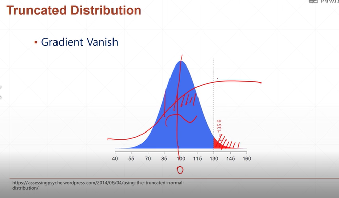

# tf2 basic
## 08 create tensor


1. turn *numpy* to tensor, input *list* to tensor
2. create *zeros, ones*, or any number of tensor
3. tensor but numbers *filled* any number
4. create tensor with *random* prob dist
5. *constant*
6. application

```py
#1 from numpy, list
tf.convert_to_tensor(np.ones([2,3]))
tf.convert_to_tensor(np.zeros([2,3]))

tf.convert_to_tensor([1,2])
tf.convert_to_tensor([1,2.])
tf.convert_to_tensor([[1],[2.]])

#2.1 tf.zeros
tf.zeros([])
tf.zeros([1])
tf.zeros([2,2])
tf.zeros([2,3,3])

#tf.zeros_like: 初始化為0
a = tf.zeros([2,3,3])
tf.zeros_like(a) #zeros but the shape accroding to the shape of a
tf.zeros(a.shape)

#2.2 tf.ones
tf.ones(1)
tf.ones([])
tf.ones([2])
tf.ones([2,3])
tf.ones_like(a)

#3 tensor but numbers filled any number
tf.fill([2,2], 0)
tf.fill([2,2], 0.)
tf.fill([2,2], 1)
tf.fill([2,2], 9)

#4.1 normal: it's different inefficiency of conv with different initial way
tf.random.normal([2,2], mean=1, stddev=1)
tf.random.normal([2,2])
tf.random.truncated_normal([2,2],mean=0, stddev=1)  #截斷的normal  
# Since some function like sigmond fu. might gradient vanish at std=1 sigma, renewing the solution will become slow. Because of that, we  use "truncated" to select without edged numbers.

#4.2 uniform
tf.random.uniform([2,2], minval=0, maxval=1)
tf.random.uniform([2,2], minval=0, maxval=100)

#4.3 random permutation
idx = tf.range(10)  #index
idx = tf.range.shuffle(idx)

a = tf.range.normal([10,784])
b = tf.range.uniform([10], maxval=10, dtype=tf.int32)

a = tf.gather(a, idx)
b = tf.gather(b, idx)

```



```py
#5.1 tf.constant
tf.constant(1)
tf.constant([1])
tf.constant([1, 2.])
tf.constant([[1, 2.], [3.]]) #invalid

#5.2 loss: mse(out, y)
out = tf.random.uniform([4,10])
y = tf.range(4) #[0,1,2,3]
y = tf.one_hot(y, depth=10)

loss = tf.keras.losses.mse(y, out)
loss = tf.reduce_mean(loss)

#5.3 vector: x*w+b, bise-> [out_dim]
net = layers.Dense(10)  #dim8 to dim10
net.build((4,8))
net.kernel #w
net.bias #b

#5.4 matrix: 
x = tf.random.normal([4,784])
net = layers.Dense(10)
net.build((4,784))

#to know the dim, the shape
net(x).shape
net.kernel.shape
net.bias.shape

```

```py
#6 application: deep learning
#dim=3 tensor, x:[b, seq_len, word_dim]
(X_train, y_train), (X_test, y_test) = keras.datasets.imdb.load_data(num_words=10000)
x_train = keras.preprocessing.sequence.pad_sequences(X_train, maxlen=80)
x_train.shape

emb = embedding(x_train)
emb.shape
out = run(emb[:4])
out.shape

#dim=4 tensor, image:[b, h, w, 3]
#feature maps:[b, h, w, c]  -> image type is recorded with this type
x = tf.random.normal((4,32,32,3)) #4 photos
net = layers.Conv2D(16, kernel_size=3)
net(x)  #[4,32,32,16], turn the channel from 3 to 16

#dim=5 tensor, single task:[b, h, w, 3]
#meta-learning: learning how to learn
#掌握每個維度具體涵義, what application each dim of tensor use in?


```

 

