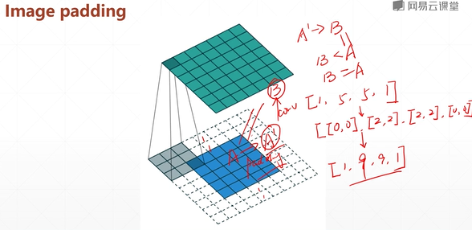

# tf2 adv
## 17 pad and tile

* pad
* tile
* broadcast_to

```py
#1 pad
a = tf.reshape(tf.range(9), [3,3])
tf.pad(a, [[0,0],[0,0]])
tf.pad(a, [[1,0],[0,0]])
tf.pad(a, [[1,1],[0,0]])
tf.pad(a, [[1,1],[1,0]])
tf.pad(a, [[1,1],[1,1]])

#1.1 image padding
a = tf.random.normal([4,28,28,3])
b = tf.pad(a, [[0,0],[2,2],[2,2],[0,0]])
b.shape         #TensorShape([4,32,32,3])
```


  
```py
#2 tile: repeat data along dim n times
# [a,b,c],2 -> [a,b,c,a,b,c]

#inner dim first
a
tf.tile(a,[1,2])
tf.tile(a,[2,1])
tf.tile(a,[2,2])

#tile vs broadcast_to
aa = tf.expand_dims(a,axis=0)
tf.tile(aa,[2,1,1])
tf.broadcast_to(aa,[2,3,3])

```

