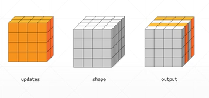
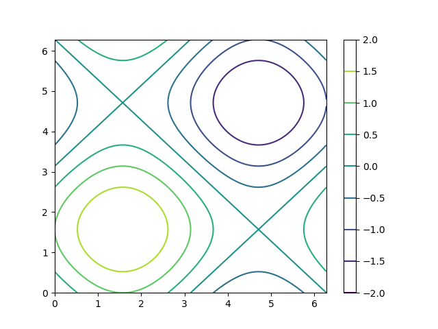
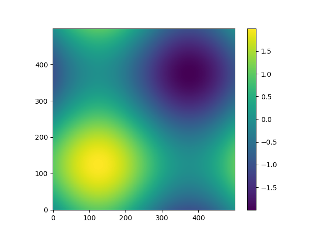

# tf2 adv
## 19 advanced operation

* where: select with coodinates
* scatter_nd: renew with coodinates
* meshgrid: create a coodinate plate

```py
#1 where
a = tf.random.normal([3,3])
mask = a>0
tf.boolean_mask(a,mask)   #array([0.57, 0.50, 1.15, 2.72])
indices = tf.where(mask)  #shape=(5,2)
tf.gather_nd(a,indices)   #array([0.57, 0.50, 1.15, 2.72])

mask
A = tf.ones([3,3])
B = tf.zeros([3,3])
tf.where(mask, A, B)

```
```py
#2 scatter_nd
indices = tf.constant([[4],[3],[1],[7]])
updates = tf.constant([9,10,11,12])
shape = tf.constant([8])
tf.scatter_nd(indices, updates, shape)

#

indices = tf.constant([[0],[2]])
updates = tf.constant([ [[5,5,5,5], [6,6,6,6], [7,7,7,7], [8,8,8,8]], [[5,5,5,5], [6,6,6,6], [7,7,7,7], [8,8,8,8]] ])
updates.shape    #TensorShape([2,4,4])

shape = tf.constant([4,4,4])
tf.scatter_nd(indices, updates, shape)

```


```py
#3 meshgrid

#numpy
point = []

for y in np.linspace(-2,2,5):
    for x in np.linspace(-2,2,5):
        points.append([x,y])

return np.array(points)

#GPU acceleration
# x:[-2,2] y:[-2,2]
# generate points: [N,2]

y = tf.linspace(-2.,2,5)
y
x = tf.linpace(-2.,2,5)
points_x, points_y = tf.meshgrid(x,y)
points_x.shape    #TensorShape([5,5])

points_x
points_y
points_x.shape

points = tf.stack([points_x,points_y], axis=2)

```


