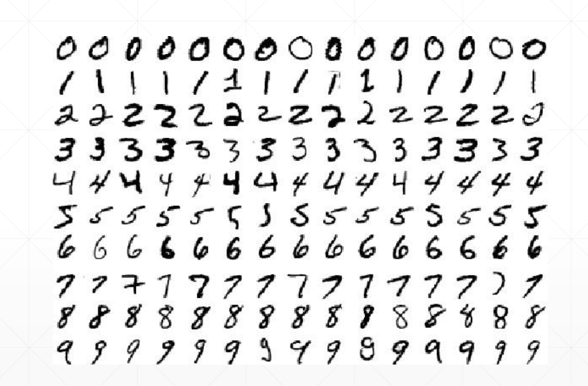

# Neural Network and Fully Connected Layer
## 20 Data uploading

* kera.datasets
* tf.dataset.from_tensor_slices: shuffle, map, batch, repeat
* input pipeline

### Dataset used usually: keras.datasets
1. boston housing: Boston housing price regression dataset
2. mnist/fashion mnist: MNIST/fashion-MNIST dataset
3. cifar10/100: small images classification dataset
4. imdb: sentiment classification dataset
  
    
    
### 1. MNIST: 
- (28*28*1): 1 channel
- 70k/ 60k/ 10k



```py
(x,y), (x_test, y_test) = keras.datasets.mnist.load_data()
x.shape                     #(60000, 28, 28)
y.shape                     #(60000,)
x.min(), x.max(), x.mean()  #(0,255,33.3184...) -> /225, regular to [0,1]

x_test.shape, y_test.shape  #((10000,28,28), (10000,))
y[:4]                       #array([5,0,4,1], dtype=unit8)
y_onehot = tf.one_hot(y, depth=10)
y_onehot[:2]

```

### 2. CIFAR10/100: 
- [32,32,3]

  
```py
# numpy > tensor > iter

(x,y), (x_test, y_test) = keras.datasets.cifer10.load_data()

x.shape, y.shape, x_test.shape, y_test.shape   #((5000,32,32,3), (50000,1), (10000,32,32,3), (10000,1))
x.min(), x.max()                               #(0,255)
y[:4]                                          #array([6],[9],[9],[4], dtype=uint8)

# iter: tf.data.Dataset
(x,y), (x_test,y_test) = keras.datasets.cifar10.load_data()
db = tf.data.Dataset.from_tensor_slices(x_test)
next(iter(db)).shape           #TensorShape([32,32,3])

db = tf.data.Dataset.from_tensor_slices((x_test, y_test))
next(iter(db))[0].shape        #TensorShape([32,32,3])

db = tf.data.Dataset.from_tensor_slices((x_test,y_test))
db = db.shuffle(10000)


# .map
def preprocess(x,y):
    x = tf.cast(x, dtype=tf.float32)/255.
    y = tf.cast(y, dtype=tf.int32)
    y = tf.one_hot(y, depth=10)
    return x,y
db2 = db.map(preprocess)

res = next(iter(db2))
res[0].shape, res[1].shape  #(TensorShape([32,32,3]), TensorShape([1,10]))
res[1][:2]


# .batch
db3 = db2.batch(32)
res = next(iter(db3))
res[0].shape, res[1].shape  #(TensorShape([32,32,32,3]), TensorShape([32,1,10]))


# StopIteration
db_iter = iter(db3)
while True:
    next(db_iter)

# repeat()
db4 = db3.repeat()
db4 = db3.repeat(2)

```


```py
def prepare_mnist_features_and_labels(x, y):
    x = tf.cast(x, tf.float32) / 255.0
    y = tf.cast(y, tf.int64)
    return x, y

def mnist_dataset():
    (x,y), (x_val, y_val) = datasets.fashion_mnist.load_data()
    y = tf.one_hot(y, depth=10)
    y_val = tf.one_hot(y_val, depth=10)

    ds = tf.data.Dataset.from_tensor_slices((x,y))
    ds = ds.map(prepare_mnist_features_and_labels)
    ds = ds.shuffle(60000).batch(100)
    ds_val = tf.data_Dataset.from_tensor_slices((x_val, y_val))
    ds_val = ds_val.map(prepare_mnist_features_and_labels)
    ds_val = ds_val.shuffle(10000).batch(100)
    return ds, ds_val

```


