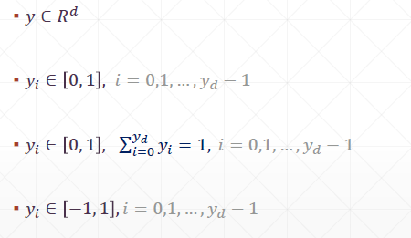
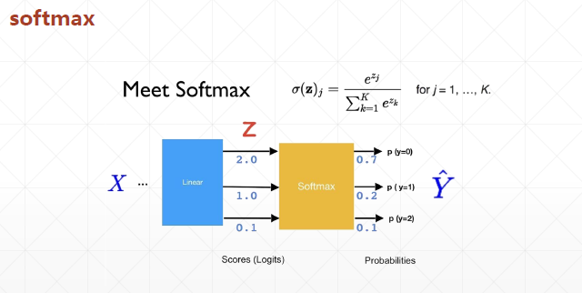
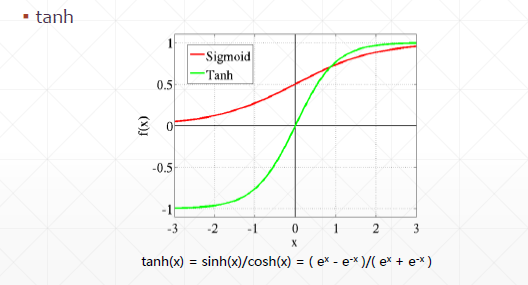

# Neural Network and Fully Connected Layer
## 23 the way of output



1. y belong to R^d
* linear regression
* naive classification with MSE
* other general prediction
* out = relu(X@W+b) -> logits
  
  
2. yi belong to [0,1]: sigmoid
* binary classification  
equal to 1 if y>0, else equal to 0  
* image generation
rgb, gen: 圖片重構  
out = relu(X@W+b)  
out' = sigmoid(out)   

```py
a = tf.linspace(-6,6,10)
tf.sigmoid(a)

x = tf.random.normal([1,28,28])*5
tf.reduce_min(x), tf.reduce_max(x)

x = tf.sigmoid(x)
tf.reduce_min(x), tf.reduce_max(x)
```

3. yi belong to [0,1], sum(yi)=1: softmax

```py
a = tf.linspace(-2.,2,5)
tf.sigmoid(a)
tf.nn.softmax(a)

```
  


```py
# practice: classification
logits = tf.random.uniform([1,10], minval=-2, maxval=2)
prob = tf.nn.softmax(logits, axis=1)
tf.reduce_sum(prob, axis=1)

```

4. yi belong to [-1,1]: tanh

```py
a
tf.tanh(a)
```

