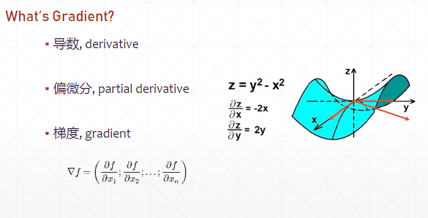

# Stochastic Gradient Descent (SGD)
## 25 Gradient Descent

* What's gradient
* What does it mean
* How to search
* AutoGrad

1. 


- 導數: limit x 趨近於某個數，某個數的變動率，由於常見接觸的是一維、二維的函數，沿著x軸的變動率，但實際上對於3,4維以上的變動，其導數可以任意方向變動。比如說對於這個馬鞍形狀的曲面，沿a方向有個導數, 沿b方向有個導數, 所以導數是個通用概念，函數沿著某個方向前進的變動範圍，這個範圍定義為導數。  
- 偏微分: 若是沿著某個方向走，此時得到一個導數，即偏微分。x分之z(z對x作偏微分) z沿著x軸的變動範圍，因為是沿著x的變動範圍，跟y沒有關係。  
- 梯度: 將所有方向的偏微分合起來，得到梯度這個向量。  

4. AutoGrad
with tf.gradientTape() as tape:   
- build computation graph  
- loss = f_thita(x)  
[w_grad] = tape.gradient(loss,[w])  


```py
# GradientTape
w = tf.constant(1.)
x = tf.constant(2.)
y = x*w

with tf.GradientTape() as tape:
    tape.watch([w])
    y2=x*w
grad1 = tape.gradient(y,[w])      #[None]

with tf.GradientTape() as tape:
    tape.watch([w])
    y2=x*w
grad2 = tape.gradient(y2,[w])     #numpy=2.0


# Persistent GradientTape
w = tf.constant(1.)
x = tf.constant(2.)
y = x*w

#
with tf.GradientTape() as tape:
    tape.watch([w])
    y2=x*w
grad2 = tape.gradient(y2,[w])    #numpy=2.0

#
grad2 = tape.gradient(y2,[w])    #non-persistent

#
with tf.GradientTape(persistent=True) as tape:
    tape.watch([w])
...

```

```py
# 2nd-order
with tf.GradientTape() as t1:
    with tf.GradientTape() as t2:
        y = x*w+b
    dy_dw, dy_db = t2.gradient(y,[w,b])
d2y_dw2 = t1.gradient(dy_dw, w)

```

2nd_derivative.py


