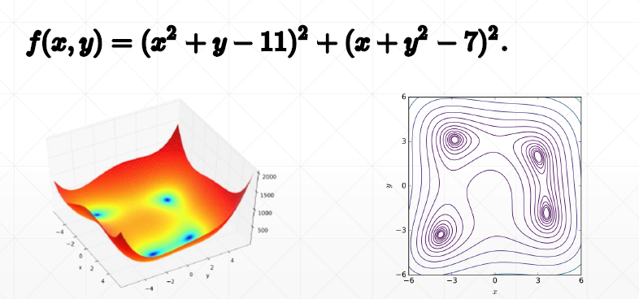
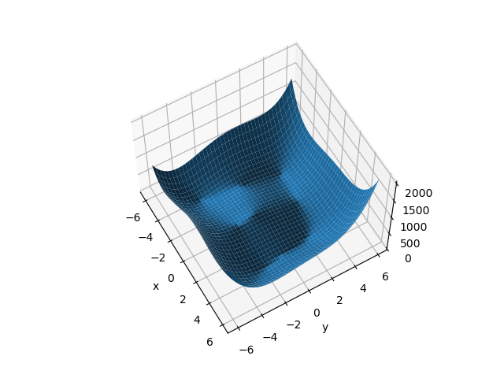
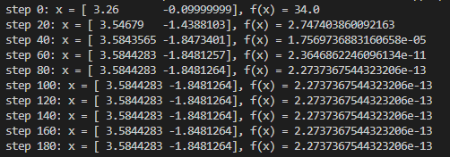

# Stochastic Gradient Descent (SGD)
## 70 Himmelblau function optimization

Himmelblau function: f(x,y)


```py
#1 plot
import numpy as np
import matplotlib.pyplot as plt

def himmelblau(x):
    return (x[0] ** 2 + x[1] - 11) ** 2 + (x[0] + x[1] ** 2 - 7) ** 2

x = np.arange(-6,6,0.1)
y = np.arange(-6,6,0.1)
print('x,y range:', x.shape, y.shape)  #x,y range: (120,) (120,)
X, Y = np.meshgrid(x,y)
print('X, Y maps:', X.shape, Y.shape)  #X,Y maps: (120, 120) (120, 120)
Z = himmelblau([X,Y])

fig = plt.figure('himmelblau')
ax = fig.gca(projection = '3d')
ax.plot_surface(X, Y, Z)
ax.view_init(60, -30)
ax.set_xlabel('x')
ax.set_ylabel('y')
plt.show()

```


```py
#2 Gradient Descent

# [1.,0.], [-4, 0.], [4, 0.]
x = tf.constant([-4., 0.])      #initial

for step in range(200):
    
    with tf.GradientTape() as tape:
        tape.watch([x])
        y = himmelblau(x)

    grads = tape.gradient(y, [x])[0] #derivate
    x -= 0.01 * grads

```

