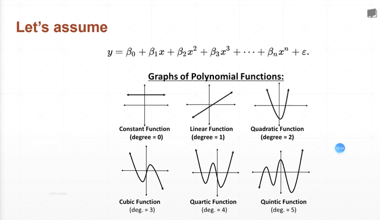
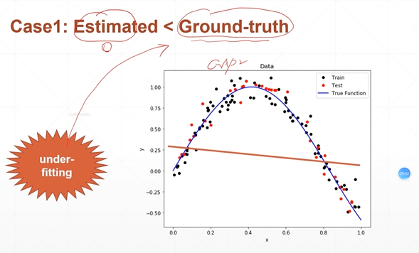
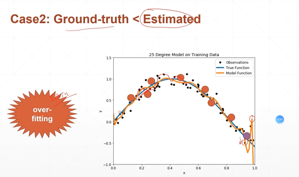
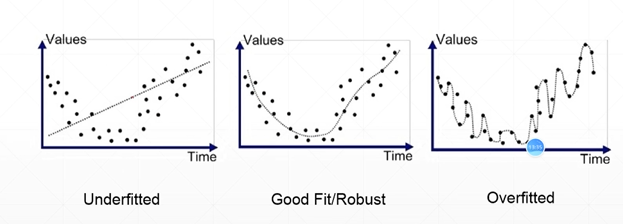

# Overfitting
## 33 Overfitting and underfitting

scenario1: house price  
scenario2: GPA  

**1. The ground-truth dustribution**  
- that's perfect if known  
- however... such as image recognition  

**2. another factor: noise**
- y = w*x + b + eps, eps~N(0.01,1)  

**3. Mismatch: ground-truth vs. estimated**  
- Model capacity: 模型的搜索空間  
- Revolution of depth: More layer more par, lead to enhencing the model capacity.   
1. AlexNet, 8 layers, ILSVRC2012  
2. VGG, 19 layers, ILSVRC2014  
3. ResNet, 152 layers, ILSVRC2015

## case1 underfitting  

* train acc. is bad  
* test acc. is bad as well  

## case2 overfitting  

* train loss and acc. is much better  
* test acc. is worse  
* => generalization performance is worse 泛化能力  

## How to detect/reduce overfitting?  
- cross validation
- regulization  
- early stipping- Dropout  

