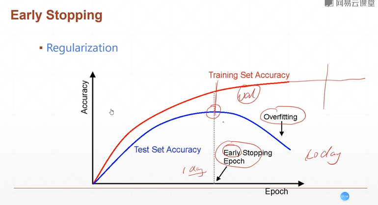
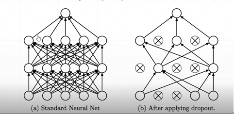
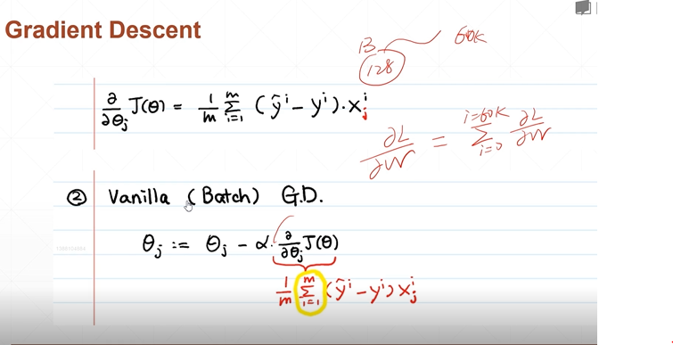
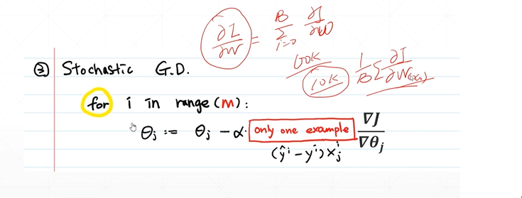

# Overfitting
## 37 Early stopping and Dropout

* early stopping
* dropout
* stochastic gradient descent

# 1. Early Stop


**how-to**
* Validation set to select parameters  
* Monitor validation performance  
* Stop at the highest val performance

# 2. Dropout  

* learning less to learn better  
* Each connection has p=[0, 1] to lose    


```py
network = Sequential([layers.Dense(256, activation='relu'),
                    layers.Dropout(0.5),  #0.5 rate to drop
                    layers.Dense(128, activation='relu'),
                    layers.Dropout(0.5),
                    layers.Dense(64, activation='relu'),
                    layers.Dense(32, activation='relu'),
                    layers.Dense(10)])
```

```py
# behavior between train amd test
for step, (x,y) in enumerate(db):
    with tf.GradientTape() as tape:
        # [b,28,28] => [b,784]
        x = tf.reshape(x, (-1, 28*28))
        # [b,784] => [b,10]
        out = network(x, training=True)
    
    #test
    out = network(x, training=False)

```

# 3. Stochastic Gradient Descent
* stochastic: not random, probability function
* Deterministic:   



Not single usually, set the batch = 16, 32, 64, 128. 


