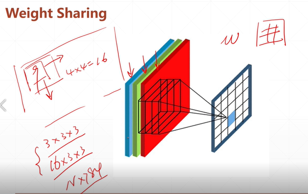
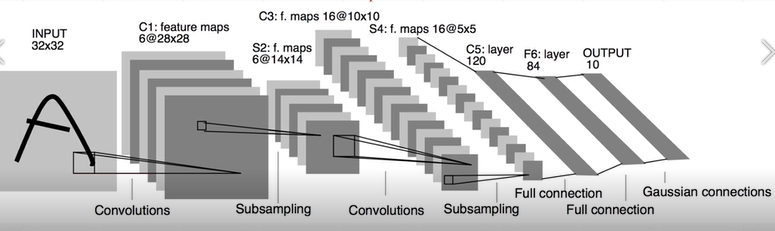
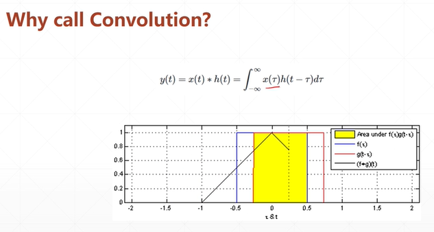

# Convolutional Neural Networks, CNN  
## 38 what?

Feature maps
why not linear? since fully connected: 內存占用, 耗費大量算力   
=> used CNN, receptive field, 只關注跟我局部相關的區域點  
such as partial connected, locally connected(weight sharing)  

  
  
下降了參數量, 局部相關、全局共享    
  
對應元素相乘, 後累加。  

   
信號與另個信號作鏡像偏值，作積分。
離散的卷積和  

Convolution in computer vision  
* sharpen 銳利  
* blur  
* edge detect
w=3*3滑動窗口，不斷地提起特徵，再以另個窗口提取特徵，可以得到另一種觀察方式，堆疊後，增加網絡的抽象能力。  

