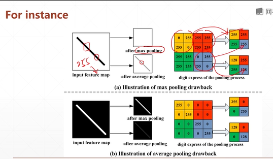
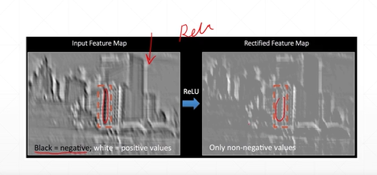

# Convolutional Neural Networks, CNN  
## 39 convolution and pooling  

* pooling 下採樣
* unsample 上採樣  
* ReLU  

# 1. Pooling  
   
subsampling: 將 28 * 28 的feature map，pooling到 14 * 14 的feature map。  
max/avg pooling: (stride=2)


```py
x                 #TensorShape([1,14,14,4])

pool = layers.MaxPool2D(2, strides=2)
out = pool(x)     #TensorShape([1,7,7,4])

pool = layers.MaxPool2D(3, strides=2)
out = pool(x)     #TensorShape([1,6,6,4])

out = tf.nn.max_pool2d(x, 2, strides=2, padding='VALID')   #TensorShape([1,7,7,4])

```
# 2. Upsampling
```py
# upsample: nearest, bilinear
# UpSampling2D: feature map的放大

x = tf.random.normal([1,7,7,4])
layer = layers.UpSampling2D(size=3)
out = layer(x)      #TensorShape([1,21,21,4])

layer = layers.UpSampling2D(size=2)
out = layer(x)      #TensorShape([1,14,14,4])

```

# 3. ReLU

  
```py

x = tf.random.normal([2,3])
tf.nn.relu(x)
layers.ReLU()(x)

```

