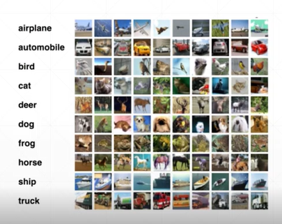
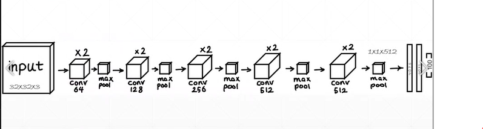
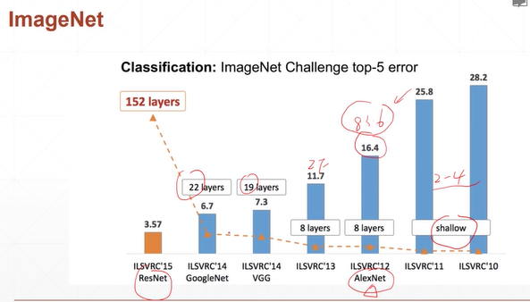
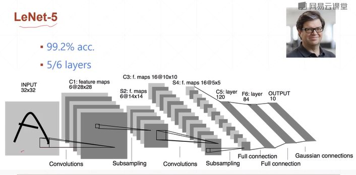
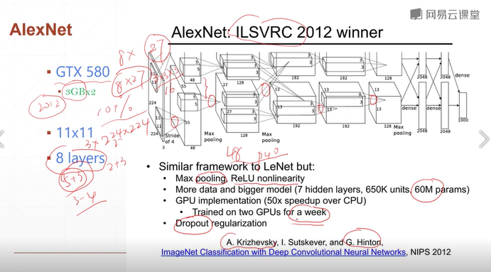

# Convolutional Neural Networks, CNN  
## 40 CIFAR100 and VGG13

# 1. CIFAR100  
* 32*32   
* 60k: 50k+10k  
  

**pipeline**
* Load datasets  
* Build network  
* Train  
* Test  

   
cifar100_train.py  
    
    
  
# 2. VGG13  

2010 shallow: ILSVRC10, ILSVRC11    
2012 8Layers: ILSVRC12- **AlexNet** :star: (準確率提升了10多個%)  
2013 8Layers: ILSVRC13-ZFNet (準確率再提升)  
2014 19Layers: ILSVRC14-VGG  
2014 22Layers: ILSVRC14- **GoogleNet** :star:    
    152Layers: ILSVRC15- **ResNet** :star:   

  

   
:trophy: the chapion of 2012Y  
dataset: imageNet, (224,224,3)  
GPU used, 2塊GTX, 3GB*2, 
(5+3) 5convolution, 更易提取image info., many pars      
with pooling layer and  
ReLU, dropout regularization, to prevent overfitting

