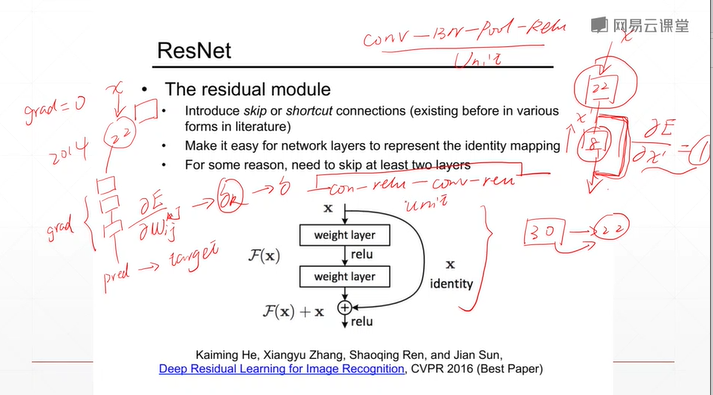
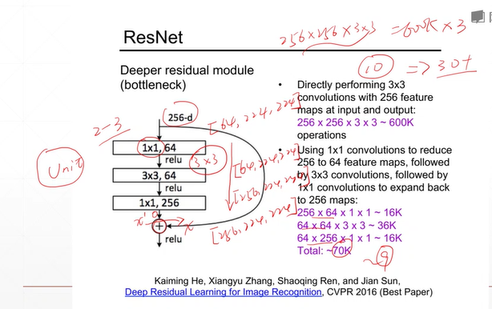
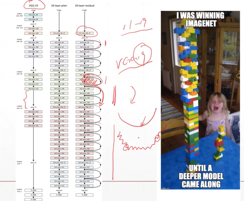
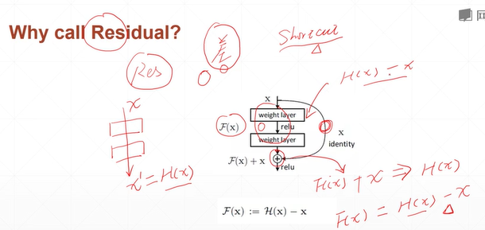
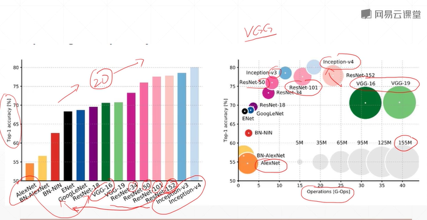
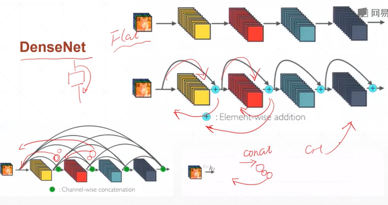

# Convolutional Neural Networks, CNN  
## 43 ResNet and DenseNet(深度殘差網路)  


# Introduction of ResNet   

   
   
- last unit: conv + batchnet + pooling + Relu  
unit here: conv(1,1,64) + relu + conv(3,3,64) + relu + conv(1,1,256) + shortcut  

   
- revolution of depth:  
AlexNet, 8 layers (ILSVRC 2012)  
VGG, 19 layers (ILSVRC 2014)  
ResNet, 152 layers (ILSVRC 2015)


- MSRA @ ILSVRC & COCO 2015 competitions  
imageNet classification, detection, localization  
COCO detection, segmentation   
  
- shortcut- why call residual?  



# The comparison of networks   
   
- AlexNet - VGG16(20 layers) - GoogleLeNet - ResNet(34, 50, 101, 152)  
VGG16: 以20層為分水嶺, 愈多層表現愈差。ResNet解決了這個問題，愈多層會愈來愈好。  
Inception: 為GoogleNet的加深版本  
- operation運算性能:  
better-ResNet, Inception. 👍  
worse- VGG(no small window 沒有用小卷積和技術, 參數計算量大。)

```py
# Basic block

class BasicBlock(layers.Layer):
    def __int__(self, filter_num, stride=1):
        super(BasicBlock, self).__int__()

        self.conv1 = layers.Conv2D(filter_num, (3,3), strides=stride, padding='same')  
        self.bn1 = layers.BaatchNormalization()
        self.relu = layers.Activation('relu')
        self.conv2 = layers.Conv2D(filter_num, (3,3), strides=1, padding='same')
        self.bn2 = layers.BatchNormalization()
        if stride != 1:
            self.downsample = Sequential()
            self.downsample.add(layers.Conv2D(filter_num, (1,1), strides=stride))
            self.downsample.add(layers.BatchNormalization())
        else:
            self.downsample = lambda x: x
        
        self.stride = stride
    
    def call(self, inputs, training=None):
        residual = self.downsample(inputs)

        conv1 = self.conv1(inputs)
        bn1 = self.bn1(conv1)
        relu1 = self.relu(bn1)
        conv2 = self.conv2(relu1)
        bn2 = self.bn2(conv2)

        add = layers.add([bn2, residual])
        out = self.relu(add)
        return out
        
```
```py
# Res block  
def _build_resblock(self, block, filter_num, blocks, stride=1):
    res_blocks = keras.Sequential()
    res_blocks.add(block(filter_num, stride))

    for _ in range(1, blocks):
        res_blocks.add(block(filter_num, stride=1))

    return res_blocks

```


中間的每一層都有可能與最開始的每一層有機會接觸，連接很密集。  
對前面訊息有總和，不是elementwise相加，而是concate操作，使得後方的channel越來越大。反之，使你的channnel不至於太大，這是從ResNet延伸而得的DenseNet。  


