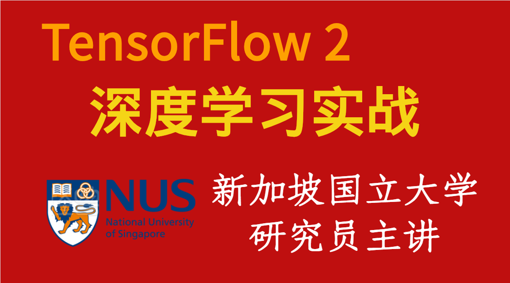

# 深度学习与TensorFlow2入门实战

视频教程链接：[深度学习与TensorFlow2入门实战](https://study.163.com/course/courseMain.htm?share=2&shareId=480000001847407&courseId=1209092816&_trace_c_p_k2_=10515f5942ba46b5a4ec1c30a46b0269)

01 深度學習初見  
03 回歸問題  
04 tf2 basic  
05 tf2 adv  
06 神經網絡與全連接層  
07 隨機梯度下降  
08 keras高層接口  
10 卷積神經網絡  
11 循環神經網絡  
12 autoencoders  
13 GAN  

