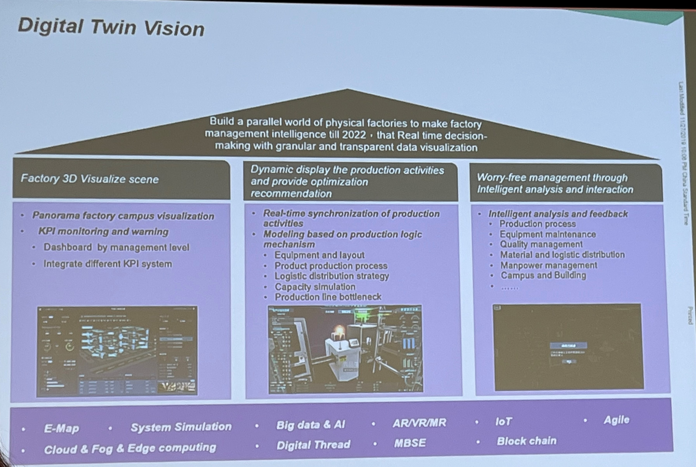
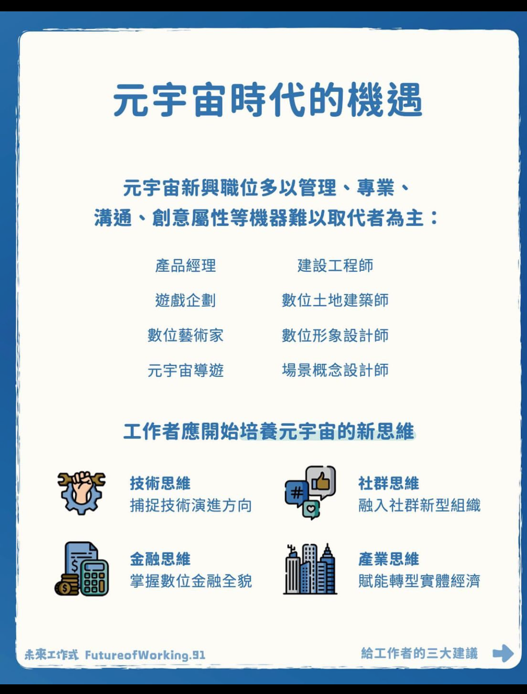

 

# <元宇宙大未來>
元宇宙在現實與數位間的技術，同時提供工作者應對的行動計劃。  
不是單一的數位空間，而是無數個數位空間的聚合體。

1. 數據成為核心資產  
    * 有價值的數位資產

2. 數位與實體經濟深度融合，實現全球普惠  
    * **數位孿生、3D建模**，將物理世界轉為數位模型; 透過**AR**，將數位元素融入物理世界  
    * 基於**區塊鏈**而無須第三方機構  
    * 給予年輕人、開發中國家新機遇  
   
    token成為連接數位與實體世界的資產，NFT利用區塊鏈發行，具備獨特、不可分割、權屬清晰、數量透明等特徵。  
    
3. 經濟社群與數位文化崛起，重塑自我形象和身分體系  
    * 每個人都是數位內容的創作和傳播者   

    區塊鏈可以確保數位身分的安全性，避免偽造冒用，有效保護隱私。  
    雖在元宇宙可獲得沉浸式的數位體驗，但社會生活的真實感受與體驗永遠不可或缺。  
  
  
## 元宇宙的演進  

|year_name| Term | Detail | topical business |
|---|----|:---|----|
|AD2000, WEB 1.0| 個人電腦互聯網 | 具有可讀性，用戶可以輕鬆獲得資訊，功能包括: 網路新聞、線上搜尋、電子郵件等。 | google, yahoo, 新浪, baitu |
|AD2010, WEB 2.0| 行動互聯網 | 具備可讀與可寫性，可深度參與內容創作與傳播，功能包括手機遊戲、網路直播、社群媒體等。 | facebook, airbnb, tiktok, 螞蟻金服 |
|AD2020, WEB 3.0| 元宇宙 | 具備可讀、可寫即可擁有性，用戶擁有數據集內容，未來區塊鏈、人工智慧、物聯網等技術帶動數位世界。 | 新型經濟組織，而非巨頭企業強行壟斷。 |

  
## 元宇宙的四大技術支柱  
1. **建構:** 形成數位空間並持續優化
    * 需要巨大的運算能力和數據儲存空間為基礎，運用雲端運算、邊緣運算等。  
    * 基礎設施高度分散，由無數個各自獨立但又相容連通的數位空間共同創作。 
    
    
2. **映射:** 雙向打通、疊加物理與數位空間  
    * 數位孿生: 在數位空間中創造複製體，從現實世界複製本體的即時狀態及外界環境。   
    * 3D 掃描：對物體的外型、結構及色彩進行掃描，轉換為數位空間的元素及訊號。   
    
   
3. **接入:** 用戶大規模穿梭數位與物理空間  
    * VR/AR：前者產生可互動的3D環境;後者將數位圖像資訊疊加在物理世界  
    * MR：修改物理世界的視覺效果，如看到肉眼無法直視的燒焊場景、血管位置等  
    
   
4. **應用:** 人機深度互動，創造新智慧經濟價值   
    * 區塊鏈：將元宇宙打造成去中心化、分散式商業、數位資產及社群制為核心的體系   
    * 人工智慧：打造出有形象、有身份、有故事、有情感和思想的數位人   

    
 

