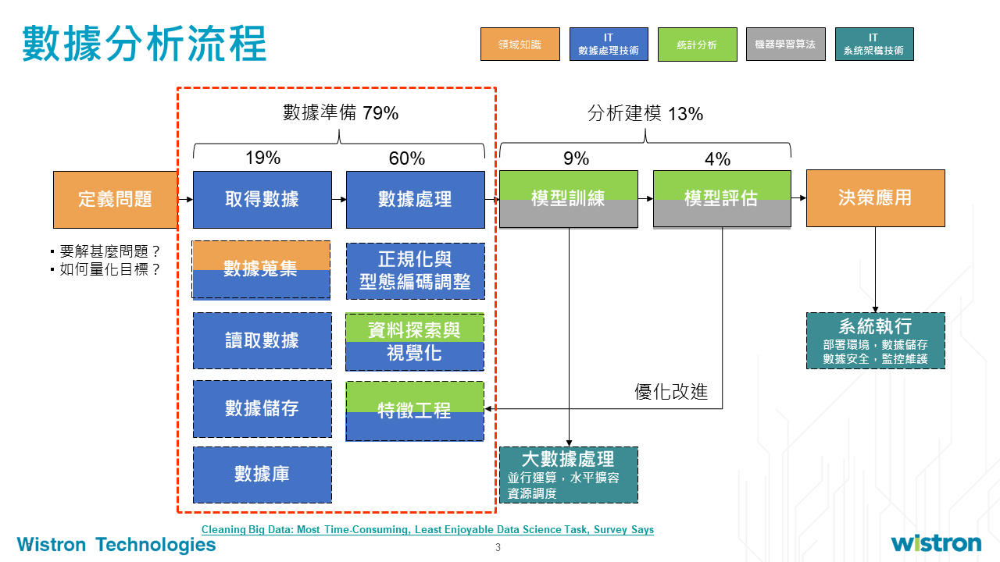

* 數據分析與應用  
* 如何與數據科學家合作 

# :cat: 數據分析與應用  

技能整合            |  AI應用
|:-------------------------:|:-------------------------:|
 | 

 

* **Business:** 業務、創新。以數據驅動的企業運營模式可分為: *描述型, 診斷型, 預測型, 決策型* 分析。

* **Data analysis:** 演算法，技術對於數據應用的推動: 數據分析、數據挖掘、大數據、人工智慧應用(BI: 數字; VISION: 圖片, video; NLP: 文字)  
* **Tech, infra:** 雲服務, 中台  
算力增強+儲存空間提升，促成演算法的開發與表現。

 

## 1. 業務定義  
業務問題轉成分析問題: 分類, 回歸, 聚類

## 2. 數據蒐集  
1) 數據標準: 相關性, 可靠性, 有效性  
2) 數據來源: 廠端提供, 系統數據, 機台數據  
3) 數據結構: 結構化資料(數值型, 時序型), 非結構化資料(圖像型, 文字型)  
	 
* 數據庫**儲存**
    * 關係型(SQL): Orecle, MySQL  
    * 非關係型(NoSQL): ES, MongoDB, Redis  
* 數據流**處理**: Nifi, Kafka  
* API接口  
* FTP  

## 3. 數據探索 
1) 探索性分析，如: 異常值分析, 缺失值分析, 相關分析, 週期性分析  
2) 清理數據: 特徵工程
## 4. 模型訓練  
1) 監督式學習, 非監督式學習, 增強學習  
2) 回歸, 分類, 聚類, 關聯  
:sweat_drops: 把模型包成API
## 5. 模型評價  
1) 混淆矩陣…  
2) 欠擬合Underfitting/過擬合Overfitting
## 6. 決策應用  
標準? 風險?  
風險成本矩陣  

# :cat: 如何與數據科學家合作  
 
**Translator:** ensuring business and tech alignment by translating between requirements and analytics/tech specs.  
**DS:** 採用科學方法、運用數據挖掘工具或高階分析技巧尋求新數據價值的開發人員。  
因應需求，在分析項目過程中，DS需要瞭解domain許多的專業知識，持續朝分析目標前進。  

 
有好的產品和業務感，轉成分析問題，再將分析結果轉成action。  

 
 
 
 

