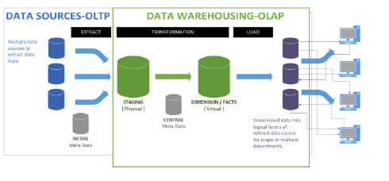

# Outline  

1. Concept  
1.1 技術實驗室: 心技體  
1.2 資料分析領域(Analytic Domain)  
2. 數據處理(Data processing)  
2.1 資料處理 ETL 與 ELT - Extract, Transform, Load   
3. 數據管理  
3.1 數據管理-ACID: Atomicity, Consistency, Isolation, Durability    
3.2 數據管理-OLTP, OLAP  
4. Some keywords  
分散式系統(Distributed computing)  
Hadoop, Spark  

# 1. Concept
## 1.1 技術實驗室: 心技體   

心: 數位轉型與資料分析  
* Simon 的數位轉型雙飛輪  

技: Process session  
* 資料分析的架構與積木  
* 資料處理(Data processing) ETL與ELT
* OLTP與OLAP  
* 資料結構是資料處理(Data processing) 的基石  
* 巨量資料與分散式系統 

體: Pandas 實作基礎
* Python 基本語法  
* Python 基本運算概念  
* Pandas 介詔與使用  
* Pandas IO 介詔與使用  
* Pandas 讀入與導出  

 

## 1.2 資料分析領域(Analytic Domain)
Analytics blocks有非常多的樣貌，可以根據相似的分析特質來區分為不同的資料分析領域(Analytic domain)以便簡化構建與運維的設計。
1. Information Portal 
2. Analytics Workbench 
3. Data Science Laboratory 
4. Artificial Intelligence Hub

 

在不同的分析情境(Analytic moments)，通常會使用來自不同分析領域(Analytic domain)的不同類型的輸出。  
  

# 2. 數據處理  
## 2.1 資料處理 (Data processing) ETL 與 ELT  

ETL是擷取(Extract)、轉換(transform)和載入 (load)的英文縮寫  
* **Extract擷取:** 從一或多個擷取資料的過程，擷取後，資料將載入暫存區中。
* **Transform轉換:** 需要先獲取與清理資料，並將其轉換為通用格式，以便儲存在目標資料庫、資料儲存庫、資料倉儲或資料湖泊中。清除通常需要取出重複、不完整或明顯錯誤的記錄。
    * Cleaning
    * Filtering
    * Joining
    * Sorting
    * Splitting
    * Deduplication
    * Summarization

* **Load載入:** 將格式化後的資料插入目標資料庫 、資料倉儲等。

# 3. 數據管理  
## 3.1 數據管理-ACID  
ACID 是指資料庫管理系統(DBMS）在寫入或更新資料的過程中，為保證事務（transaction）是正確可靠的，必須具備四個特性: 
1. **原子性 Atomicity** ，或稱不可分割性、不可約簡: 一個事務（transaction）中的所有操作，全部完成或全部不完成，不會結束在中間某個環節。若事務在執行過程中發生錯誤，會被回滾(Rollback）到事務開始前的狀態，就像這個事務從來沒有執行過一樣。  
2. **一致性 Consistency** : 在事務開始前和事務結束後，資料庫的完整性沒有被破壞。這表示寫入的資料必須完全符合所有的預設約束、觸發器、級聯回滾等。  
3. **隔離性 Isolation**，又稱獨立性: 資料庫允許多個並發事務同時對其數據進行讀寫和修改的能力，隔離性可以防止多個事務並發執行時，由於交叉執行而導致數據不一致。  
4. **持久性 Durability**: 事務處理結束後，對數據的修改是永久的，即便系統故障也不會丟失。  

## 3.2 數據管理-OLTP vs OLAP  
兩者皆表示為 **數據管理**，其目標與應用情境不一樣，所以兩者的資料儲存結構與運算負載不一樣。  
OLTP 重視數據處理以及一致性，OLAP重視數據分析。先以OLTP系統 確保數據一致性，再用OLAP做報表或商業智慧分析等應用。      

1. **OLTP (Online Transactional Processing)** 是指系統能處理大量更新以及新增的查詢，Transactional表示處理資料時包含讀、寫。  
OLTP: 遵循著ACID(Atomicity, Consistent, Isolated, Durable)，一個事務(Transaction)完成後才會執行下一筆，確保整個系統的*資料一致性*。ex. 銀行系統  

2. **OLAP (Online Analytical Processing)**: 用來做歷史資料的分析以及報告，通常需要做很多的數據聚合(data aggregation)以及批次處理(Batch processing)。ex. BI系統、報告工具  

  

# 4. Some keywords  
Hadoop, Spark
* 2008.04 *hadoop*成為最快的TB及數據排序系統，通過一個910節點的群集，在209秒內完成對1TB數據的排序。    
* 2014.11 *Spark*擊敗Hadoop，Spark不到30mins完成排序100TB的資料量，打破hadoop保有72min的世界紀錄。  

## 分散式系統(Distributed computing)  
* 由一組電腦，透過網路相互連接傳遞訊息與通訊後，並協調他們的行為而形成的系統。  
* 組件間彼此互動，把需要進行大量計算的工程資料分割成小塊，由多台電腦分別計算，再上傳運算結果後，將結果統一合併得出資料結論。

**分散式系統的大分類:**   
1. 分散式計算，例如: Spark, Flink , Impala, Presto
2. 分散式儲存，例如:   
分散式的檔案系統 HDFS, S3, Minio, Google File System, ..etc  
分散式的資料庫 Redis, Cassandra, Elasticsearch, MongoDB...  
3. 分散式控制
4. 分散式服務

### 分散式儲存: HDFS, S3, Minio, Google File System, etc  
  

**Hadoop Compatible File Systems:**     
Aliyun OSS  
Amazon S3  
Azure Blob Storage  
Azure Data Lake Storage  
Openstack swift Tencent COS  

### 分散式計算引擎: Hadoop MapReduce, Spark RDD, Flink, Impala, Presto ..  
雲端運算的關鍵技術是*MapReduce*，最早是由Google 2004年提出的paper，後來也運用在開源的雲端技術Hadoop中。

和傳統開發模式相比，  
開發人員需要先分析問題的解決流程，找出可利用 平行運算 的資料部分，也就是那些能夠被切成小段分開來處理的資料，再針對這些資料寫成*Map程式*。

.            |  .
|:-------------------------:|:-------------------------:|
  |  
