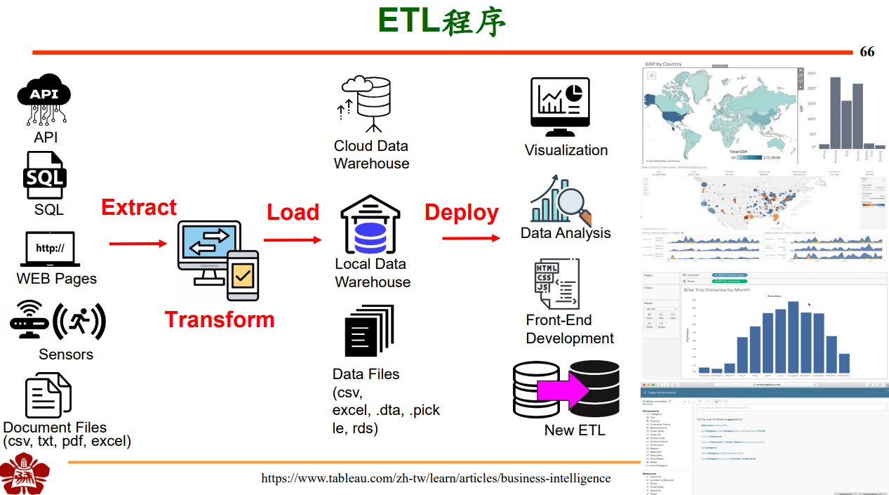

# :hamster: Outline of Data processing_DnA  

1. Concept  
1.1 技術實驗室: 心技體  
1.2 資料分析領域(Analytic Domain)  
2. 數據處理(Data processing)  
2.1 資料處理 ETL 與 ELT - Extract, Transform, Load   
3. 數據管理  
3.1 數據管理-ACID: Atomicity, Consistency, Isolation, Durability    
3.2 數據管理-OLTP, OLAP  
4. Some keywords  
分散式系統(Distributed computing)  
Hadoop, Spark  

# :hamster: Outline of SQL_tutorial_20220414
1. 資料儲存 Database    
1.1 SQL  
1.2 NoSQL 
2. ACID and structure  
2.1 目的: 為了確保寫進資料庫準確  
2.2 DB structure and SQL Process  
3. Join  
4. Types of SQL statements - DDL & DML 
5. SQL API  
5.1 Pymysql (-> MySQL, MariaDB) SQL_ex.py    
5.2 ORM: SQL Alchemy  

# :hamster: Outline of SQL_coursera
1. What, Why, Brief history   
1.1 What is SQL  
1.2 Why SQL  
1.3 A brief history of SQL   
1.4 SQL Process: Rational database management system  
2. ACID & JOIN  
2.1 ACID  
2.2 Join  
2.2.1 Inner join  
2.2.2 Outer join  
3. Databases and SQL for data science with python  
3.1 Basic SQL Commands  
3.2 Retrieving rows from a table  
3.3 Types of SQL statements - DDL & DML  
3.4 Scalar and String Functions   
3.5 Date and Time Functions  
3.6 Sub-queries and Nested SELECTs  
3.7 Working with Multiple Tables  
3.8 Accessing Multiple Tables with Sub-Queries  
3.9 Accessing Multiple Tables with Implicit Joins  
4. SQL API  
4.1 Benefits of python for database programming  
4.2 What's a SQL API?  
4.2.1 APIs used by popular SQL-based DBMS systems  
4.2.2 Examples of libraries used by database systems to connect to Python applications   
4.3 Concepts of the python DB API  
4.3.1 Connection & cursor objects  
4.3.2 Identify database connection credentials  
4.3.3 Create database connection  
4.3.4 Close the database connection  
4.4 Creating tables, loading data and querying data  
4.4.1 python code to create a table  
4.4.2 python code to insert data into a table  
4.4.3 Insert more rows to the table  
4.4.4 python code to query data  
4.4.5 using pandas  
5. Summary & Highlights  

