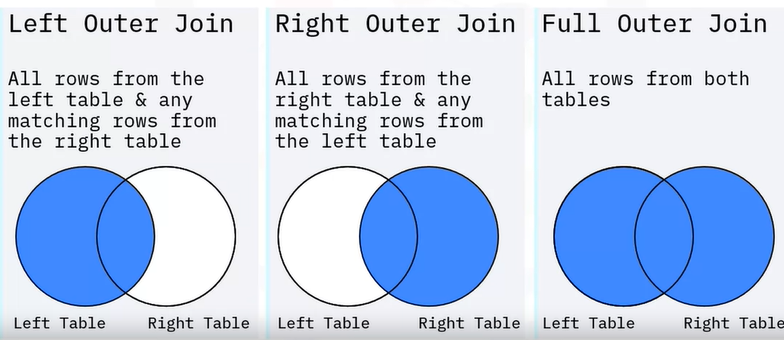
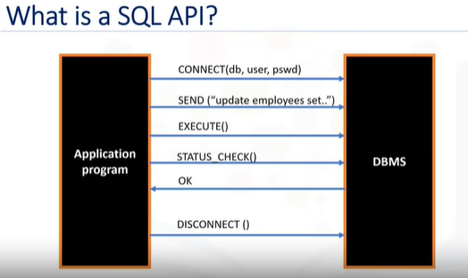

## :baby_chick:**Outline** 

1. What, Why, Brief history   
1.1 What is SQL  
1.2 Why SQL  
1.3 A brief history of SQL   
1.4 SQL Process: Rational database management system  
2. ACID & JOIN  
2.1 ACID  
2.2 Join  
2.2.1 Inner join  
2.2.2 Outer join  
3. Databases and SQL for data science with python  
3.1 Basic SQL Commands  
3.2 Retrieving rows from a table  
3.3 Types of SQL statements - DDL & DML  
3.4 Scalar and String Functions   
3.5 Date and Time Functions  
3.6 Sub-queries and Nested SELECTs  
3.7 Working with Multiple Tables  
3.8 Accessing Multiple Tables with Sub-Queries  
3.9 Accessing Multiple Tables with Implicit Joins  
4. SQL API  
4.1 Benefits of python for database programming  
4.2 What's a SQL API?  
4.2.1 APIs used by popular SQL-based DBMS systems  
4.2.2 Examples of libraries used by database systems to connect to Python applications   
4.3 Concepts of the python DB API  
4.3.1 Connection & cursor objects  
4.3.2 Identify database connection credentials  
4.3.3 Create database connection  
4.3.4 Close the database connection  
4.4 Creating tables, loading data and querying data  
4.4.1 python code to create a table  
4.4.2 python code to insert data into a table  
4.4.3 Insert more rows to the table  
4.4.4 python code to query data  
4.4.5 using pandas  
5. Summary & Highlights  


# 1. What, Why, Brief history  

## 1.1 What is SQL  

SQL is ANSI (American National Standards Institute) standard language  
To operate database, ex. Creation, deletion, fetching rows, modifying rows, etc.  

SQL is Structured Qurey Language, which is a computer language for storing, manipulating and retriving data stored in a relational database.  

SQL is the standard language for Relational Database System (RDBMS) like MySQL, MS Access, Oracle, Sybase, Informix, Postgres and SQL Server use SQL as their standard database language.  

 

## 1.2 Why SQL

SQL is widely popular because it offers the following advantages  
Allows users to: 

* access data in the relational database management systems  
* describe the data  
* define the data in a database and manipulate that data  
* embed within other languages using SQL modules, libraris & pre-compilers  
* create and drop databases and tables  
* create view, stored procedure, functions in a database  
* set permissions on tables, procedures and views  

## 1.3 A brief history of SQL

**1970** — Dr. Edgar F. "Ted" Codd of IBM IS known as the father of relational databases. He described a relational model for databases.   
**1974** — Structured Query Language appeared.   
**1978** — IBM worked to develop Codd's ideas and released a product named System/R.   
**1986** — IBM developed the first prototype of relational database and standardized by ANSI. The first relational database was released by Relational Software which later came to be known as Oracle.   

## 1.4 SQL Process: Rational database management system  
 


# 2.

## 2.1 ACID  
* Views are a **dynamic mechanism** for presenting data from one or more tables. A **transaction** represents a complete unit of work, which can be one or more SQL statements.  
* An **ACID transaction** is one where all the SQL statements must complete successfully, or none at all.  

    * **Atomic:** All changes must be performed successfully or not at all.  
    * **Consistent:** Data must be in a consistent state before and after the transaction.  
    * **Isolated:** No other process can change the data while the transaction is running.  
    * **Durable:** The changes made by the transation must persist.  

* A stored procedure is a set of SQL statements that are stored and executed on the database server, allowing you to send one statement as an alternative to sending multiple statements.  
* You can write **stored procedures** in many different languages like SQL PL, PL/SQL, Java, and C.  
    * BEGIN: Start the ACID transaction  
    * COMMIT: 
        - All statements complete successfully  
        - Save the new database state  
    * ROLLBACK: 
        - One or more statements fail  
        - Undo changes  

## 2.2 Join

* A **join** combines the rows from two or more tables based on a relationship between certain columns in these tables. To combine data from three or more different tables, you simply add new joins to the SQL statement.  
* There are two types of table joins: inner join and outer join; and three types of outer joins: left outer join, right outer join, and full outer join.  
* The most common type of join is the inner join, which matches the results from two tables and returns only the rows that match.
* You can **use an alias as shorthand** for a table or column name.  
* You can use a **self-join** to compare rows within the same table.  
	
## Types of joins  
* Inner Join  
* Outer Join  
    * Left outer join  
    * Right outer join  
    * Full outer join  

## 2.2.1 Inner join  
 

* Inner joins return only rows from joined tables that have a matching value in a common column.  
* ROWS that do not have a matching value do not appear in the result  

```SQL
SELECT B.BORROWER_ID, B.LASTNAME, B.COUNTRY, 
	L.BORROWER_ID, L.LOAN_DATE 
FROM BORROWER B INNER JOIN LOAN L 
	ON B.BORROWER_ID = L.BORROWER_ID 
```
## 2.2.2 Outer join 
 

```SQL
SELECT B.BORROWER_ID, B.LASTNAME, B.COUNTRY, 
	L.BORROWER_ID, L.LOAN_DATE 
FROM BORROWER B LEFT JOIN LOAN L 
	ON B.BORROWER_ID = L.BORROWER_ID 

SELECT B.BORROWER_ID, LASTNAME, B.COUNTRY, 
	L.BORROWER_ID, L.LOAN_DATE 
FROM BORROWER B RIGHT JOIN LOAN L 
	ON B.BORROWER_ID = L.BORROWER_ID 

SELECT B.BORROWER_ID, B.LASTNAME , B.COUNTRY, 
	L.BORROWER_ID, L.LOAN_DATE 
FROM BORROWER B FULL JOIN LOAN L 
    ON B.BORROWER_ID = L.BORROWER_ID 
```

# 3. Databases and SQL for data science with python

## 3.1 Basic SQL Commands  
* Create a table  
* Insert  
* Select  
* Update  
* Delete  

## 3.2 Retrieving rows from a table
* You can use *Data Manipulation Language (DML)* statements to read and modify data.  
* The search condition of the **WHERE** clause uses a predicate to refine the search.​  
* **COUNT, DISTINCT, and LIMIT​** are expressions that are used with SELECT statements​.  
* **INSERT, UPDATE, and DELETE** are DML statements for populating and changing tables.  

```SQL
SELECT * FROM <tablename>
SELECT <column 1>, <column 2>  FROM <tablename>
SELECT <column 1>, <column 2>  FROM <tablename>
WHERE <column 3> = 'B1'

SELECT COUNT(*) FROM FilmLocations;
SELECT COUNT(Locations) FROM FilmLocations 
WHERE Writer="James Cameron";

SELECT DISTINCT Title FROM FilmLocations;
SELECT COUNT(DISTINCT ReleaseYear) FROM FilmLocations 
WHERE ProductionCompany="Warner Bros. Pictures";

SELECT * FROM FilmLocations LIMIT 25;

INSERT INTO table_name (column1, column2, ... )
VALUES (value1, value2, ... );
UPDATE table_name SET column1 = value1, column2 = value2, ...
WHERE condition;
DELETE FROM table_name WHERE condition;

```

## 3.3 Types of SQL statements - DDL & DML  
**DDL(data definition language):** define, change, or drop data  
Ex. CREATE, ALTER, TRUNCATE, DROP  
**DML(data manipulation language):** 
1. read and modify data,     
2. CRUD operations (Create, Read, Update, Delete rows)  
Ex. INSERT, SELECT, UPDATE, DELETE  


```SQL

# DDL

CREATE TABLE table_name (
    column1 datatype,
    column2 datatype,
    column3 datatype,
   ....
);

ALTER TABLE table_name
ADD COLUMN column_name data_type column_constraint;
ALTER TABLE table_name
DROP COLUMN column_name;
ALTER TABLE table_name
ALTER COLUMN column_name SET DATA TYPE data_type;
ALTER TABLE table_name
RENAME COLUMN current_column_name TO new_column_name;

TRUNCATE TABLE table_name;
DROP TABLE table_name;

```


```SQL  
SELECT *
FROM EMPLOYEES
WHERE (SALARY BETWEEN 60000 AND 70000) AND DEP_ID = 5;

SELECT F_NAME, L_NAME, DEP_ID 
FROM EMPLOYEES
ORDER BY DEP_ID;

SELECT F_NAME, L_NAME, DEP_ID 
FROM EMPLOYEES
ORDER BY DEP_ID DESC, L_NAME DESC;

SELECT D.DEP_NAME , E.F_NAME, E.L_NAME
FROM EMPLOYEES as E, DEPARTMENTS as D
WHERE E.DEP_ID = D.DEPT_ID_DEP
ORDER BY D.DEP_NAME, E.L_NAME DESC;

SELECT DEP_ID, COUNT(*)
FROM EMPLOYEES
GROUP BY DEP_ID;

SELECT DEP_ID, COUNT(*), AVG(SALARY)
FROM EMPLOYEES
GROUP BY DEP_ID;

SELECT DEP_ID, COUNT(*) AS "NUM_EMPLOYEES", AVG(SALARY) AS "AVG_SALARY"
FROM EMPLOYEES
GROUP BY DEP_ID
ORDER BY AVG_SALARY;

SELECT DEP_ID, COUNT(*) AS "NUM_EMPLOYEES", AVG(SALARY) AS "AVG_SALARY"
FROM EMPLOYEES
GROUP BY DEP_ID
HAVING count(*) < 4
ORDER BY AVG_SALARY;
```
  
## 3.3 Aggregate Functions  

```SQL
select SUM(COST) from PETRESCUE;
select SUM(COST) AS SUM_OF_COST from PETRESCUE;
select MAX(QUANTITY) from PETRESCUE;
select AVG(COST) from PETRESCUE
select AVG( COST / QUANTITY ) from PETRESCUE where ANIMAL = 'Dog';
```

## 3.4 Scalar and String Functions  

```SQL
select ROUND(COST) from PETRESCUE;
select LENGTH(ANIMAL) from PETRESCUE;
select UCASE(ANIMAL) from PETRESCUE;
select DISTINCT(UCASE(ANIMAL)) from PETRESCUE;
select * from PETRESCUE where LCASE(ANIMAL) = 'cat';
```

## 3.5 Date and Time Functions  
 
```SQL
select DAY(RESCUEDATE) from PETRESCUE where ANIMAL = 'Cat';
select SUM(QUANTITY) from PETRESCUE where MONTH(RESCUEDATE)='05';
select SUM(QUANTITY) from PETRESCUE where DAY(RESCUEDATE)='14';
select (RESCUEDATE + 3 DAYS) from PETRESCUE;
select (CURRENT DATE - RESCUEDATE) from PETRESCUE;
```

## 3.6 Sub-queries and Nested SELECTs
* How to use sub-queries in the: 
    * WHERE clause 
    * list of columns 
    * FROM clause 

```SQL
select * 
from employees 
where salary < AVG(salary);
select EMP_ID, F_NAME, L_NAME, SALARY 
from employees 
where SALARY < (select AVG(SALARY) 
                from employees);
select EMP_ID, SALARY, MAX(SALARY) AS MAX_SALARY 
from employees; 
select EMP_ID, SALARY, 
( select MAX(SALARY) from employees ) AS MAX_SALARY 
from employees;
select *
from ( select EMP_ID, F_NAME, L_NAME, DEP_ID from employees) AS EMP4ALL;
```

## 3.7 Working with Multiple Tables
```SQL  
SELECT column_name(s)
FROM table1, table2;
SELECT column_name(s)
FROM table1, table2
WHERE table1.column_name = table2.column_name;
```

## 3.8 Accessing Multiple Tables with Sub-Queries  
```SQL 
select * 
from employees 
where JOB_ID IN 
	(select JOB_IDENT from jobs);

select * 
from employees 
where JOB_ID IN 
	(select JOB_IDENT from jobs where JOB_TITLE= 'Jr. Designer');
select JOB_TITLE, MIN_SALARY,MAX_SALARY,JOB_IDENT 
from jobs 
where JOB_IDENT IN 
	(select JOB_ID from employees where SALARY > 70000 );
select JOB_TITLE, MIN_SALARY,MAX_SALARY,JOB_IDENT 
from jobs 
where JOB_IDENT IN 
	(select JOB_ID from employees where YEAR(B_DATE)>1976 );
select JOB_TITLE, MIN_SALARY,MAX_SALARY,JOB_IDENT
from jobs 
where JOB_IDENT IN 
	(select JOB_ID from employees where YEAR(B_DATE)>1976 and SEX='F' );
```

## 3.9 Accessing Multiple Tables with Implicit Joins  
Ways to access multiple tables in the same query: 
1. Sub-queries   
2. Implicit JOIN   
3. JOIN operators (INNER JOIN, OUTER JOIN, etc.)   

```SQL  
select * 
from employees, jobs;
select * 
from employees, jobs 
where employees.JOB_ID = jobs.JOB_IDENT;
select * 
from employees E, jobs J 
where E.JOB_ID = J.JOB_IDENT;
select EMP_ID,F_NAME,L_NAME, JOB_TITLE 
from employees E, jobs J 
where E.JOB_ID = J.JOB_IDENT;
select E.EMP_ID,E.F_NAME,E.L_NAME, J.JOB_TITLE 
from employees E, jobs J 
where E.JOB_ID = J.JOB_IDENT;
```

  
# 4. SQL API  

## 4.1 Benefits of python for database programming 
* Python ecosystem : NumPy, pandas, matplotlib, SciPy 
* Ease of use 
* Portable 
* Python supports relational database systems 
* Python Database API (DB-API) 
* Detailed documentation

## 4.2 
  

## 4.2.1 APIs used by popular SQL-based DBMS systems  
| Application or Database | SQL API |
| :------------ |:---------------|
| MySQL | MySQL C API |
| PostgreSQL | psycopg2  |
| IBM DB2 |  ibm_db  |
| SQL Server | dblib API |
| Database access for Microsoft Windows OS |ODBC |
| Oracle | OCI |  
| Java | JDBC |

## 4.2.2 Examples of libraries used by database systems to connect to Python applications  
| Database | DB API |
| :------------ |:---------------|
| IBM DB2 | ibm_db  |
| Compose for MySQL | MySQL Connector/Python |
| Compose for PostgreSQL | psycopg2 |
| Compose for MongoDB | PyMongo |

## 4.3 Concepts of the python DB API  
  

## 4.3.1 Connection & cursor objects    
* Connection objects  
    * Database connections
	* Manage transactions

**What are connection method?**  
.cursor()   
.commit()   
.rollback()   
.close()   
  


* Cursor objects
    * Database queries
	* Scroll through result set
	* Retrieve results
  
**What are cursor methods?**  
.callproc()   
.execute()   
.executemany()   
.fetchone()  
.fetchmany()  
.fetchall()  
.nextset()  
.arraysize()  
.close()

```SQL
from dbmodule importconnect 

# Create connection Object 
Connection = connect('databasename', 'username', 'pswd') 

# Create a cursor Object 
Cursor = connection.cursor() 

# Run Queries 
Cursor.execute('select from mytable') 
Results = cursor.fetchall() 

# Free resources 
Cursor.close() 
Connection.close()
```
## 4.3.2 Identify database connection credentials
```SQL
dsn_driver = "{IBM DB2 ODBC DRIVER}" 
dsn database = "BLUDB"  
dsn_hostname = "YourDb2Hostname"   
# e.g. " dashdb-txn-sbox -yp-daI09-04. services.dal.bluemix.net"   
dsn_port = "50000" 
dsn_protocol = "TCPIP" 
dsn_uid = "*********"
dsn_pwd = "*********"
```

## 4.3.3 Create database connection  
```SQL  
dsn = (
    "DRIVER = {{IBM DB2 ODBC DRIVER}};"
    "DATABASE = {0};"  
    "HOSTNAME = {1};"
    "PORT = {2};"
    "PROTOCOL = TCPIP;"
    "UID = {3};"
    "PWD = {4};").format(dsn_database, dsn_hostname, dsn_port, dsn_uid, dsn_pwd)

try:  
    conn = ibm_db.connect(dsn, "", "")
    print ("Connected!")

except:
    print ("Unable to connect to database")

```

## 4.3.4 Close the database connection  
```SQL
ibm_db.close(conn)  
```

## 4.4 Creating tables, loading data and querying data  

ibm_db.exec_immediate() 
The parameters for the function are: 
* Connection 
* Statement 
* Options 

## 4.4.1 python code to create a table  
```SQL
stmt = ibm_db.exec_immediate(conn, 
"CREATE TABLE Trucks( 
serial_no varchar(20) PRIMARY KEY NOT NULL, 
model VARCHAR(20) NOT NULL, 
manufacturer VARCHAR(20) NOT NULL, 
Engine_size VARCHAR(20) NOT NULL, 
Truck_C1ass VARCHAR(20) NOT NULL) "
```

## 4.4.2 python code to insert data into a table  
```SQL
stmt = ibm_db.exec_immediate(conn, 
"INSERT INTO Trucks ( serial_no, model, manufacturer, Engine_size, Truck_Class) 
VALUES( 'A1234','Lonestar','International Trucks', 'Cummins ISX15', 'Class 8') ;") 
```

## 4.4.3 Insert more rows to the table
```SQL
stmt = ibm_db.exec_immediate(conn, 
"INSERT INTO Trucks ( serial_no, model, manufacturer, Engine_size, Truck_Class)  
VALUES( 'B5432','Volvo VN','Volvo Trucks','Volvo Dll','Heavy Duty Class 8');")


stmt = ibm_db.exec_immediate(conn, 
" INSERT INTO Trucks(serial_no, model, manufacturer,  Engine_size, Truck_C1ass) 
VALUES( 'C5674', 'Kenworth W900', 'Kenworth Truck Co', 'Caterpillar C9', 'Class 8');")   
```

## 4.4.4 python code to query data
  


## 4.4.5 using pandas
  


# 5. Summary & Highlights  

Congratulations! You have completed this lesson. At this point in the course, you know: 
* You can access a database from a language like Python by using the appropriate API. Examples include ibm_db API for DB2, psycopg2 for ProstgreSQl, and dblib API for SQL Server. 
* DB-API is Python's standard API for accessing relational databases. It allows you to write a single program that works with multiple kinds of relational databases instead of writing a separate program for each one. 
* The D8_APl connect constructor creates a connection to the database and returns a Connection Object, which is then used by the various connection methods. 
* The connection methods are: 
    * The **cursor()** method, which returns a new cursor object using the connection.  
    * The **commit()** method, which is used to commit any pending transaction to the database.  
    * The **rollback()** method, which causes the database to roll-back to the start of any pending transaction.  
    * The **closet()** method, which is used to close a database connection. 
* You can use SQL Magic commands to execute queries more easily from Jupyter Notebooks. 
    * Magic commands have the general format **%sql select * from tablename**. 
    * **Cell magics** start with a double %% (percent) sign and apply to the entire cell. 
    * **Line magics** start with a single % (percent) sign and apply to a particular line in a cell.  


