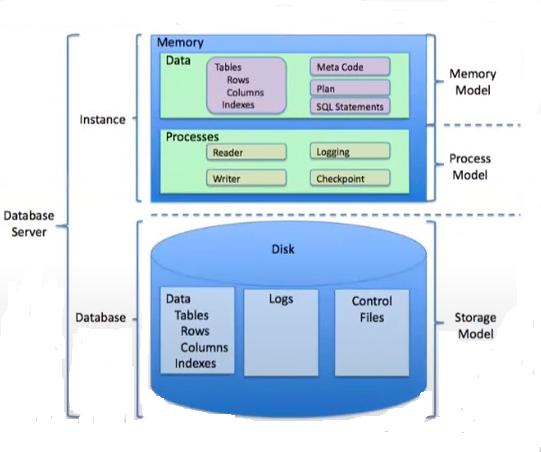
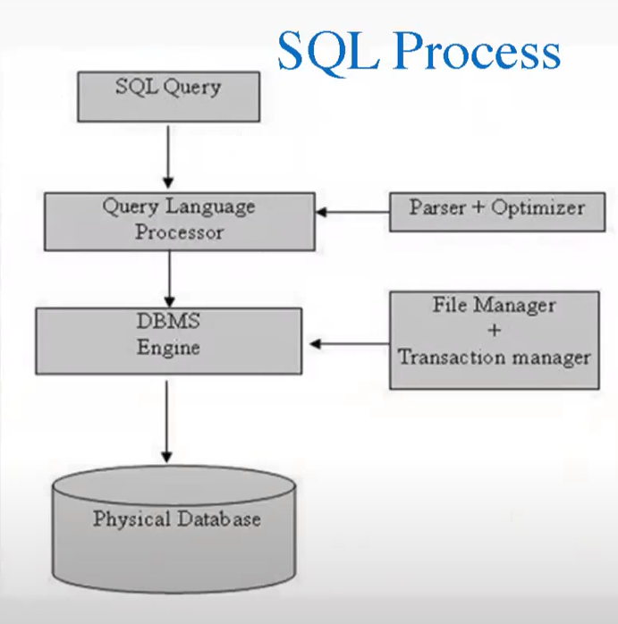
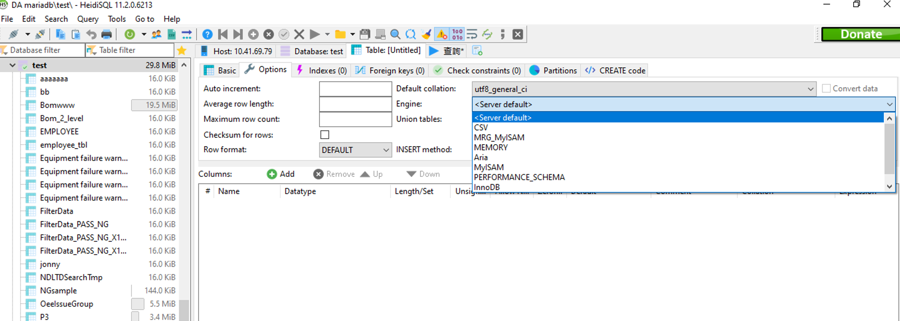
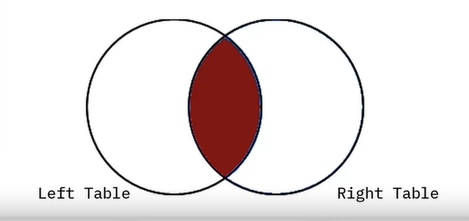
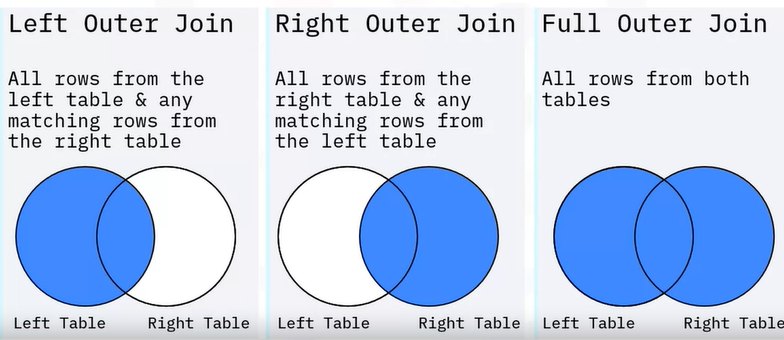
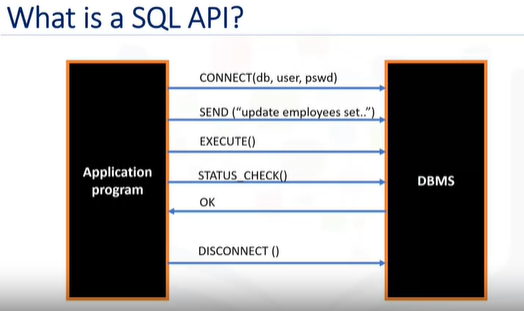

## Recall DAbasic_coursera: 數據蒐集    
1) 數據標準: 相關性, 可靠性, 有效性  
2) 數據來源: 廠端提供, 系統數據, 機台數據  
3) 數據結構: 結構化資料(數值型, 時序型), 非結構化資料(圖像型, 文字型)  
	 
* 數據庫**儲存**
    * 關係型(SQL): Orecle, MySQL  
    * 非關係型(NoSQL): ES, MongoDB, Redis  
* 數據流**處理**: Nifi, Kafka  
* API接口  
* FTP 
   
    
# 1. 資料儲存 Database    

## 1.1 SQL   
SQL是查詢資料庫的語言     
**關係型數據庫 relationship database:**   
關係型數據是一個結構，有許多廠商以此結構開發相關產品 ex. MariaDB, Oracle, MySQL, PGSQL, SQL server(microsoft)...  

表與表間方方正正的，並透過某些關係聯繫兩張表 ex. *join, primary key & foreign key* ...這些關係是透過這些約束所建立  
ex.在合併時，我透過WT員工的名字join兩張表，若這個人沒有出現在WT員工的表中，則不會出現在合併表格中。  

* *primary key:* uniquely idetifies each row in a table  
* *foreign key:* refers to a primary key of another table  
  
## 1.2 NoSQL    
若表變的很多時，維護起來會變的很麻煩，有些時候我們需要可以快速維護，而非這麼穩定的資料結構。便可能以 *json* doc形式作儲存，ex. MongoDB, Radis...  
另外，非結構化儲存可能會以json或圖(Neo4j, 以節點方式作儲存)的形式作儲存，其查詢的語言為NoSQL。  

## 輕鬆片刻: 小科普  
mariaDB 與 mySQL是同一個人寫的，mySQL被甲骨文收購，作者有點生氣，又寫了一個開源程式mariaDB。  

# 2. ACID and structure  

## 2.1 目的: 為了確保寫進資料庫準確，  
如銀行轉帳，轉進轉出，a帳戶減少錢，b帳戶增加錢，使一進一出的合理性。  

1. Atomic 原子性: 最小事件的不可分割性  
2. Consistent 一致性: 
3. Isolated 隔離性: 事件與事件之間是相互獨立的 ex. a給b 1元, c給b 1元，b帳戶需增加2元。  
4. Durable 持久性: 事件不可逆 ex. 轉帳後紀錄不可抹滅  


## 2.2 DB structure and SQL Process   

structure            |  SQL Process
|:-------------------------:|:-------------------------:|
  |  

database: 儲存空間  
memory: 處理讀寫程序速度...

寫一條SQL，進到processor，處理寫進的SQL，  
接著優化與解析，使查詢數據更快速  
engine 可以選很多SQL(如下方敘述)  
作一系列動作，刪除一些數據，再拿一些表作增加，步驟1步驟2...完成，把這些動作放在一起，下次跑時可以一起跑，  
存儲過程(**BEGIN, COMMIT, ROLLBACK**)   


 
(mariaDB) 右鍵>create new>option: engine  
最常用的: MyISAM, InnoDB...    

# 3. Join  

## Types of join  
* Inner Join: 左右皆有，  
* Outer Join  
    * Left outer join: 以左為主    
    * Right outer join: 以右為主    
    * Full outer join

 
 


```SQL
SELECT B.BORROWER_ID, B.LASTNAME, B.COUNTRY, 
	L.BORROWER_ID, L.LOAN_DATE 
FROM BORROWER B INNER JOIN LOAN L 
	ON B.BORROWER_ID = L.BORROWER_ID 
```
SELECT(查詢)一張表，將BORROWER表取別名為B，將LOAN表取別名為L，  
選取B表的BORROWER_ID, LASTNAME, COUNTRY  
選取L表的BORROWER_ID, LOAN_DATE  
以兩表的BORROWER_ID 作 inner join

```SQL
SELECT B.BORROWER_ID, B.LASTNAME, B.COUNTRY, 
	L.BORROWER_ID, L.LOAN_DATE 
FROM BORROWER B LEFT JOIN LOAN L 
	ON B.BORROWER_ID = L.BORROWER_ID 

SELECT B.BORROWER_ID, LASTNAME, B.COUNTRY, 
	L.BORROWER_ID, L.LOAN_DATE 
FROM BORROWER B RIGHT JOIN LOAN L 
	ON B.BORROWER_ID = L.BORROWER_ID 

SELECT B.BORROWER_ID, B.LASTNAME , B.COUNTRY, 
	L.BORROWER_ID, L.LOAN_DATE 
FROM BORROWER B FULL JOIN LOAN L 
    ON B.BORROWER_ID = L.BORROWER_ID 
```


# 4. Types of SQL statements - DDL & DML  
**DDL(data definition language):** define, change, or drop data  
Ex. CREATE, ALTER, TRUNCATE, DROP  
**DML(data manipulation language):** 
1. read and modify data,     
2. CRUD operations (Create, Read, Update, Delete rows)  
Ex. INSERT, SELECT, UPDATE, DELETE  
  
   
### DDL不更改表結構下，修改table有三種方式：
1. INSERT INTO: 在表下方增加一行    
2. REPLACE INTO: 改整行    
3. UPDATE __ SET column1 = value1, column2 = value2: 修改某一個值
      
* help>SQL help(F1)
* 增刪查改  

```SQL
SELECT * FROM bookinfo;  
INSERT INTO bookinfo (`id`,`pub_date`,`readcount`)  
VALUES (7,"2022-04-11",0);  

UPDATE bookinfo  
    SET `NAME`= "c" WHERE `id` = 6  
```  

# 5. SQL API  
  
用python執行這些指令，  
CONNECT: 寫了帳密(DBip, user, pwd)與DB連接，  
SEND: 寫SQL指令，  
EXECUTE: 點一下執行，  
STATUS CHECK: 確認執行狀況，沒問題回傳OK後，  
DISCONNECT  

## 5.1 Pymysql (-> MySQL, MariaDB)
可以寫原生指令
## 5.2 ORM: SQL Alchemy
不懂SQL也可以直接以python下指令，可以寫SQL亦可用python，多封裝一層結構較為複雜，可連到所有的DB。  

## :frog: TO DO: Pymysql    
* Search for official document  
* SQL_ex.py  
  
連接後透過游標執行每一個SQL，有兩個cursor，    
INSERT INTO插入這筆資料，%S: 替換詞/佔位符，用下面那一行 插入值，  
更換表，需要COMMIT提交更改，才可以執行。  

下一個cursor執行查詢動作，  
查詢"webmaster@python.org"的相關資訊，  
在print出查詢結果。  


