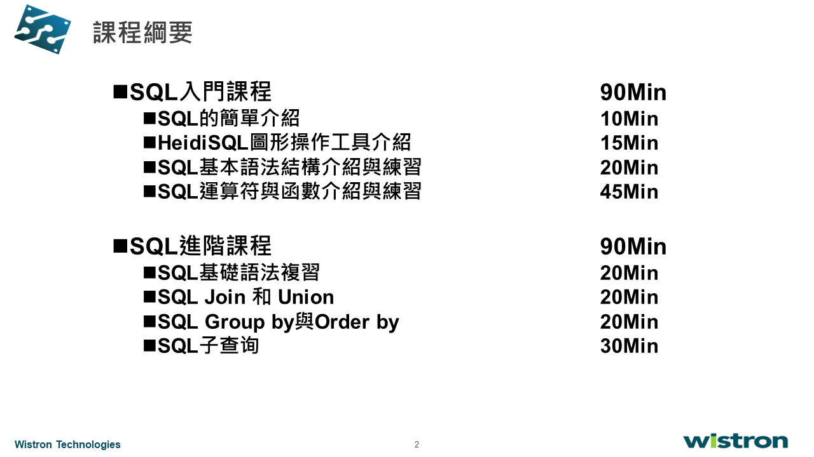
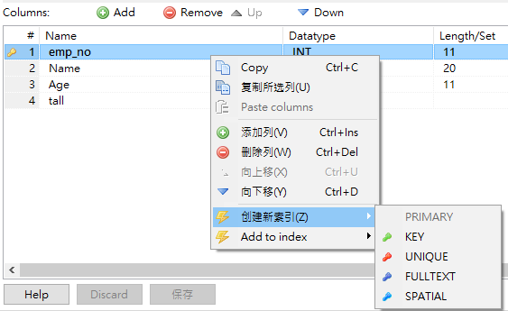
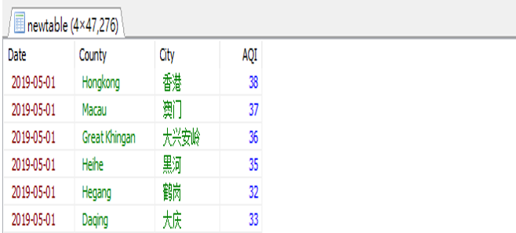
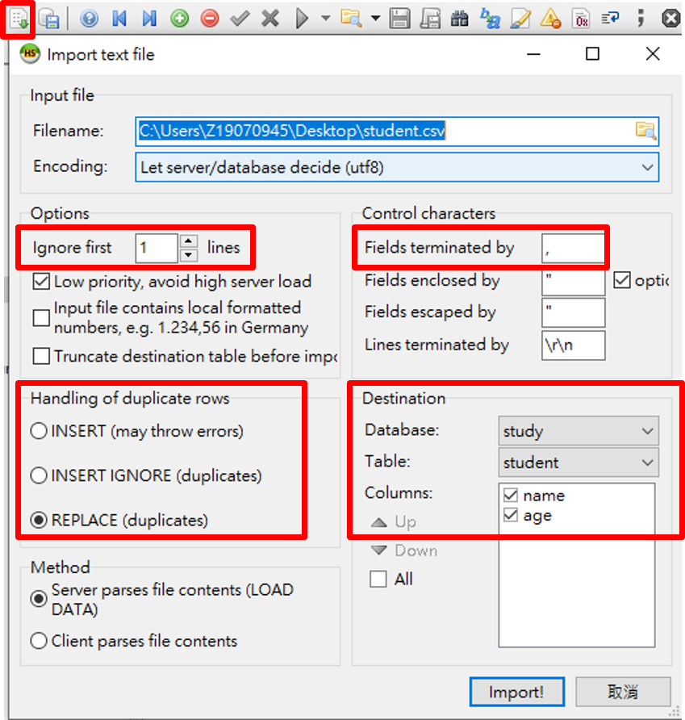
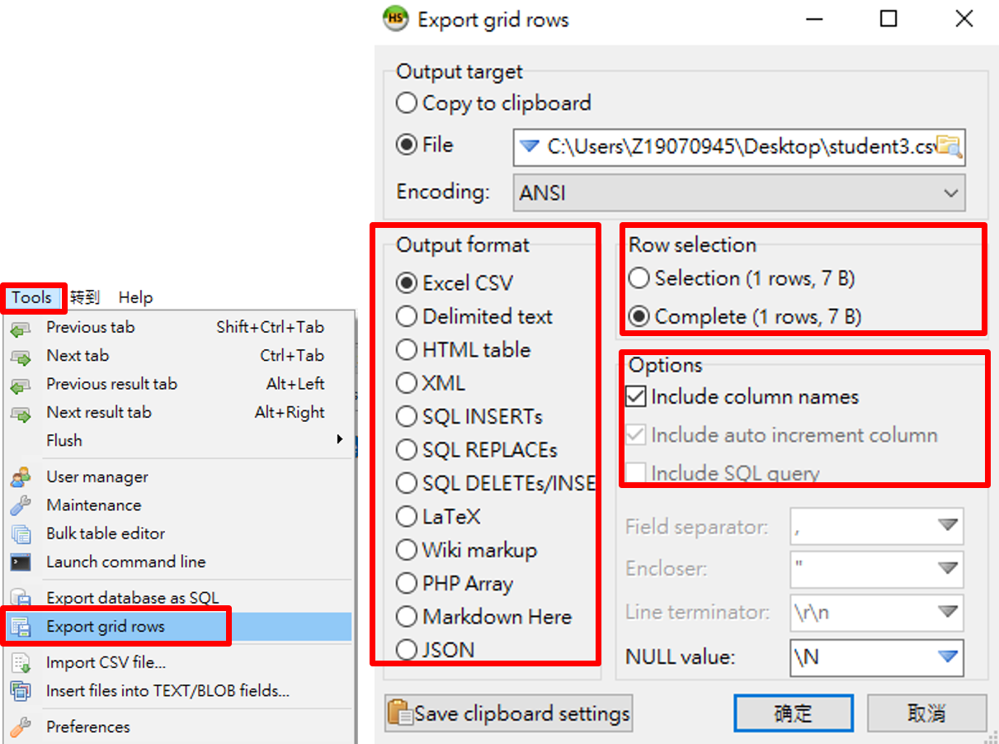

  

# :snail: 基本SQL語法  
* 查詢語句：  
**SELECT** column_name **FROM** table_name **WHERE** condition ;
* 插入語句：  
**INSERT INTO** table_name(col1,col2,col3) **VALUE**(val1,val2,val3) ;
* 刪除語句：  
**DELECT  FROM** table_name **WHERE** condition ;
* 更新語句：  
**UPDATE** table_name **SET** column = value **WHERE** condition ;

1. Comparison operator
2. Arithmetic operator 
3. Logical operator
4. 4.1 Numerical function   
4.2 Character function  
4.3 Date&Time Function 


## 1/2 
| Comparison operator |    | | Arithmetic operator | |
|:--------:|:-------:| :-------:| :-------:| :-------:| 
| = | 等於 | | + | 加 |
| != | 不等於 | | - | 減 |
| ">" | 大於 | | * | 乘 |
|< | 小於 | | / | 除 |
| ">=" | 大於或等於 | |% | 取餘數 |
| <= | 小於或等於  | |
| <>  |  不等於 | |

## 3. Logical operator
|  |  | 
|:--------:|:-------:| 
| AND | 和 | 
| OR | 或 | 
| NOT | 否定 | 
| () | 優先計算或包括在內的值 | 
| IN | 在其中之一 | 
| _ | 任意字元  | 
| %  |  任意長度的任意字元 | 

## 4.1 Numerical function 
| | |
|:--------:|:-------:|
| FLOOR | 取小於或等於傳入數字的最小整數 | 
| CEIL | 取大於或等於傳入數字的最小整數 | 
| :star: ROUND | 取傳入數字的四捨五入整數 | 
| EXP | 取e自然數的指定幕次數 | 
| LOG | 取e自然數的指定對數 | 
| :star: SUBSTRING | 切割字符串  | 

## 4.2 Character function
|  | |  
|:-------:|:-------:|
| LOCATE| 尋找子字符串在父字符串的位置 |
|  CHAR_LENGTH | 測量字符串長度 |
| :star: REPLACE | 用輸入字符串取代指定字符串 |
| TRIM | 去除字串左右兩邊空白 |
| Left/Right | 取左/右邊開始指定個數字元 |
| Isnull | 測試是否空值 |
| UPPER/ LOWER | 字串轉大/小寫 |
| :star: CONCAT | 子串拼接 |


## 4.3 Date&Time Function 
|  |   | 
|:--------:|:-------:| 
| :star: YEAR | 取年份 | 
| :star: MONTH | 取月份 | 
| :star: Week | 取周 |
| :star: DayOfMonth | 取日(一月中) |
| DayOfWeek | 取日(一周中) |
| DayOfYear | 取日(一年中) | 
| WeekOfYear | 取周(一年中) | 
| Now | 現在時間 | 
 
# :snail: Advanced SQL

## Part1
1. 在創建表後，須確保索引列無重複值，否則會報錯   
2. 將查詢結果寫入新表格 create table  
3. 新增資料於表格
4. 匯入資料  
5. 匯出資料

#
1. 在創建表後，須確保索引列無重複值，否則會報錯   

```SQL

/*刪除表格 */
DROP TABLE if EXISTS EMP_Family;
CREATE TABLE EMP_Family(
    `emp_no` INT,
    `Name` varchar(20),
    `Age` INT,
    `tall` Float,
    primary KEY(emp_no)
);
/*創建類似表格 */
CREATE TABLE EMP_Family_2 LIKE EMP_Family;

SELECT * FROM EMP_Family;
SELECT * FROM EMP_Family_2;

```
  


2. 將查詢結果寫入新表格 create table  

```SQL
/*刪除表格*/
DROP TABLE if EXISTS newtable;
/*填入新表*/
CREATE TABLE newtable AS
(
    SELECT `Date`,`Country`, `City`,`AQI`
    FROM HistoryWeather
    WHERE `AQI` > 30
);
/*查看新表*/
SELECT * FROM newtable;

```
  


3. 新增資料    
```SQL
/*刪除表格*/
DROP TABLE if EXISTS newtable;
/*填入新表*/
CREATE TABLE EMP_Family(
    `emp_no` INT,
    `Name` varchar(20),
    `Age` INT,
    `tall` Float,
    primary KEY(emp_no)
);

/*新增資料於表格1: 正常新增，檢查PK鍵是否重覆，重覆報錯*/
INSERT INTO EMP_Family (emp_no, Name, Age, tall) 
VALUES(100001,'張小明',5,67.5)
, (100002,'張大明',7,83.2)
, (100003,'張小小',1,31.9);

/*查看新表*/
SELECT * FROM EMP_Family;
```

```SQL
/*新增資料於表格2: 檢查到PK鍵重覆的狀況下，略過這一筆新增數據*/
INSERT IGNORE INTO EMP_Family(`exp_no`, `Name`,`Age`,`tall`)
VALUES(100001,'張小明', 9,9);

/*新增資料於表格3: 檢查到PK鍵重覆的狀況下，用新增數據取代原有*/
REPLACE INTO EMP_Family(`exp_no`, `Name`,`Age`,`tall`)
VALUES(100001,'張小明', 9,99.9);

/*查看新表*/
SELECT * FROM EMP_Family;
```

4. 匯入資料
```SQL
/*先建立資料表*/
CREATE TABLE SacramentocrimeJanuary2006(
    cdatetime datetime
    ,address varchar(100)
    ,district int
    ,beat varchar(100)
    ,grid int
    ,crimedescr varchar(100)
    ,ucr_ncic_code int
    ,latitude float
    ,longitude float
)DEFAULT CHARSET=utf8 DEFAULT COLLATE utf8_unicode_ci;

/*開始匯入資料，從檔案匯入資料表*/
LOAD DATA LOCAL
INFILE 'T:/CSV/SacrementocrimeJanuary2006.csv'
INTO TABLE SacrementocrimeJanuary2006
/*欄位分割是'，'，每行結尾是 '\r'，跳過第一行行頭*/
FIELDS TERMINATED BY ','
LINES TERMINATED BY '\r'
IGNORE 1 LINES;
/*查詢匯入結果*/
SELECT * FROM employees.SacrementocrimeJanuary2006

```
  

5. 匯出資料
```SQL
/*開始會出檔案，要寫到那個檔案*/
SELECT *
INTO OUTFILE 'T:/sacrementocrimeJanuary.csv'
/*欄位分割符號用'，'，每行換行符號用 '\r'*/
FIELDS TERMINATED BY ','
LINES TERMINATED BY '\r'
/*從那個表格*/
FROM employees.sacrementocrimeJanuary2006
```
  

## Part2 
1. join & union
2. group by & order by
3. 子查詢

#

1. join & union

|  |   | 
|:--------:|:-------:| 
| join | 自然聯結，兩張表格都要有相同值才會結合起來 | 
| left join | 左邊單聯結，以第一張表格為主的結合。如果沒有對應值，會用空值替代 |
| right join | 右邊單聯結，以第二張表格為主的結合。如果沒有對應值，會用空值替代|

```SQL
/*inner join*/
SELECT *
FROM ZHongshan_Weather_old temp
JOIN Zhongshan_Weather_new wea  
ON temp.Date = wea.Date 
AND temp.Time = wea.Time
AND temp.City = wea.City;

/*left join*/
SELECT temp.City, temp.Date, temp.Time, temp.Temperature, wea.Wind_speed, 
FROM ZHongshan_Weather_old temp
LEFT JOIN Zhongshan_Weather_new wea 
ON temp.Date = wea.Date 
AND temp.Time = wea.Time
AND temp.City = wea.City;
```

```SQL
/*join & insert*/
CREATE TABLE `TableA` (
    `Name1` CHAR(10) NULL DEFAULT NULL,
    `Value1` Int(11) NULL DEFAULT NULL,
);
CREATE TABLE `TableB` (
    `Name2` CHAR(10) NULL DEFAULT NULL,
    `Value2` Int(11) NULL DEFAULT NULL,
);

INSERT INTO TableA values ('A001',1), ('A002',1);
INSERT INTO TableB values ('A001',2);
UPDATE TableA JOIN TableB ON TableA.Name1 = TableB.Name2
SET TableA.Name1 = TableB.Name2;

SELECT * FROM TableA;
```

```SQL
/*Union*/
SELECT *
FROM ZHongshan_Humidity_Temperature
WHERE Humidity = 100 AND Temperature = 11.11
UNION
SELECT *
FROM ZHongshan_Humidity_Temperature
WHERE Humidity = 88 AND Temperature = 20
```

2. group by & rollup

```SQL
SELECT Province, City, WindPower, SUM(AQI) AS SUM_AQI
FROM HistoryWeather
WHERE Province = 'Guangdong'
GROUP BY City, WindPower;

/*Rollup : 除了匯總列之外，還另外產生各匯總列的小計與全部列的總計數值。*/
SELECT Province, City, WindPower, SUM(AQI) AS SUM_AQI
FROM HistoryWeather
WHERE Province = 'Guangdong'
GROUP BY City, WindPower WITH ROLLUP;
```

```SQL
/*從歷史天氣篩選最高溫度小於50的廣東縣市，並從大到小排序。  
從大到小：DESC; 從小到大：ASC*/

SELECT Country, MAX(High_Temp)
FROM study.HistoryWeather
WHERE Province = 'Guangdong'
GROUP BY Country
HAVING MAX(High_Temp) < 50
ORDER BY MAX(High_Temp) DESC;
```

3. 子查詢 
分三類: where, from, exist

```SQL
/*WHERE子查詢結構*/
SELECT col1, col2...
FROM table_name
WHERE (col1, col2) [<>=IN]
(
    SELECT col1, col2...
    FROM table_name
    WHERE condition
);

/*FROM子查詢*/
SELECT col1, col2...
FROM (
    SELECT col1, col2...
    FROM table_name
    WHERE condition
)
WHERE condition;
```

```SQL
/*WHERE子查詢結構1
選取工資比boy高的員工名字與工號*/
SELECT `name`, `salary`
FROM employees
WHERE `salary` > (
    SELECT `salary`
    FROM employees
    WHERE `name` = `Boy`
)


/*WHERE子查詢結構2
選取跟gigi同部門，工資比double高的員工姓名與工資*/
SELECT `name`, `salary`
FROM employees
WHERE `dept` = (
    SELECT `dept`
    FROM employees
    WHERE `name` = `gigi`
)
AND `salary` > (
    SELECT `salary`
    FROM employees
    WHERE `name` = `double`
)

/*子查詢與IN結合3
查詢未來天氣數據，這些地區在歷史天氣中滿足篩選要求*/
SELECT * FROM syudy.FutureWeather
WHERE (Province, County, City) IN (
    SELECT Province, County, City
    FROM study.HistoryWeather
    WHERE DATE > '2019-05-10'
    AND DATE < '2019-05-20'
    AND High_Temp > 30
);
```

```SQL
/*FROM子查詢架構
搜索所有AQI水平大於等於3的城市中，出現次數大於等於10次的城市及次數。
兩個AS的功能類似，第一個是重命名column，第二個是重命名子表*/
SELECT *
FROM (
    SELECT City, COUNT(*) AS `count`
    FROM HistoryWeather
    WHERE `AQILevel` >= 3
    GROUP BY City
)AS temp
WHERE `count` >= 10;
```

4. 小結: SQL區段順序

```SQL
/*語法結構及優先順序總結：*/
SELECT col_name, col_name...
FROM table_name
WHERE condition()
GROUP BY col_name, col_name
HAVING condition()
ORDER BY col_name, col_name... [ASC | DESC]
LIMIT row_count

/*省分, 縣市作high_temp平均，
平均溫度大於30才算有效，資料筆數大於50才映出結果，
最後結果依溫度大小降序排列*/
SELECT Province, County, AVG(High_Temp) AS Temp,
COUNT(*) AS Count
FROM study.HistoryWeather
WHERE High_Temp > 30
GROUP BY Province, County
HAVING COUNT(*) > 50
ORDER BY Temp DESC;

```