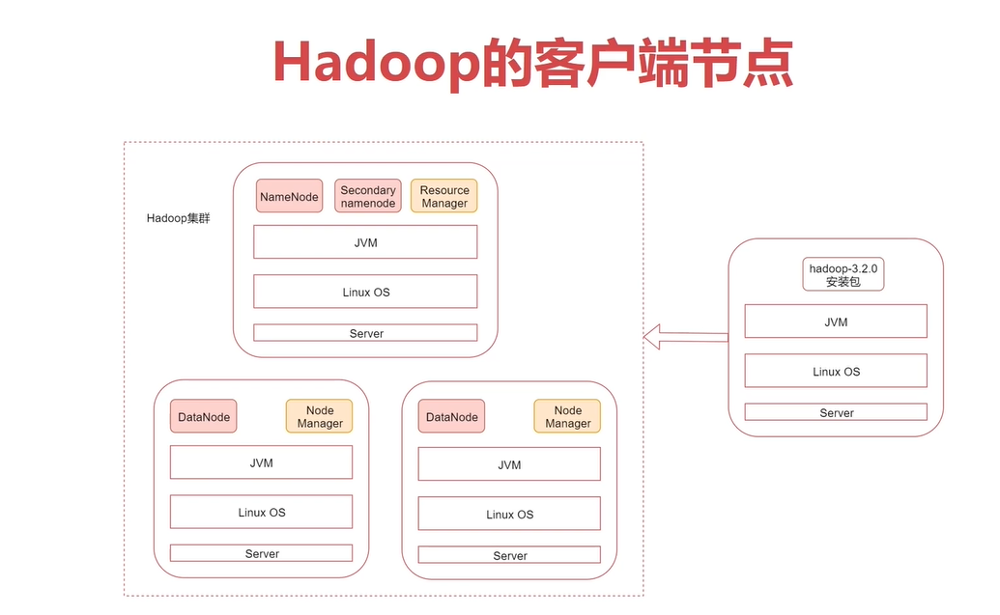
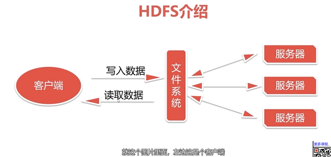
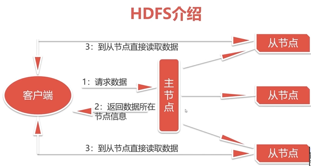
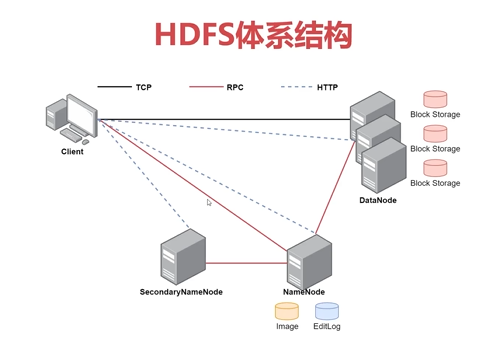
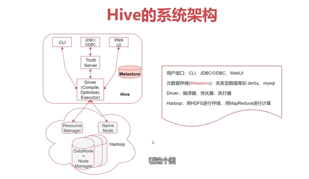
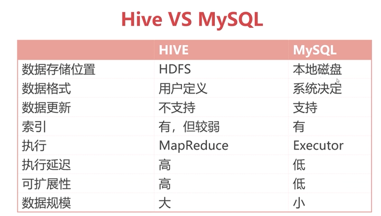

# Ovarall   

1. [1.2.1.1]--1-1什麼是Hadoop  ok   
2. [1.3.1.1]--1-1HDFS介紹    
3. [1.3.1.2]--1-2HDFS的Shell介紹      
4. [1.4.1.1]1-1NameNode介紹     
5. [1.4.1.2]1-2NameNode深入      
6. [1.5.1.1]1-1MapReduce介紹       
7. [1.5.1.2]1-2MapReduce執行原理       
8. [1.7.1.1]1-1快速了解Flume          
9. [2.8.1.1]1-1快速了解Hive  ok   
10. [2.8.2.1]2-1數據庫和數據倉庫的區别  ok     
11. [3.14.1.1]1-1什麼是消息陣列         
12. [3.14.1.2]1-2什麼是Kafka          

# 1. [1.2.1.1]--什麼是Hadoop  
大數據起源之hadoop    
* 了解hadoop的前世今生   
* 掌握hadoop集群的安裝部署  
* 掌握hadoop中HDFS的使用   

**甚麼是hadoop?**   
* 解決海量數據的存儲與計算問題   
* 適合海量數據的 分布式存儲 和 分布式計算   
    - 分布式存儲: 儲存在多機台上   
    - 分布式計算: 多台機台同時運算   
* hadoop的作者是Doug Cutting, hadoop是作者孩子給毛絨象玩具起的名字.   
    

# 2. [1.3.1.1]--1-1HDFS介紹    
hadoop有三大組件: HDFS, MapReduce, YARM   
HDFS- 分布式文件系統,   
  
左邊是客戶端, 當用戶透過客戶端寫入或讀取數據時, 透過中間的文件系統, 串接後面的服務器, 所以我們的數據可以存儲在多台服務器上, 後期服務器或增或減皆可.   
用戶主要透過文件系統與服務器進行交互, 寫數據時通過文件系統, 文件系統將數據存到不同服務器上.   
    
主節點好比中介公司, 安排工作人員服務從節點的房源, 主節點跟客戶端說是哪個工作人員, 直接去找那個工作人員服務    

HDFS(Hadoop Distributed File System), hadoop框架分布式文件系統    
HDFS允許文件通過網絡在主機上分享的文件系統, 可以讓多台機器上的多個用戶分享文件與存儲空間. (共享的分佈式文件系統)    
分佈式文件系統有很多, 如GFS(google), TFS(Tabao), S3(Amazon)...   
為甚麼會有多種?   
特點不同, HDFS-適合大文件存儲, 不適合存儲小文件   

# 3. [1.3.1.2]--1-2HDFS的Shell介紹   
在linux的shell命令行下操作, 相當於操作linux的文件系統    
操作格式: bin/hbfs dbs -xxx scheme ://authority /path   

首先要使用hadoop bin目錄下的hdfs命令, 後面指定dfs, 表示要操作的是一個分布式文件系統,    
注意: 這些屬於基本的固定格式, 如果說在PATH中配置hadoop的bin目錄, 那麼在這邊使用時, 直接寫hdfs即可. 不用再帶路徑訊息   

scheme- hdfs   
authority-  表示集群中namenode所在節點的ip, 和對應的port (主節點 ip:port)    
path- 操作文件的path   

在core-site.xml配置文件中, 有個fs.defaultFS, 代表HDFS的地址.   
可以到集群裡作確認,   
cd /data/soft/hadoop-3.2.0/etc/hadoop/    
cat core-site.xml   

# 4. [1.4.1.1]1-1NameNode介紹    
　　　
###　HDFS體系結構:   
* HDFS支持主從結構, 主節點稱為*NameNode*, 支持多個從節點稱為*DateNode*, 支持多個    
    - hadoop支持主從結構, hadoop包含HDFS及YARN這些組件, 所以說HDFS及YARN也都是支持主從結構, 那HDFS中的主節點稱為NameNode   
    - 主要是因為主節點上, 運行的有NameNode進程, 可支持多個主節點   
    - 從節點稱為DateNode, 因為上有DateNode進程, 可支持多個DateNode   
* HDFS中還包含一個*SecondaryNameNode*進程    

    

前面配置的集群裡的NameNode, SecondaryNameNode   
不同的線, 不同的通訊協議    

### NameNode介紹:     
* NameNode是整個文件系統的管理節點,   
* 主要維護整個文件系統的文件目錄樹, 文件/目錄的訊息, 每個文件對應的數據塊列表, 並且負責接收用戶操作請求.      
    - 文件目錄樹: 文件層級關係ls   
    - 數據塊列表: 文件存在哪個數據塊   

# 9. [2.8.1.1] 快速了解Hive   
數據倉庫之HIVE, 需要掌握:      
- 甚麼是HIVE  
- 甚麼是數據倉庫    
- 數據倉庫與數據庫間的區別   
- HIVE中庫與表的操作   
- 掌握HIVE中高級函數的用法: 寫HIVE相當於SQL   

**甚麼是HIVE**    
- HIVE是建立在hadoop上的**數據倉庫**基礎架構, 它提供了一系列工具, 可以進行數據提取, 轉化, 加載(**ETL**).  
- HIVE定義了簡單的類SQL查詢語言, 稱為HQL, 允許熟悉SQL的用戶直接查詢Hadoop中的數據.   
也允許熟悉MapReduce(MR)的開發者, 自定義的mapreduce任務, 處理內建的SQL函數無法完成的複雜分析任務.   
- HIVE包含SQL解析引擎, 會將SQL語句轉譯為MR Job, 然後在hadoop中執行.   
HIVE可以通過SQL查詢hadoop中的數據, 並且SQL底層也會轉化為MapReduce任務, 所以說, HIVE是基於hadoop.   

**HIVE的數據存儲**   
- HIVE的數據存儲基於hadoop的HDFS   
- HIVE沒有專門的數據存儲格式, 默認可以加載文本文件textfile, sequencefile, RCfile....    

**HIVE的系統架構**    
    
1. 下面的是hadoop集群, 上面的是hive, hive是基於hodoop   
2. 用戶接口   
* CLI- shell命令行, 透過shell操作hive,   
* JDBC/ODBC- 透過JDBC/ODBC的方式操作,   
* webUI- 或是透過瀏覽器操作, 瀏覽器底層還是走JDBC   
3. 元數據存儲(metastore)- metastore是一個存儲系統, hive中的元數據存儲在metastore中, 目前metastore僅支持derby, mysql兩個數據庫.  
* 元數據: 後期我們會在hive中建一些表, 表中的訊息, 稱為"元數據"    
4. driver包含編譯器, 優化器, 執行器, 透過這三個組件 可以完成hive語句, 從詞法分析, 語法分析, 到編譯, 優化, 以及最終生成一查詢計畫.    
* driver會將SQL的查詢計畫存儲到HDFS中, 接著被MapReduce執行   
5. hadoop: 用HDFS存儲數據, 用MapReduce進行計算    
* hadoop中主要包含HDFS, MapReduce, 會發現hive會使用HDFS存儲數據, 再使用MapReduce進行計算.  
* 有個特例: select * from table, 這種任務一般不會生成MapReduce任務, 但如果加where過濾條件, 便會生成MapReduce任務. 因為這種 select * from table 的查詢語句可以直接查詢HDFS中對應的文件, 不需要經過MapReduce任務.       
   
從HIVE2開始, 官方不建議使用默認的MapReduce引擎, 而是使用Tez或spark引擎.   
大數據引擎有幾個歷史發展階段, 皆支持在YARM上執行.   
* 第一代大數據計算引擎- MapReduce   
* Tex 基於MapReduce, 主要結合hive使用, 核心是將map和reduce, 這兩階段進一步拆分, 拆分後這些操作經過控制程序組裝後, 便可以靈活組合, 產生新操作.    
    - tex分解任務, 再組成一大任務, 便不需要再作多個任務了, 中間也不需傳輸數據, 藉此【提高執行效率】.   
    - taz也支持在YARM上執行, 只需配置hive, 不管使用哪一引擎, 都不會影響hive, 即SQL使用      
    - 沒有被廣泛使用, 多與hive一起作使用.   
* 第三代大數據計算引擎- Spark  
    - 改變磁盤的計算思路, 採用「內存計算」, 也就是說, Spark從HDFS中讀取後, 中間的計算結果不會進磁盤, 最終結果才會作計算. 而MapReduce需要透過shuffle把數據從map端拉到reduce端, 所以效率沒有spark高.    
* 第四代大數據計算引擎- Flink   
    - 支持純實時數據計算的一個計算引擎, 在實時計算領域優於spark  

hive既不存儲數據, 也不計算數據, 皆是由hadoop作. hive底層最核心為driver, 用SQL生成一個查詢計畫與執行計畫.     
hive-driver 將SQL語句解析為最終的查詢計畫, 接著執行.   
數據在HDFS中, 執行時可使用MapRduce, Taz或其他計算引擎    

**metastore**  
* metastore 是hive元數據的集中存放地, 
* 元數據包括表名, 列, 分區, 屬性, 表的數據所在的目錄 
* metastore默認使用内嵌的derby數據庫作為存儲引擎, 推薦使用"mysql"數據庫作為外置存儲引擎, 可支持多用戶同時訪問與共享.  
    - 因為derby僅支持單人操作, 以目錄開啟hive後, 生成derby.log, metastore_db, 若切換目錄啟動hive, 則會重新生成log, db..    

# 10. [2.8.2.1] 數據庫和數據倉庫的區别 
**HIVE vs MySQL**    
    

* mysql支持數據更新, 增刪改查    
* hive執行延遲高: 寫個SQL, 到SQL轉成MapReduce任務, 最終提交到hadoop集群上執行, 中間會消耗很長時間.   
* hive可擴展, 因為底層是hadoop, 擴展性較強   
* 一般使用hive的數據規模, 都是T, P以上的數據     

**數據庫 vs 數據倉庫**
* 數據庫: 傳統關係型數據庫主要應用在基本的事務處理, 如銀行交易; 支持增刪改查.    
* 數據倉庫: 主要作些複雜的分析操作, 側重決策支持, 相對數據庫而言, 數據倉庫分析的數據規模較大; 僅支持查詢. (無修改, 刪除功能)    
* 本質是OLTP與OLAP的區別:     
    - OLTP (on-line transaction processing): **操作型處理**, 稱為聯機事務處理, 面相交易的處理系統。 針對具體業務在數據庫聯機的日常操作, 通常對少數紀錄進行查詢, 修改，用戶較關心操作的響應時間, 數據安全性, 完整性等問題。   
    - OLAP (on-line analytical processing): **分析型處理**, 聯合分析處理, 一般針對某些主題的歷史數據進行分析, 支持管理決策.   

