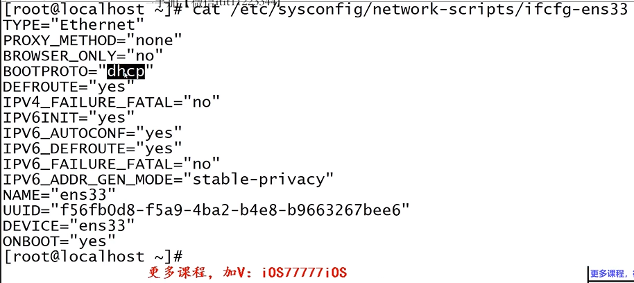
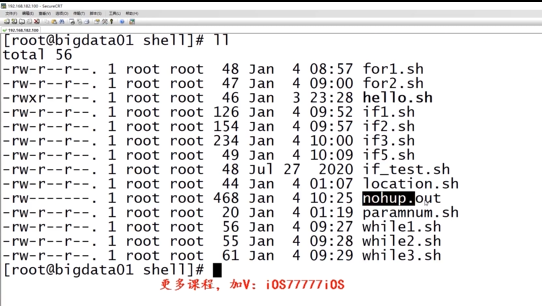
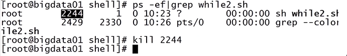
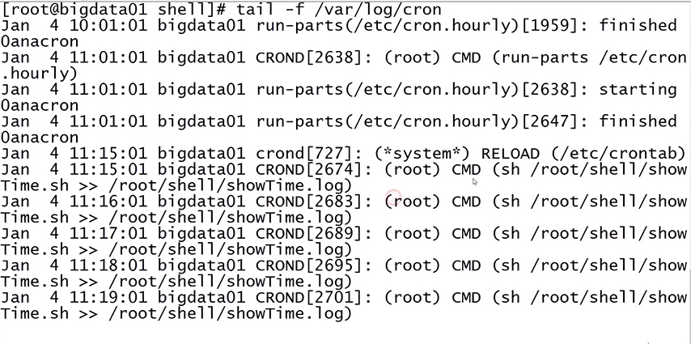

# 4.1-4.3 linux 高級配置   

linux 分配身分證號碼(id): 靜態ip設置
linux 起名字(hostname): 臨時設置+永久設置
linux 防火牆: 臨時關閉+永久關閉


可能發生...  
1. SecureCRT中的配置訊息連不上虛擬機, 通過IP addr查看虛擬機ip訊息. 發現虛擬機的訊息發生變化,  

cat /etc/sysconfig/network-scripts/ifcfg-ens33

   
vi, 
將bootproto ="static"  
**在底下加:**
IPADDR = 192.168.182.100  #編輯>虛擬網絡編輯器, 後面的數字可以認定3~254    
GATEWAY = 192.168.182.2   #編輯>虛擬網絡編輯器>NAT>NAT設置/網關IP    
DNS1 = 192.168.182.2      #同上   

**重啟網卡**  
service network restart   
ip addr

2. ip很難記...   
hostname
hostname bigdata01  #臨時設置   
vi /etc/hostname    #永久設置


3. 防火牆設置   
練習時可以關閉 in cent os7   
systemctl stop firewalld      #臨時關閉  
systemctl status firewalld   

systemctl disable firewalld   #永久關閉 
systemctl list-unit-files | grep firewalld


# 4.4 开发执行第一个shell脚本
* 甚麼是shell? shell是用戶與linux操作系統的溝通橋樑   

* shell腳本文件, 後綴通常是 " .sh "  
* shell腳本第一行內容是: " #!/bin/bash ", 其他行以#開頭的表示才是註釋  


mkdir shell   
cd shell/   
vi hello.sh   

```shell
#!/bin/bash

# first command
echo hello world!

!wq
```

* 執行shell腳本  
bash hello.sh  or   sh hello.sh  
./hello.sh   or   hello.sh   
bash -x:  shell腳本的單步執行

說明:   
ll /bin/bash    #指向 /bin/bash  
ll /bin/sh      #指向 /bin/sh -> bash  


chmod u+x hello.sh  
ll
./hello.sh    #執行當前目錄下的腳本

echo $PATH
pwd
vi /etc/profile

在最後一行加 " export PATH = .:$PATH "
wq
source /etc/profile
echo $PATH

bash -x hello.sh   #單行執行


# 4.5 shell中的變量  
* 變量不需要聲明, 初始化也不需要指定類型  
* 變量命名: 只能使用數字, 字母, 下滑線, 且不能以數字開頭.  
* 變量賦值是通過"="進行賦值, 在變量, 等號和值之間不能出現空格.  

name=zs
echo $name  or  echo ${name}   
echo ${name}hehe   
echo $name hehe   

# 4.6 變量的四種分類  
* 本地變量   
* 環境變量   
* 位置變量   
* 特殊變量   

1. 本地變量  
VAR_NAME=VALUE
* 應用場景: 在shell腳本中, 定義一些臨時變量時使用, 對當前shell進程的子shell進程, 及其他shell進程無效.  

pstree
yml install -y psmisc  #安裝變量的yml

2. 環境變量  
export VAR_NAME=VALUE
* 應用場景: 用於設置臨時環境變量, 對子shell進程有效, 及其他shell進程無效. 
* 設置永久環境變量, 需添加到配置文件 /etc/profile 中, 然後執行 source /etc/profile 可立即有效


export age=18
echo $age
bash            #進到bash裡

vi /etc/profile
export age=19     #在profile文件裡增加這參數   
source /etc/profile
echo $age   

3. 位置變量  
$0, $1, $2...
location.sh abc xyz   
位置變量相當於java中main函數的args參數, 可在shell腳本中動態獲取外部參數.  


vi location.sh   

#!/bin/bash
echo $0
echo $1
echo $2
echo $3

:wq

sh location.sh abc xyz  


4. 特殊變量 
* $?: 上一條命令的返回狀態碼, 狀態碼在0~255之間, 成功為0   
echo $?  

ll   
echo $?   #0   
lk   
echo $?   #127   

* $#: shell腳本所有參數的個數   

vi paramnm.sh   

#!/bin/bash  
echo $#   
wq

sh paramnum.sh a b c #返回腳本後面的變量個數   

* 變量和引號的特殊使用   
- '': 單引號不解析變量 echo '$name'   
- "": 雙引號解析變量 echo "$name"    
- ``: 反引號是執行並引用的執行結果  echo `$name`   
- $(...)是另一種寫法, 效果一樣   


name=jack   
echo '$name'   #name   
echo $name     #jack   
echo "$name"   #jack   
echo `$name`   #bash: jack: command not found  


name=pwd   
pwd            #/root/shell   
echo `$name`   #/root/shell   
$($name)       #bash: /root/shell: Is a directory   
echo $($name)  #/root/shell   

echo '"$name"'   # "$name"
echo "'$name'"   # 'pwd'


# 4.7-4.9 shell中的循環和判斷   
* for循環   
* while循環   
* if判斷   

# 4.7 for循環   

1. 連續的數值   
for ((i=0;i<10;i++>))
do   
...
done   

2. 有限且不連續的數值   
for i in 1 2 3  
do   
...
done   

ex.  
vi for1.sh   

#!/bin/bash   
for((i=0;i<10;i++>))
do 
echo $i
done

:wq
sh for1.sh


ex.  
vi for2.sh

#!/bin/bash      
for i in 1 2 3     
do    
echo $i    
done   

:wq
sh for2.sh


# 4.8 while循環   
- 適用於循環次數未知, 或不便於使用for直接生成較大列表時   
- 測試條件為真, 則進入循環; 測試條件為假, 則退出循環. 

while 測試條件  
do    
...   
done  


**測試條件:**  
* test EXPR 或 [EXPR] 中括號, 和表達式間的空格不能少. 
* 整體測試: -gt(大於), -lt(小於), -ge(大於等於), -le(小於等於), -eq(等於), -ne(不等於)   
* 字符串測試: =(等於), !=(不等於)    

ex.   
1. 
vi while1.sh   

#!/bin/bash   
while test 2 -gt 1   
do
echo yes
sleep 1
done

sh while1.sh   

2. 
cp while1.sh while2.sh   
vi while2.sh   

#!/bin/bash   
while [ 2 -gt 1 ]   
do
echo yes
sleep 1
done

3. 
cp while2.sh while3.sh   
vi while3.sh   

#!/bin/bash   
while [ "abc" = "abc" ]   
do
echo yes
sleep 1
done

sh while3.sh 


# 4.9 if判斷
* 單分支   
* 雙分支   
* 多分支   

* if判斷之單分支 
if測試條件  
then  
    選擇分支  
fi  

ex.   
1. 
vi if1.sh  

#!/bin/bash  
if [ $# -lt 1 ]
then
    echo "not found param"
    exit 100
fi

flag=$1
if [ $flag -eq 1 ]
then
    echo one
fi

wq
sh if1.sh 1  #one
sh if1.sh 2  #not found param
echo $?      #100


* if判斷之雙分支 
if測試條件  
then  
    選擇分支1
else
    選擇分支2
fi  

ex. 
2. 
cp if1.sh if2.sh   
vi if2.sh  


#!/bin/bash  
if [ $# -lt 1 ]
then
    echo "not found param"
    exit 100
fi

flag=$1
if [ $flag -eq 1 ]
then
    echo one
else
    echo "not support"  
fi

wq
sh if2.sh 1  #one
sh if2.sh 2  #not support
sh if2.sh    #not found param   


* if判斷之多分支 
if 測試條件1  
then  
    選擇分支1
elif 測試分支2
then
    選擇分支2
...
else
    選擇分支n
fi  

ex. 
2. 
cp if2.sh if3.sh   
vi if3.sh  


#!/bin/bash  
if [ $# -lt 1 ]
then
    echo "not found param"
    exit 100
fi

flag=$1
if [ $flag -eq 1 ]
then
    echo one
elif [ $flag -eq 2 ]
then
    echo two
elif [ $flag -eq 3 ]
then
    echo three
else
    echo "not support"  
fi

wq
sh if3.sh 1  #one
sh if3.sh 2  #two
sh if3.sh 3  #three
sh if3.sh 4  #not support

* 若在windows底下開發, 需轉成unix格式  


# 4.10 shell擴展  

1. 後臺模式運行腳本: nohup xxx.sh &  

默認情況下, 關閉shell窗口時, shell窗口會如同其他通過它啟動的shell腳本發送停止訊號. 當加上nohup記號, 便會阻斷訊號的發送, 所以已經放在shell後台的腳本, 便不會停止.   

cd shell/  
nohup sh while2.sh &  

**確認shell腳本是否還在運行**   
ps -ef|grep while2.sh   
cd shell/  
ll
   

more nohup  
ps -ef|grep while2.sh  #查shell的ID
   

kill 2244

2. 標準輸出(1), 標準錯誤輸出(2), 重定向(> or >>)   
 

ll 1 > a.txt  #1表標準輸出, > 表重定向
* ll後面可接, 目錄directory或文件file訊息
* 不能有空格, 將執行1後的結果, 重定向至a.txt 
* 標準輸出1, 可省略  
ll 1>a.txt  
more a.txt  #total 56
ll 1>a.txt  
more a.txt  #total 56, 表示會覆蓋原先的內容   
ll 1>>a.txt  
more a.txt  #total 56,..., total 60  


lk 1>b.txt   #bash: lk: command not found  
lk 2>b.txt
more b.txt   #bash: lk: command not found 


3. 綜合案例   
nohup hello.sh 1>/dev/null 2>&1 &
#1>/dev/null: 將正確訊息存進linux的黑洞裡, 這個路徑存進去後, 就找不到了. (即: 將標準輸出重定向到/dev/null裡)
#2>&1: 將標準錯誤輸出, 重定向到標準輸出裡, 若是指定文件, 可以直接指定, 若是指定這種 文件描述符, 須加個"&" (即: 將標準錯誤重定向到標準輸出裡)
也就是說, 無論是標準輸出, 還是標準錯誤, 接重定向到 /dev/null裡. 所以說最終結果, 此腳本輸出的日誌訊息, 不管是正確還是錯誤, 最終都會進到這個黑洞裡.       

nohup sh while2.sh >/dev/null 2>&1 &   #2470   


# 4.11 linux中的計時器crontab  
* crontab作用於週期性被執行的命令    
配置一條命令   
* 格式: *  *   *   *   * user-name command  
第一個* : 分鐘(0-59)   
第二個* : 小時(0-23)    
第三個* : 日期(1-31)   
第四個* : 月份(1-12)    
第五個* : 星期(0-6)    


* 查看crontab服務狀態: systemctl status crond   
#通常這服務都是開啟的   
* 啟動/停止crontab服務: systemctl start/stop crond
* 添加定時任務: vi /etc/crontab          

cd shell/
vi showTime.sh   

#!/bin/bash   
showTime= `date "+%Y-%m-%d %H:%M:%S"`
echo $showTime  

vi /etc/crontab   


* * * * * root sh /root/shell/showTime.sh >> /root/shell/showTime.log    
wq

tail -f showTime.log   #監控所產生的log文件   
若我們所執行的腳本, 不會產生任何輸出訊息, 該如何確認腳本被成功調度, 可透過查看crontab的執行日作確認.   

* 查看crontab執行日誌: tail -f /var/log/cron   

* 停止腳本調度     
vi /etc/crontab  
在指令前面加一個 " # "註釋掉   


* Q. 如果設置任務, 每七分鐘執行一次, 那麼任務分別會在甚麼時間點執行?   
*/7 * * * * root sh /root/shell/showTime.sh >> /root/shell/showTime.log 


