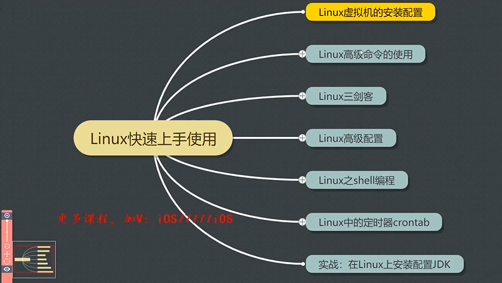
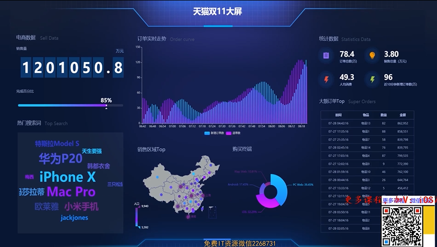
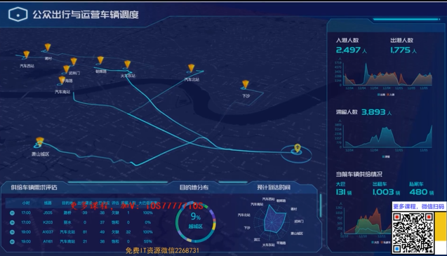

# 5.1 實戰: 在linux上安裝配置JDK   
在linux系統中安裝大數據框架, 大部分大數據框架皆須依賴java環境, 所以JDK的安裝便是最基礎的環境配置.   
app: JDH8   

mkdir -p /data/soft    
cd /data/soft/   
ll    

tar -zxvf jdk-8u202-linux-x64.tar-gz jdk1.8.0_202/    
mv jdk1.8.0_202/ jdk1.8   
vi /etc/profile/    

在底下增加一段話:   
export JAVA_HOME=/data/soft/jdk1.8    
export PATH=.:$JAVA_HOME/bin:$PATH   #使可以在任何地方應用JAVA命令   
wq   

source /etc/profile
java -version   

# 5.2 summary of linux    
   

# 5.3-5.6 甚麼是大數據    

1. 甚麼是大數據  
2. 大數據產生的背景   
3. 大數據的4v特徵    
4. 大數據的行業應用    

## 甚麼是大數據   
用案例說明最貼切!   
* 對位置作實時運算, 可求出實時路況.   
* 資訊推薦, 平台的個性化推薦, 透過採集用戶行為數據, 根據用戶特點進行用戶畫像, 對用戶人群進行劃分, 若屬於同一類型, 則同一類型人群喜歡的內容即有可能相似.  
* 買pizza的故事? 啤酒?  

高大上的名詞: hadoop, spark...   

## 大數據產生的背景
* 訊息技術的進步, 用戶網路行為產生大量訊息, 因為數據量普及大量, 故稱為大數據. 其中智能設備的持續普及, 是大數據快速增長的重要因素.  
    - 智能設備的普及   
    - 存儲設備性能的提高, 和網絡寬帶的增加  
* 雲計算技術的興起, 將分散數據集中在數據中心, 使處理和分析海量數據成為可能.    
* 數據資源化的趨勢, 因各行各業開始重視數據價值, 透過分析與挖掘數據 才能顯示其價值, 數據即生產力~~   

## 大數據的4v特徵   
* Volume 量大: 存儲量大, 計算量大. 包括採集, 存儲和計算的數據量都非常大. 大數據的起始計量單位至少PZE...    
* Variety 多樣: 來源多, 格式多. 是指數據種類和來源多樣化, 包括結構化, 半結構化, 和非結構化的數據, 包括網路日誌, 視頻, 音頻, 圖片, 地理位置訊息等多類型數據, 這樣多類型的數據, 提高了數據處理技術的要求.  
* Velocity 快速: 數據增長快, 處理速度要求快. 時效性要求高, 比如說: 
    - 搜尋引擎要求幾分鐘前的新聞要能被用戶查詢到, 個性化推薦算法, 盡可能要求「實時」完成推薦   
* Value 價值: 價值密度低, 和數據總量的大小成反比.  隨著互聯網和物聯網的廣泛應用, 海量訊息但價值密度較低, 如何結合業務邏輯, 並透過機器學習算法挖掘數據價值, 是大數據時代最需要解決的問題.   

## 大數據的行業應用   
* 醫療大數據, 金融大數據, 零售大數據, 電商大數據, 交通大數據...   
目前大數據以深入融入我們的生活中,   
如天貓雙11大屏, 透過大數據的實時運算, 快速分析海量數據    
    
公眾出行與運營車輛調度: 根據站點滯留人數, 動態調整班次, 發車間隔, 充分利用車輛資源, 讓乘客快速坐上車, 且不讓車輛空跑, 實現資源的最大化利用    
   

