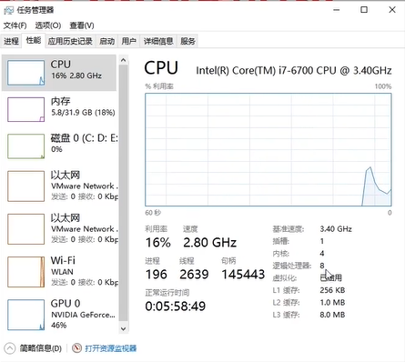

# 第01章 学好大数据先攻克Linux   

第1章笑傲大数据成长体系课   
第2章Linux虚拟机安装配置   
第3章Linux极速上手   
第4章Linux试炼之配置与shell实战   
第5章Linux总结与走进大数据  

##  第02章 Linux虚拟机安装配置    
* Linux虛擬機的安裝  
* Linux中高級命令的使用  
* Linux中的shell編程  

在windows中使用VMware安裝虛擬機，並且可以使用類似 Xshell或SecureCRT之類的工具，去連接Linux虛擬機。   

**Linux虛擬機的安裝**
- 安裝VMware15軟件 (other: wsl)  
- 使用VMware安裝配置Linux虛擬機   
- 使用SecureCRT連接Linux虛擬機   

安裝虛擬機前，需確認電腦的虛擬化功能已開啟   
   

1. (創建新的虛擬機>自定義>稍後安裝操作系統)  
2. VMware workstation: Linux, CentOS 64,   
3. VMname: bigdata01  
(建立一個檔案夾在D槽)    
location: D:\Program File(x86)\Virtual Machines\bigdata01  
4. 處理器數量-1, 每個處理器的內核數量-1   
(確認任務管理器的內存大小) 內存-2G   
網絡類型: 使用網絡地址轉換(NAT)   
選擇I/O控制器類型: LSI Logic   
硬盤類型: SCSI, 創建新虛擬硬盤   
指定硬盤容量: 50, 將虛擬磁盤拆分程多個文件  
磁碟文件: bigdata01.vmdk   
5. 完成XD   

