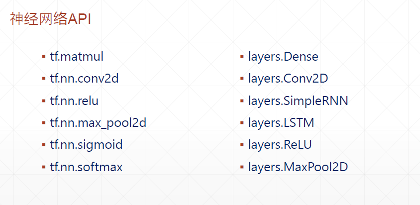

win10, python3.7, anaconda2019.03,   
tensorflow-gpu2.0/1.14, CUDA 10.0


# 深度學習框架介紹

Tensorflow+keras  
PyTorch+Caffe2

## 為甚麼用TF?
- GPU加速 : gpu_accelerate.py
- 自動求導 : autograd.py
- 神經網絡layers

 

# 開發環境
- win10 or ubuntu 16.04
- step1. anaconda, python 3.7 (add to my PATH, CMD: conda list)
- step2. CUDA 10.0 
    - there is NVIDIA顯卡 in NB(GTX 1060 6GB, GTX 1080Ti 11GB)
    - CUDA install (驅動, CUPTI)
    - cuDNN install
    - PATH configure

    step2.1 CUDA install  
    step2.2 cuDNN copy  
    step2.3 env variable config  

- TensorFlow 2.0
    ```py
    # cpu version
    pip install --upgrade tensorflow  
    # gpu version
    pip install --upgrade tensorflow-gpu  

    # or install specific version
    # cpu version
    pip install tensorflow==2.0.0-alpha0  
    # gpu version
    pip install tensorflow-gpu==2.0.0-alpha0

    # under CMD
    where ipython
    ipython
    import tensorflow as tf
    tf.test.is_gpu_available()
    ```
    
- Visual studio, Pycharm


