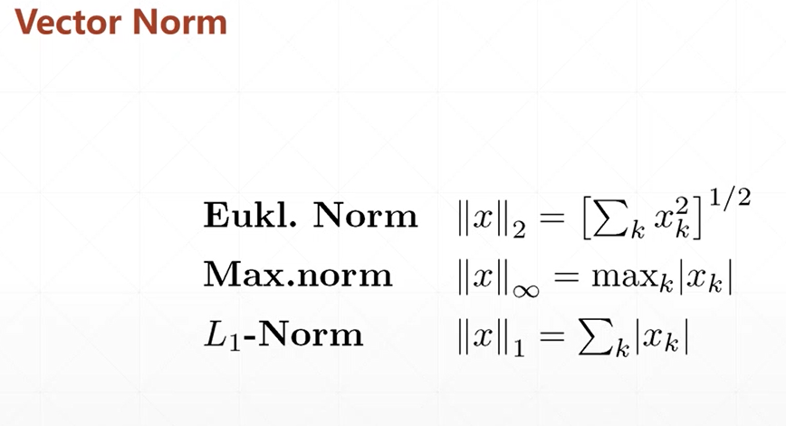

# tf2 adv
## 15 Math statistic

* tf.norm
* tf.reduce_min/max/mean
* tf.argmax/argmin: the location of max/min  
* tf.equal
* tf.unique



```py
#1 tf.norm: here talks about vector norm  
a = tf.ones([2,2])
tf.norm(a)                    #squr(1^2+1^2+1^2+1^2)=sqrt(4)=2
tf.sqrt(tf.reduce_sum(tf.square(a)))

a = tf.ones([4,28,28,3])
tf.norm(a)                    #96.99484
tf.sqrt(tf.reduce_sum(tf.square(a)))

# L1 norm
b = tf.ones([2,2])
tf.norm(b)                    #squr(1^2+1^2+1^2+1^2)=sqrt(4)=2.0
tf.norm(b, ord=2, axis=1)     #[1^2+1^2, 1^2+1^2]=[1.4142, 1.4142]
tf.norm(b, ord=1)             #1norm+1norm+1norm+1norm=4.0
tf.norm(b, ord=1, axis=0)     #array([2.,2.])
tf.norm(b, ord=1, axis=1)     #array([2.,2.])

```
```py
#2 tf.reduce_min/max/mean
a = tf.random.normal([4,10])
tf.reduce_min(a), tf.reduce_max(a), tf.reduce_mean(a)
tf.reduce_min(a, axis=1), tf.reduce_max(a, axis=1), tf.reduce_mean(a, axis=1)

#1.1872448, 2.1353827, 0.3523524
#array([-0.3937837, -1.1872448, -1.1366792, -1.1366792])
#array([1.9718986, 1.1612172, 2.1353827, 2.0984378])
#array([0.61504304, -0.01389184, 0.606747, 0.20151143])

```
```py
#3 argmax/argmin
a.shape              #TensorShape([4,10])
tf.argmax(a).shape   #TensorShape([10])
tf.argmax(a)         #array([0, 0, 2, 3, 1, 3, 0, 1, 2, 0])
tf.argmin(a).shape   #TensorShape([10])
tf.argmin(a)         #array([1, 1, 1, 1, 1, 1, 3, 1, 3, 1])

#不太懂耶...


#4 tf.equal
a = tf.constant([1,2,3,2,5])
b = tf.range(5)
tf.equal(a,b)          #[F,F,F,F,F]

res = tf.equal(a,b)
tf.reduce_sum(tf.cast(res, dtype=tf.int32))  #0


# For example
a                   #shape=(2,3), 2 sample 3 prob. 
                    #array([0.1, 0.2, 0.7], [0.9, 0.05, 0.05])
pred = tf.cast(tf.argmax(a,axis=1), dtype=tf.int32)  #array([2,0])
y                   #array([2,1])
tf.equal(y,pred)    #array([T,F])
correct = tf.reduce_sum(tf.cast(tf.equal(y,pred), dtype=tf.int32))
correct             #1
correct/2

```

```py
#5 tf.unique
a = tf.range(5)
tf.unique(a)                   #array([0,1,2,3,4])   
a = tf.constant([4,2,2,4,3])
tf.unique(a)                   #array([0,1,1,0,2])
tf.gather([4,2,3], [0,1,1,0,2])

```