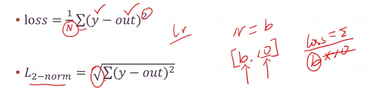
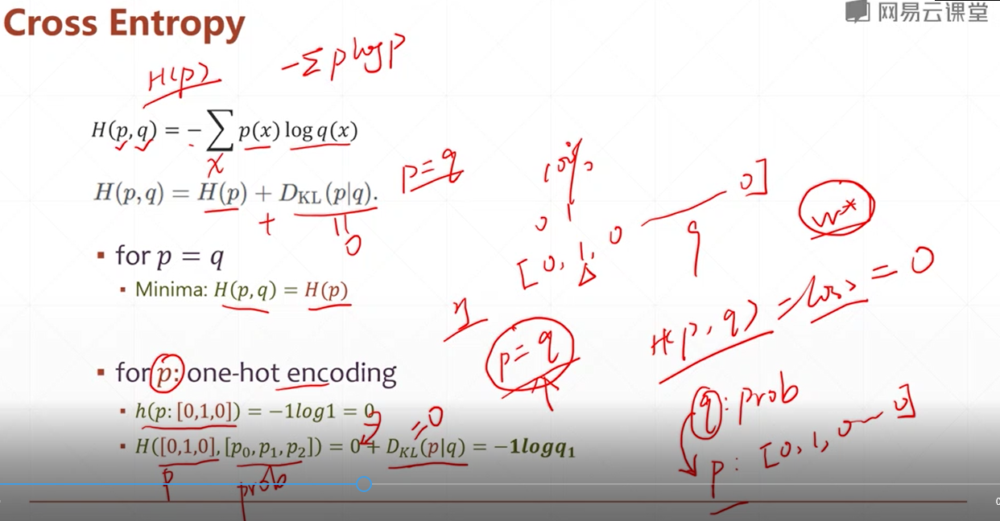
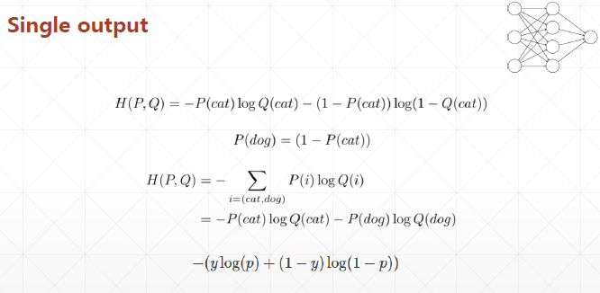
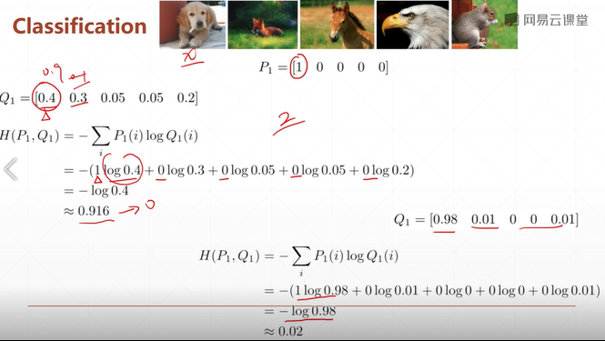

# Neural Network and Fully Connected Layer
## 24 loss function


* MSE
* Cross entropy loss
* Hinge loss: sim_i_max(0,1-yi*h_thita(xi))

1. MSE


```py
y = tf.constant([1,2,3,0,2])
y = tf.one_hot(y, depth=4)
y = tf.cast(y, dtype=tf.float32)

out = tf.random.normal([5,4])

loss1 = tf.reduce_mean(tf.square(y-out))        
loss2 = tf.square(tf.norm(y-out))/(5*4)
loss3 = tf.reduce_mean(tf.losses.MSE(y,out))

```

2. Cross entropy loss
### entropy
* uncertainty, meature of surprise
* lower entropy -> more info.

```py
# lottery
a = tf.fill([4],0.25)
a*tf.math.log(a)/tf.math.log(2.)
-tf.reduce_sum(a*tf.math.log(a)/tf.math.log(2.))  #numpy=2.0

a = tf.constant([0.1,0.1,0.1,0.7])
-tf.reduce_sum(a*tf.math.log(a)/tf.math.log(2.))  #numpy=1.3567796

a = tf.constant([0.01, 0.01, 0.01, 0.97])
-tf.reduce_sum(a*tf.math.log(a)/tf.math.log(2.))  #numpy=0.24194068

```



  
3. classification 




```py
# categorical cross entropy
# more bigger loss is, more bigger crossentropy is.

tf.losses.categorical_crossentropy([0,1,0,0],[0.25,0.25,0.25,0.25])    #numpy=1.3862944
tf.losses.categorical_crossentropy([0,1,0,0],[0.1,0.1,0.8,0.1])        #numpy=2.3978953
tf.losses.categorical_crossentropy([0,1,0,0],[0.1,0.7,0.1,0.1])        #numpy=0.35667497
tf.losses.categorical_crossentropy([0,1,0,0],[0.01,0.97,0.01,0.01])    #numpy=0.030459179

criteon([0,1,0,0],[0.1,0.7,0.1,0.1])
criteon([0,1],[0.9,0.1])

tf.losses.BinaryCrossentropy()([1],[0.1])    #numpy=2.30255842
tf.losses.binary_crossentropy([1],[0.1])

```

why we use entropy?  
- "Sigmoid + MSE" might gradient vanish  
- MSE converge slower  
- however some better, such as meta-learning.  

```py
# Numerical Stability
x = tf.random.normal([1,784])
w = tf.random.normal([784,2])
b = tf.zeros([2])

logits = x@w+b
prob = tf.math.softmax(logits, axis=1)
tf.losses.categorical_crossentropy([0,1], logits, from_logits=True)  #key: one_hot encoding, from_logits=True
tf.losses.categorical_crossentropy([0,1], prob)

```


