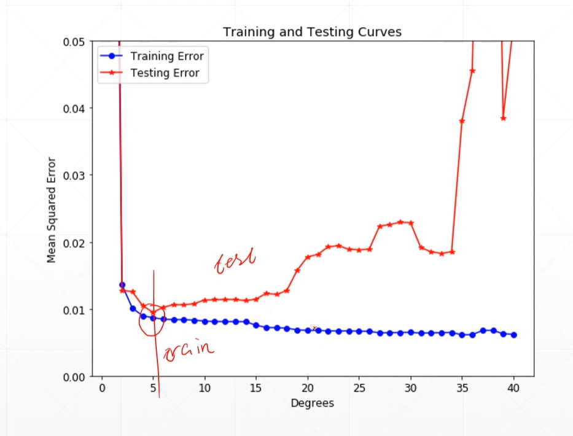

# Overfitting
## 34 Cross variadition

splitting train dataset and test dataset  
calculate loss and accuracy to know whether good or not  

```py
#train, test
(x, y), (x_val, y_val) = datasets.mnist.load_data()

db = tf.data.Dataset.from_tensor_slices((x,y))
db = db.map(preprocess).shuffle(60000).batch(batchsz)

ds_val = tf.data.Dataset.from_tensor_slices((x_val, y_val))
ds_val = ds.val.map(preprocess).batch(batchsz)


#train, val, test
(x, y), (x_test, y_test) = datasets.mnist.load_data()

x_train, x_val = tf.split(x, num_or_size_splits = [50000,10000])
y_train, y_val = tf.split(y, num_or_size_splits = [50000,10000])
db_train = tf.data.Dataset.from_tensor_slices((x_train,y_train))
db_train = db_train.map(preprocess).shuffle(50000).batch(batchsz)

db_val = tf.data.Dataset.from_tensor_slices((x_val,y_val))
db_val = db_val.map(preprocess).shuffle(10000).batch(batchsz)

db_test = tf.data.Dataset.from_tensor_slices((x_test,y_test))
db_test = db_test.map(preprocess).batch(batchsz)

```

```py
#Evaluate during train
network.ompile(optimizer=optimizers.Adam(lr=0.01),
        loss = tf.losses.CategoricalCrossentropy(from_logits=True),
        metrics = ['accuracy']
    )
network.fit(db_train, epochs=5, validation_data=db_val, validation_freq=2)

#test after training
print('Test performance:')
network.evaluate(db_test)

```

## train test trade-off 
  

## k-fold cross validation  
* merge train/val sets  
* randomly sample 1/k as val set  

```py
for epoch in range(500):
    idx = tf.range(60000)
    idx = tf.random.shuffle(idx)
    x_train, y_train = tf.gather(x, idx[:50000]), tf.gather(y, idx[:50000])
    x_val, y_val = tf.gather(x, idx[-10000:]), tf.gather(y, idx[-10000:])

    db_train = tf.data.Dataset.from_tensor_slices((x_train, y_train))
    db_train = db_train.map(preprocess).shuffle(50000).batch(batchsz)

    db_val = tf.data.Dataset.from_tensor_slices((x_val, y_val))
    db_val = db_val.map(preprocess).batch(batchsz)

#training...
#evalution...

network.fit(db_train_val, epochs=6, validation_split=0.1, validation_freq=2)

```
