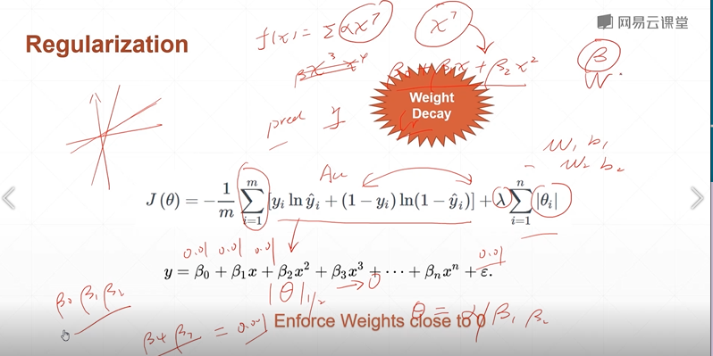
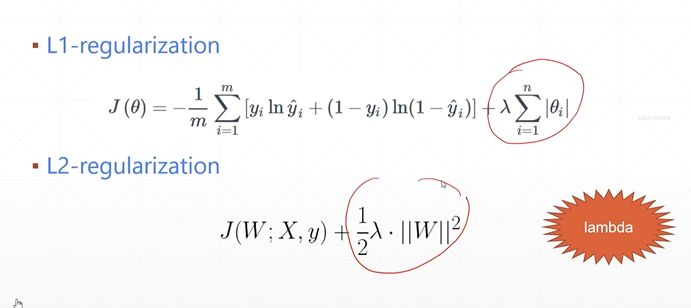

# Overfitting
## 35 Regularization

To reduce overfitting  
Occam's Razor: more things should not be used than are necessary.

* More data: more cost  
* Constraint model complexity-shallow, regularization: 
ResNet152, ResNet36 表達力太強, 當預測MinitSet時不需要那麼好,  
可以選稍微差一些的, 像是LeNet5, AlexNet5, 自己搭建的7~8層的模型。  
當不知道模型複雜度時, 也不知道數據集的大小, 應該選擇多少規模的結構,  
會優先選擇大一點的網路結構, 表達能力強一些。  
如使用ResNet52, 再使用regularization。  

* Dropout: enhence robuct
* Data argumentation: 數據增強    
* Early stopping: 使用validation set提前終結   


weight dacay  
表達能力沒這麼好, 不學習噪聲樣本  



```py
#One-by-one regularization  

L2_model = keras.models.Sequential([
    keras.layers.Dense(16, kernel_regularizer=keras.regularizers.L2(0.001),
                        activation=tf.nn.relu, input_shape=(NUM_WORDS,)),
    keras.layers.Dense(16, kernel_regularizer=keras.regularizers.L2(0.001),
                        activation=tf.nn.relu),
    keras.layers.Dense(1, activation=tf.nn.sigmoid)
])

```

```py
#flexible regularization

for step, (x,y) in enumerate(db):
    with tf.GradientTape() as tape:
        # ...
        loss = tf.reduce_mean(tf.losses.categorical_crossentropy(y_onehot, out, from_logits=True))

        loss_regularization = []
        for p in network.trainable_variables:
            loss_regularization.append(tf.nn.L2_loss(p))
        loss_regularization = tf.reduce_sum(tf.stack(loss_regularization))

        loss = loss + 0.0001 * loss_regularization

    grad = tape.gradient(loss, network.trainable_variables)
    optimizer.apply_gradients(zip(grads, network.trainable_variables))


```

