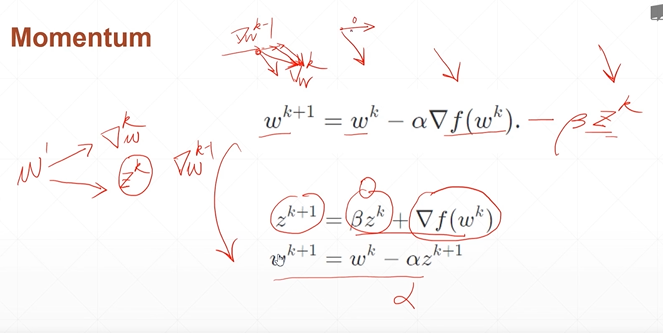

# Overfitting
## 36 momentum and learning rate

  
st.更新幅度緩和, 較有機會得到全局最優解  

```py
# Momentum
optimizer = SGD(learning_rate=0.02, momentum=0.9)
optimizer = RMSprop(learning_rate=0.02, momentum=0.9)
optimizer = Adam(learning_rate=0.02, beta_1=0.9, beta_2=0.999)

```


```py
# Adaptive learning rate

optimizer = SGD(learning_rate=0.2)

for epoch in range(100):
    # get loss
    # change learning rate
    optimizer.learning_rate = 0.2 * (100-epoch)/100
    # update weights

```