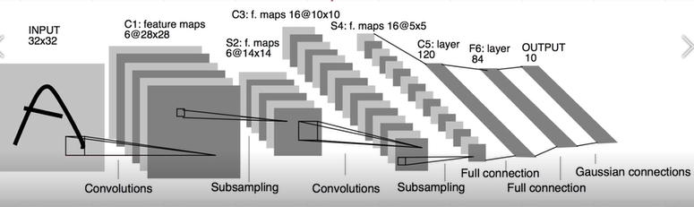
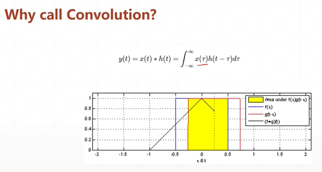
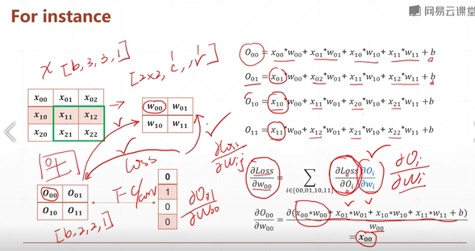

# Convolutional Neural Networks, CNN  
## 38 what?

Feature maps
why not linear? since fully connected: 內存占用, 耗費大量算力   
=> used CNN, receptive field, 只關注跟我局部相關的區域點  
such as partial connected, locally connected(weight sharing)  

  
  
下降了參數量, 局部相關、全局共享    
  
對應元素相乘, 後累加。  

   
信號與另個信號作鏡像偏值，作積分。
離散的卷積和  

Convolution in computer vision  
* sharpen 銳利  
* blur  
* edge detect
w=3*3滑動窗口，不斷地提起特徵，再以另個窗口提取特徵，可以得到另一種觀察方式，堆疊後，增加網絡的抽象能力。  


# CNN

**2D Convolution**  
padding(步長) & stride(降維)  
channels: 多通道輸出, 三通道輸入     
pyramid architecture  

```py
# layers.Conv2D
import tensorflow as tf
from tensorflow.keras import layers

layer = layers.Conv2D(4, kernel_size=5, strides=1, padding='valid')
out = layer(x)        #TensorShape([1,28,28,4])

layer = layers.Conv2D(4, kernel_size=5, strides=1, padding='same')
out = layer(x)        #TensorShape([1,32,32,4])

layer = layers.Conv2D(4, kernel_size=5, strides=2, padding='same')
out = layer(x)        #TensorShape([1,16,16,4])

layer.call(x).shape   #TensorShape([1,16,16,4])

```
```py
# weight & bias
layer = layers.Conv2D(4, kernel_size=5, strides=2, padding='same')
out = layer(x)        #TensorShape(1,16,16,4)

layer.kernel
layer.bias            #array([0.,0.,0.,0.])
```

```py
# nn.conv2d
w = tf.random.normal([5,5,3,4])
b = tf.zeros([4])
x.shape                                               #TensorShape([1,32,32,3])

out = tf.nn.conv2d(x, w, strides=1, padding='VALID')  #TensorShape([1,28,28,4])
out = out + b                                         #TensorShape([1,28,28,4])
out = tf.nn.conv2d(x, w, strides=2, padding='VALID')  #TensorShape([1,14,14,4])

```
  
The loss could derivative, ie. the gradient exists 


