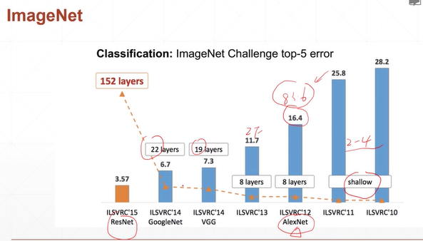
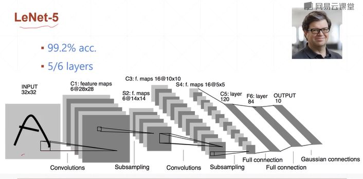
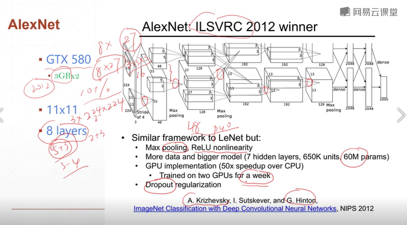
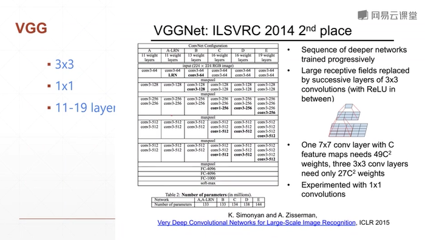
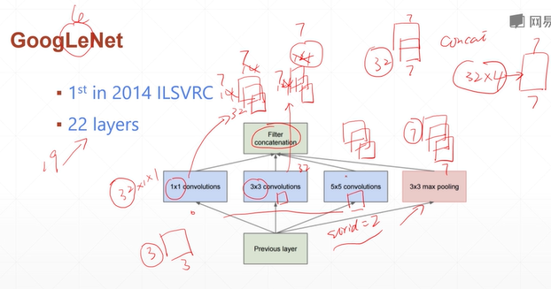
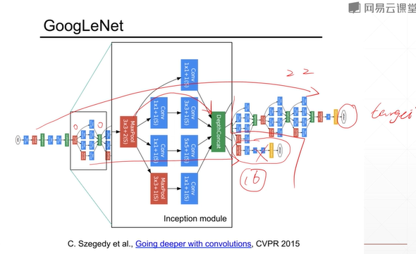
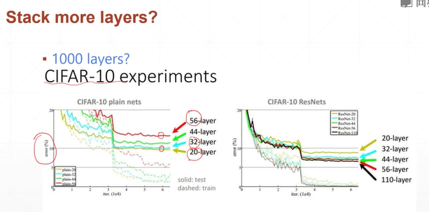

conti after lesson 39   

# Convolutional Neural Networks, CNN  
## 41 Classical CNN  

# 2. VGG13  

2010 shallow: ILSVRC10, ILSVRC11    
2012 8Layers: ILSVRC12- **AlexNet** :star: (準確率提升了10多個%)  
2013 8Layers: ILSVRC13-ZFNet (準確率再提升)  
2014 19Layers: ILSVRC14-VGG  
2014 22Layers: ILSVRC14- **GoogleNet** :star:    
    152Layers: ILSVRC15- **ResNet** :star:   

**1. LeNet**
  
- 1980Y, created the network of CNN based on LeNet-5, and used in witten script(Minst). 
- Less par and run with DSP (not GPU), 
- The architeture of LeNet is made of convolution and subsampling. The subsampling is not max pooling or avg pooling, it just interlaced sampling (隔行採樣), no par in the network.  
- Since Minst dataset is small and sample data, the accuracy of LeNet5 is large.  

**2. AlexNet**  
   
:trophy: The chapion of 2012Y  
- Dataset: imageNet, (224,224,3)  
- GPU used, 2塊GTX, 3GB*2, 
- (5+3) 5convolution, 更易提取image info., many pars      
- With pooling layer and **11*11** windows.      
- ReLU, dropout regularization, to prevent overfitting

**3. VGGnet**

:trophy: The 2nd in 2014Y  
- There are six visions of network created by VGG 牛津大學視覺研究組, such as VGG11, VGG16, VGG19.  
- convolution卷積層, pooling,  
Fully-connected全連接層, The output is fully-connected of 1000 layers, and with softmax to calculate cross entropy loss.   
- **1*1** windows, 大一點的全值窗口有更寬一點的視野, 大一點的窗口有更多的全值連接, 更接近全值連接, 所以參數量也會變大。   
大一點的窗口並沒有比較大的優勢, 反而小一點的窗口, 如3*3的窗口, 僅能感受9像素的視野。這種小視野的優勢是在VGG被探索出來的, 不僅減少了計算量, 還沒有減少精度, 計算起來非常快, 這是VGG最大的價值。  
- **1*1** windows, if (14,14,32), there is 32 channels, ie. 32 feature maps. If **1*1** windows 

**4. GoogleLeNet**  
  
:trophy: The chapion in 2014Y  
- Concate more types of windows, there is much information from the windows.  
- 22 layers or 16 layers...   
- If stacking more layers, test in 1000 layers, with CIFER-10 experiments, we got more layer more error, and the accuracy is more lower. So not just getting great result easily accroding to stacking layers.   
When we stack from 4 layers to 22 layers, there is great result. Therefore if more than 22 layers, might get worse result in testing set. Since the architeture of network is too deep to find out the optimal solution.  
   
  

**5. ResNet**   

