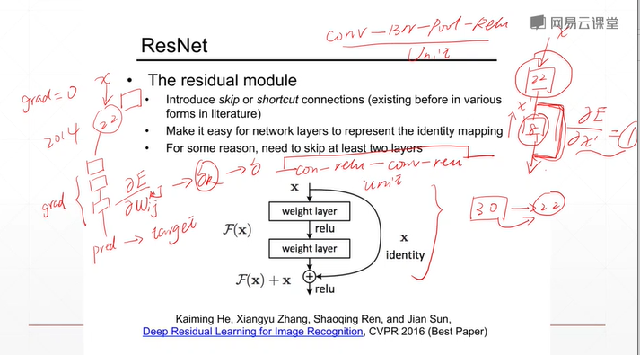
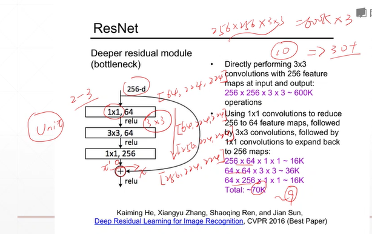
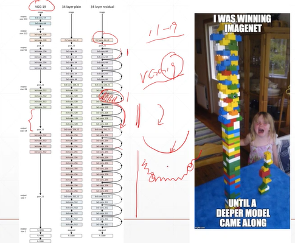
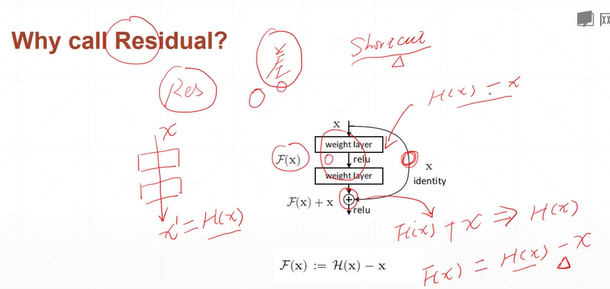
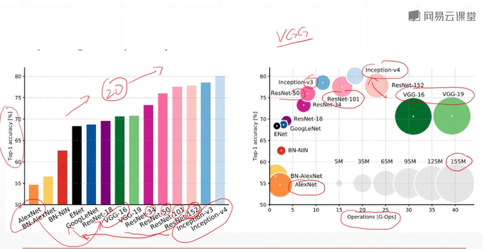
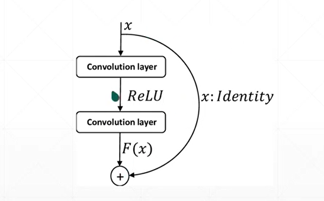
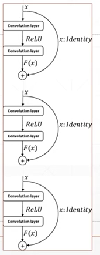
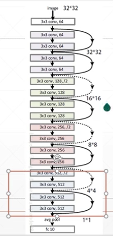

# Convolutional Neural Networks, CNN  
## 43 ResNet and DenseNet(深度殘差網路)  


# 1.1 Introduction of ResNet   

   
   
- last unit: conv + batchnet + pooling + Relu  
unit here: conv(1,1,64) + relu + conv(3,3,64) + relu + conv(1,1,256) + shortcut  

   
- revolution of depth:  
AlexNet, 8 layers (ILSVRC 2012)  
VGG, 19 layers (ILSVRC 2014)  
ResNet, 152 layers (ILSVRC 2015)


- MSRA @ ILSVRC & COCO 2015 competitions  
imageNet classification, detection, localization  
COCO detection, segmentation   
  
- shortcut- why call residual?  



# 1.2 The comparison of networks   
   
- AlexNet - VGG16(20 layers) - GoogleLeNet - ResNet(34, 50, 101, 152)  
VGG16: 以20層為分水嶺, 愈多層表現愈差。ResNet解決了這個問題，愈多層會愈來愈好。  
Inception: 為GoogleNet的加深版本  
- operation運算性能:  
better-ResNet, Inception. 👍 
worse- VGG(no small window 沒有用小卷積和技術, 參數計算量大。)

```py
# Basic block

class BasicBlock(layers.Layer):
    def __int__(self, filter_num, stride=1):
        super(BasicBlock, self).__int__()

        self.conv1 = layers.Conv2D(filter_num, (3,3), strides=stride, padding='same')  
        self.bn1 = layers.BaatchNormalization()
        self.relu = layers.Activation('relu')
        self.conv2 = layers.Conv2D(filter_num, (3,3), strides=1, padding='same')
        self.bn2 = layers.BatchNormalization()
        if stride != 1:
            self.downsample = Sequential()
            self.downsample.add(layers.Conv2D(filter_num, (1,1), strides=stride))
            self.downsample.add(layers.BatchNormalization())
        else:
            self.downsample = lambda x: x
        
        self.stride = stride
    
    def call(self, inputs, training=None):
        residual = self.downsample(inputs)

        conv1 = self.conv1(inputs)
        bn1 = self.bn1(conv1)
        relu1 = self.relu(bn1)
        conv2 = self.conv2(relu1)
        bn2 = self.bn2(conv2)

        add = layers.add([bn2, residual])
        out = self.relu(add)
        return out
        
```
```py
# Res block  
def _build_resblock(self, block, filter_num, blocks, stride=1):
    res_blocks = keras.Sequential()
    res_blocks.add(block(filter_num, stride))

    for _ in range(1, blocks):
        res_blocks.add(block(filter_num, stride=1))

    return res_blocks

```


# 1.3 DenseNet

- 中間的每一層都有可能與最開始的每一層有機會接觸，連接很密集。  
- 對前面訊息有總和，不是elementwise相加，而是concate操作，使得後方的channel越來越大。反之，使你的channnel不至於太大，這是從ResNet延伸而得的DenseNet。  


# 2.1 Practice: BasicBlock, ResNet    
resnet.py  
```py
import tensorflow as tf
from tensorflow import keras
from tensorflow.keras import layers, Sequential

class BasicBlock(layers.Layer):
    def __int__(self, filter_num, strides=1):
        super(BasicBlock, self).__init__()

        self.conv1 = layers.Conv2D(filter_num, (3,3), strides=stride, padding='same')
        self.bn1 = layers.BatchNormalization()
        self.relu = layers.Activation('relu')

        self.conv2 = layers.Conv2D(filter_num, (3,3), strides=1, padding='same')
        self.bn2 = layers.BatchNormalization()

        if strides != 1:
        self.downsample = Sequential()
        self.downsample.add(layers.Conv2D(filter_num, (1,1), strides=stride))
        else:
            self.downsample = lambda x:x


    # forward
    def call(self, inputs, training=None):

        # [b,h,w,c]
        out = self.conv1(inputs)
        out = self.bn1(out)
        out = self.relu(out)

        out = self.conv2(out)
        out = self.bn2(out)

        identity = self.downsample(inputs)

        output = layers.add([out, identity])
        output = self.nn.relu(output)

        return output

class ResNet(keras.Model):

    def __init__(self, layer_dims, num_classes=100):  #[2,2,2,2]
        super(ResNet, self).__init__()

        self.stem = Sequential([layers.Conv2D(64, (3,3), strides=(1,1),
                                layers.BatchNormalization(),
                                layers.Activation('relu'),
                                layers.MaxPooling2D(pool_size=(2,2), strides=(1,1), padding='same'))
                                )])
        self.layer1 = self.build_resblock(64,  layer_dims[0])
        self.layer2 = self.build_resblock(128, layer_dims[1], strides=2)
        self.layer3 = self.build_resblock(256, layer_dims[2], strides=2)
        self.layer4 = self.build_resblock(512, layer_dims[3], strides=2)

        # output: [b,512,h,w], 
        self.avgpool = layers.GlobalAveragePooling2D()
        self.fc = layer.Dense(num_classes)


    
    def call(self, inputs, training=None):
        x = self.stem(inputs)

        x = self.layer1(x)
        x = self.layer2(x)
        x = self.layer3(x)
        x = self.layer4(x)

        # [b,c]
        x = self.avgpool(x)
        # [b,100]
        x = self.fc(x)

        return x


    def build_resblock(self, filter_num, blocks, strides=1):
        res_blocks = Sequential()
        # may down sample
        res_blocks.add(BasicBlock(filter_num, strides))

        for _ in range(1, blocks):
            res_blocks.add(BasicBlock(filter_num, strides=1))

        return res_blocks

def resnet18():
# each basicblock include 2 layers, so each ResNet include 4 layers, 4*4=16  
# add the first and last layers, we get 18 layers.  
    return ResNet([2,2,2,2])


def resnet34():
    return ResNet([3,4,6,3])

```





# 2.2 Practice: ResNet18  
resnet18_train.py  
- could based on `cifar100_train.py` 
- delete the layer part of VGG

```py
import  tensorflow as tf
from    tensorflow.keras import layers, optimizers, datasets, Sequential
import  os
from    resnet import resnet18

os.environ['TF_CPP_MIN_LOG_LEVEL'] = '2'
tf.random.set_seed(2345)


def preprocess(x, y):
    # [-1~1]
    x = 2 * tf.cast(x, dtype=tf.float32) / 255. -1
    y = tf.cast(y, dtype=tf.int32)
    return x,y


(x,y), (x_test, y_test) = datasets.cifar100.load_data()
y = tf.squeeze(y, axis=1)
y_test = tf.squeeze(y_test, axis=1)
print(x.shape, y.shape, x_test.shape, y_test.shape)


train_db = tf.data.Dataset.from_tensor_slices((x,y))
train_db = train_db.shuffle(1000).map(preprocess).batch(256)

test_db = tf.data.Dataset.from_tensor_slices((x_test,y_test))
test_db = test_db.map(preprocess).batch(256)

sample = next(iter(train_db))
print('sample:', sample[0].shape, sample[1].shape,
      tf.reduce_min(sample[0]), tf.reduce_max(sample[0]))


def main():

    # [b, 32, 32, 3] => [b, 1, 1, 512]
    model = resnet18()
    fc_net.build(input_shape=(None, 32,32,3))
    model.summary()
    optimizer = optimizers.Adam(lr=1e-3)


    for epoch in range(50):

        for step, (x,y) in enumerate(train_db):

            with tf.GradientTape() as tape:
                # [b, 32, 32, 3] => [b, 100]
                logits = model(x)
                # [b] => [b, 100]
                y_onehot = tf.one_hot(y, depth=100)
                # compute loss
                loss = tf.losses.categorical_crossentropy(y_onehot, logits, from_logits=True)
                loss = tf.reduce_mean(loss)

            grads = tape.gradient(loss, model.trainable_variables)
            optimizer.apply_gradients(zip(grads, trainable_variables))

            if step %100 == 0:
                print(epoch, step, 'loss:', float(loss))


        total_num = 0
        total_correct = 0
        for x,y in test_db:

            logits = model(x)
            prob = tf.nn.softmax(logits, axis=1)
            pred = tf.argmax(prob, axis=1)
            pred = tf.cast(pred, dtype=tf.int32)

            correct = tf.cast(tf.equal(pred, y), dtype=tf.int32)
            correct = tf.reduce_sum(correct)

            total_num += x.shape[0]
            total_correct += int(correct)

        acc = total_correct / total_num
        print(epoch, 'acc:', acc)


if __name__ == '__main__':
    main()

```


**Out of memory**
1. decrease batch size   
2. turn resnet [2,2,2,2]   
3. try Google CoLab  
4. buy new NVIDIA GPU Card: 1066, 1070, 1080  