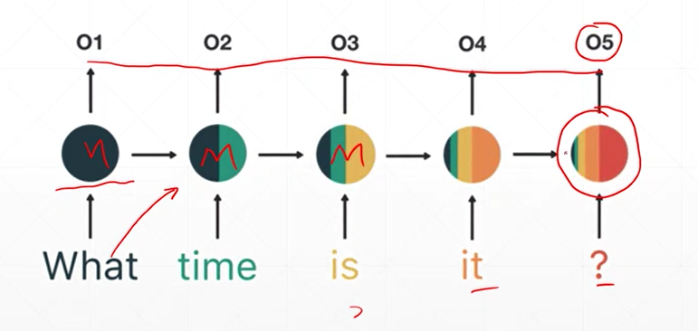

# Recurrent neural network：RNN, 循環神經網絡    

## Time series  

**1. Spatial signals**  
    
卷積神經網絡是針對二維位置相關的圖片，採用全局共享的概念，透過移動窗口慢慢提取位置相關訊息。  
除了位置相關的訊息外，還有其他更為廣泛的數據型態，如時間...  
   
**2. Temporal signals**   
- 語音訊號沿著時間軸t產生波形，沿著t產生序列訊號，  
- 文字, 聊天訊號不斷產生語句，即便是文章還是有第一句, 第二句，是為「有序」類別的資料形態。  
- 沿著時間序列不停地產生訊號，像這樣的訊號是一個sequence, or temporal signal，及時間序列上的訊號。  

**Sequence embedding:** 將序列訊號轉成數值型格式,   
ex. price-time [ b, 100, 1 ]  
image [ b, 28, 28 ]  
batch [ b, word num, word vec ]

:hankey: [word, word vec]
* sparce and high-dim, 
* use *semantic similarity*: ['word', dist]  
* be trainable  

:thought_balloon: Word2Vec, Glove

```py
# random initialized embedding  
from tensorflow.keras import layers

x = tf.range(5)
x = tf.random.shuffle(x)

net = layers.Embedding(10,4)
net(x)

# embedding layer
net.trainable
net.trainable_variables

```


## Recurrent neural network：RNN, 循環神經網絡    

**Sentiment analysis:** pos/neg  
  
單獨提取 st.  
- long sentence, too much parameters  
- no context information, consistent tensor  

=> **Weight sharing**  
- 使用共同的權重   
- consistent memory  
- record state 全局狀態, 最後一個紀錄了前面的狀態

  
  
  
  
 

**The gradient:** 


  
## Recap  

batch: b, 64  
feature len: 100  
seg len: 80   
hidden len: 64  


```py
# input dim, hidden dim 

cell = layers.SimpleRNNCell(3)     #x*w_(xh) + h*w_(hh)
cell.build(input_shape=(None,4))

cell.trainable_variables

# kernel:0            shape=(4,3)
# recurrent_kernel:0  shepe=(3,3)
# bias:0              shape=(3,)

```
## Simple layer RNN cell  


```py

x = tf.random.normal([4,80,100])
ht0 = x[:,0,:]
cell = tf.keras.layers.SimpleRNNCell(64)  

out, ht1 = cell(ht0, [tf.zeros([4,64])])

out.shape, ht1[0].shape   #tensorShape([4,64])
id(out), id(ht1[0])       

```
```py
# w, b

cell = tf.keras.layers.SimpleRNNCell(64)  
cell.trainable_variables

### h_(t+1) = xt * w_(xh) + ht * w_(hh) + b

# simple_rnn_cell/kernel:0            shape=(100,64) 
# w_(xh) = 100 -> 64
# simple_rnn_cell/recurrent_kernel:0  shepe=(64,64)
# w_(hh) = 64, 64
# simple_rnn_cell/bias:0              shape=(64,)

```
## Multi-layers RNN  
```py

x = tf.random.normal([4,80,100])
xt1 = x[:,0,:]

cell = tf.keras.layers.SimpleRNNCell(64)
cell2 = tf.keras.layers.SimpleRNNCell(64)
state0 = [tf.zeros([4,64])]
state1 = [tf.zeros([4,64])]

out0, state0 = cell(xt1,state0)
out2, state2 = cell2(out,state0)  #memory replace state

out2.shape, state2[0].shape

```
```py
state0 = [tf.zeros([batchsz, units])]
state1 = [tf.zeros([batchsz, units])]

for word in tf.unstack(x, axis=1):  #word:[b,100]
    # h1 = x*wxh + h0*whh
    # out0: [b,64]
    out0, state0 = self.rnn_cell0(word, state0, training)
    # out1: [b,64]
    out1, state1 = self.rnn_cell1(out0, state1, training)

```
```py
# RNN layer

self.rnn = keras.Sequential([
    layers.SimpleRNN(units, dropout=0.5, return_sequences=True, unroll=True),
    layers.SimpleRNN(units, dropout=0.5, unroll=True)
])
    # x:[b,80,100] => [b,64]
x = self.rnn(x) 

```