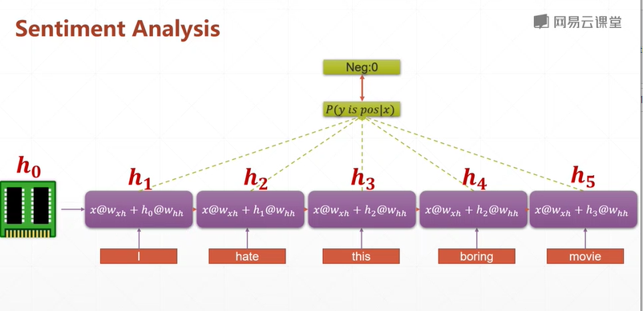

# Recurrent neural network：RNN, 循環神經網絡    

## practice: Sentiment analysis  



**two approaches** 
1. SimpleRNNCell: single layer, multi-layers   
2. RNNCell

sentiment_analysis_layer.py  

```py

import os
import tensorflow as tf
import numpy as np
from tensorflow import keras
from tensorflow.keras import layers

tf.random.set_seed(22)
np.random.seed(22)
os.environ['TF_CPP_MIN_LOG_LEVEL'] = '2'
assert tf.__version__.startswith('2.')

```
```py

batchsz = 128

# the must frequest words
total_words = 10000
max_review_len = 80
embedding_len = 100
(x_train, y_train), (x_test, y_test) = keras.datasets.imdb.load_data(num_words=total_words)
# x_train:[b,80], number
# x_test: [b,80]
x_train = keras.proprocessing.sequence.pad_sequencese(x_train, maxlen=max_review_len)
x_test = keras.proprocessing.sequence.pad_sequencese(x_test, maxlen=max_review_len)

db_train = tf.data.Dataset.from_tensor_slices((x_train, y_train))
db_train = db_train.shuffle(1000).batch(batchsz, drop_remainder=True)
db_test = tf.data.Dataset.from_tensor_slices((x_test, y_test))
db_test = db_test.batch(batchsz, drop_remainder=True)
print('x_train shape:', x_train.shape, tf.reduce_max(y_train), tf.reduce_min(y_train))
print('x_test shape:', x_test.shape)

```
```py
class MyRNN(keras.Model):

    def __int__(self, units):
        super(MyRNN, self).__init__()

        # [b,64]
        self.state0 = [tf.zeros([batchsz, units])]
        self.state1 = [tf.zeros([batchsz, units])]


        # transform text to embedding representation
        # [b,80] => [b,80,100]
        self.embedding = layers.Embedding(total_words, embedding_len,
                                         inpunt_length=max_review_len)

        # [b,80,100], h_dim: 64
        # RNN: cell1, cell2, cell3
        # SimpleRNN
        self.rnn_cell0 = layers.SimpleRNNCell(units, dropout=0.2)
        self.rnn_cell1 = layers.SimpleRNNCell(units, dropout=0.2)


        # fc, [b,80,100] => [b,64] => [b,1]
        self.outlayer = layers.Dense(1)

    
    def call(self, inputs, training=None):
        """
        net(x) net(x, training=True) : train mode
        net(x, training=False) : test mode
        :parm inputs: [b, 80]
        :param training:
        :return:

        """
        # [b, 80]
        x = inputs
        # embedding: [b,80] => [b,80,100]
        x = self.embedding(x)

        # run cell compute
        # [b, 80, 100] => [b,64]
        state0 = self.state0
        state1 = self.state1
        for word in tf.unstack(x, axis=1):  # word: [b,100]
            # h1 = x * w_xh + h * w_hh
            out0, state0 = self.rnn_cell0(word, state0, training)
            out1, state1 = self.rnn_cell1(out0, state1)

        # out: [b,64] => [b,1]
        x = self.outlayer(out)
        # p(y is pos | x)
        prob = tf.sigmoid(x)

        return prob

```
```py
# main

def main():
    units = 64
    epochs = 4

    model = MyRNN(units)
    model.compile(optimizer = keras.optimizer.Adam(0.001),
                loss = tf.losses.BinaryCrossentropy(),
                metrics=['accuracy'])
    model.fit(db_train, epochs=epochs, validation_data=db_test)

    model.evaluate()


if __name__ == '__main__':
    main()


```

