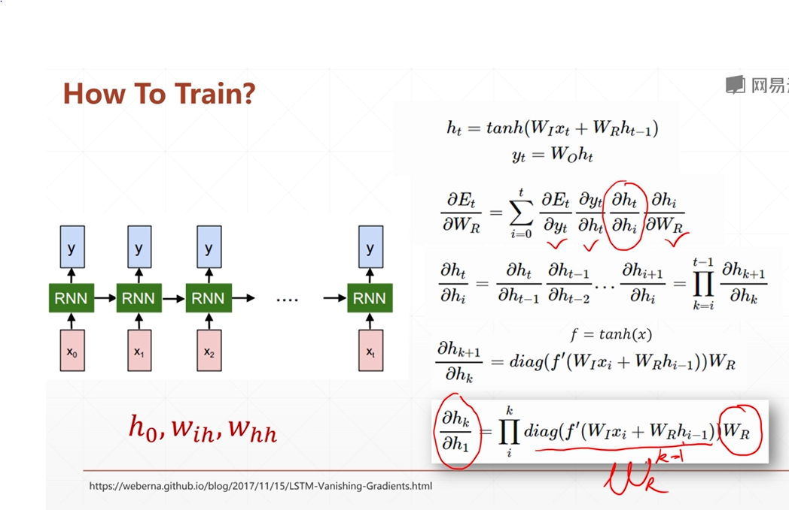

# The gradient: 



:hankey: Problem: Gradient exploding and Gradient vanishing  

Sol1. Gradient exploding - gradient clipping  

```py
with tf.GradientTape() as tape:
    logits = model(x)
    loss = criteon(y, logits)

grads = tape.gradient(loss, model.trainable_variables)
#MUST "clip gradient" here or it will disconverge!
grads = [tf.clip_by_norm(g,15) for g in grads]
optimizer.apply_gradients(zip(grads, model.trainable_variables))

```

Sol2. Gradient vanishing: 1997  
RNN vs. LSTM 

```py
# LSTM
# based on RNN of framework, change to LSTM  
# and another-GRU: simplier, lower computation cost  


```
