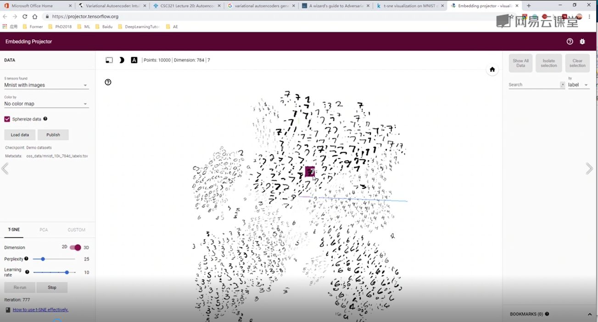
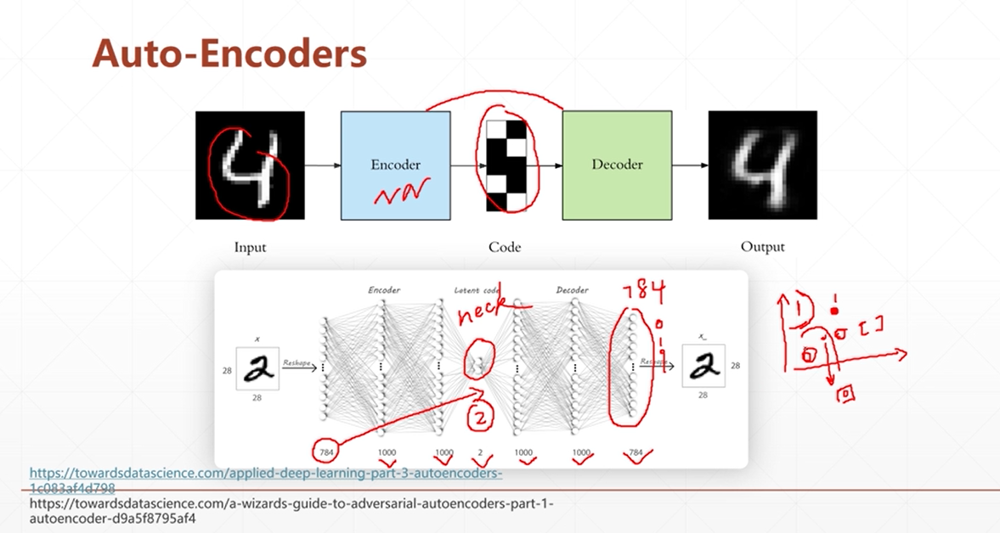
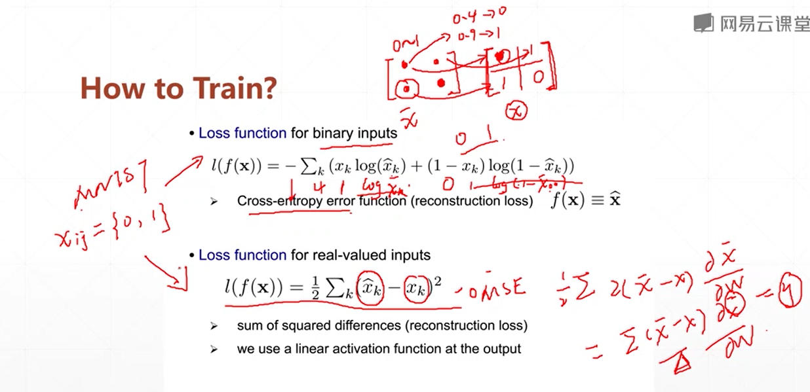
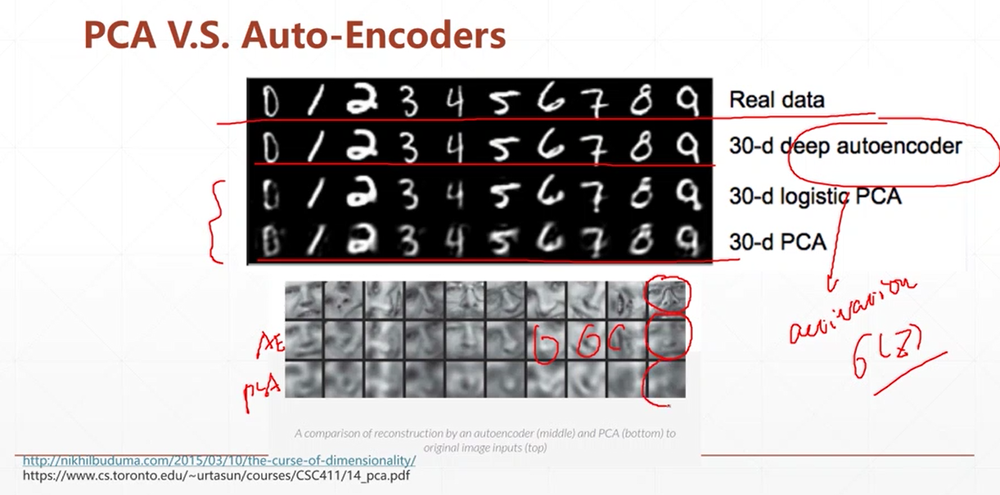
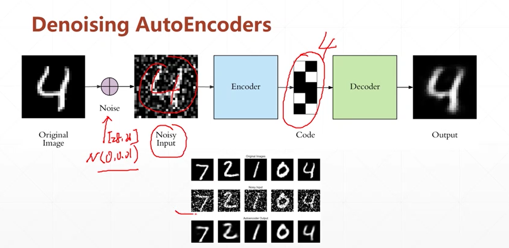
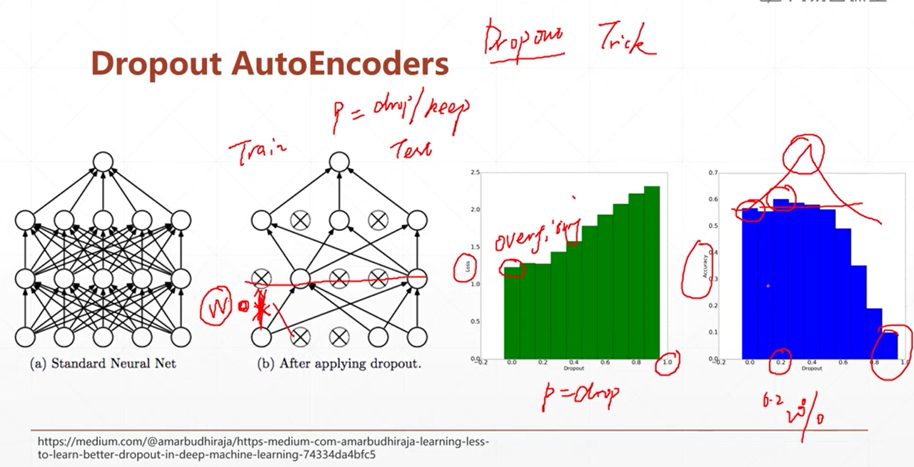
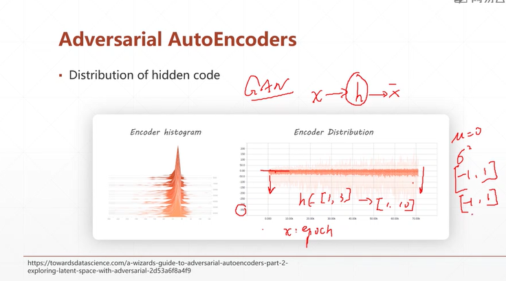
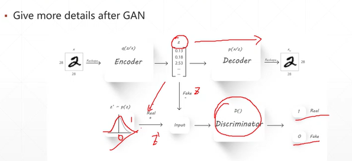
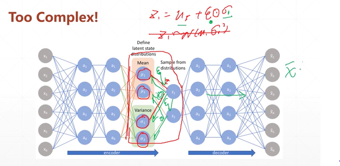

# Auto-encoders

## Auto-encoders

Supervised learning: classification, regression   
BUT! massive unlabeled data   

**WHY we needed?**  
* Dimension reduction  
* Preprocessing: huge dimension, say 224*224, is hard to process  
* Visualization: https://projector.tensorflow.org/
* Taking adventages of unsupervised data  
* Compression壓縮, dinoising降噪, super-resolution...

  
   
reconstruct
input=output   
neck: 升維, 降維  

### Dimension reduction  
PCA vs Auto-Encoders  
* PCA, which finds the directions of maximal variance in high-dim data, select only those axes that have the largest variance.    
* The linearity of PCA, however, places significant limitations on the kinds of feature dim that can be extracted.  
線性變換的效果有限   

  

### Another way of Dimension reduction  
1. Denoising Autoencoder    
    
add noisy input    

2. Dropout Autoencoder   
  
hilton  
When training, set the weight to zero st.   
the system is rebust, not depend on too many neurons,   
BY setting "the prob of dropout and keep"     

3. Adversarial Autoencoder   
   
distribution of hidden code: encoder hist, encoder dist     
    
discriminator: 識別器, between fake z and real z  
sample() isn't diff   

4. Variational Autoencoder (VAE)   

