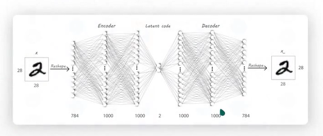
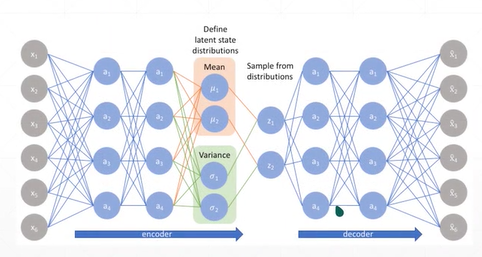
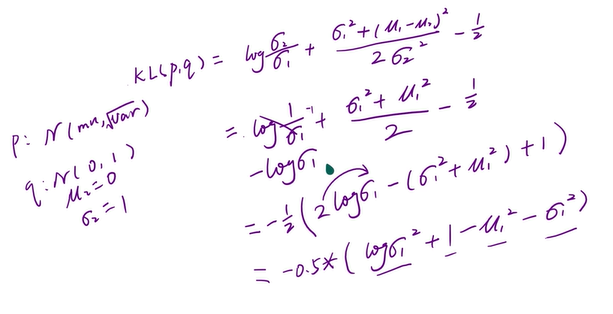

# Auto-encoders

## Auto-encoders practice  

* Auto-Encoder   
* Variational Auto-Encoders (VAE)   
   


1. Auto-Encoder  
   
autoencoder.py  
   
```py
import os
import tensorflow as tf
import numpy as np
from   tensorflow import keras
from   tensorflow.keras import Sequential, layers
from   PIL import Image
from   matplotlib import pyplot as plt

tf.random.set_seed(22)
np.random.seed(22)
os.environ['TF_CPP_MIN_LOG_LEVEL'] = '2'
assert tf.__version__.startswitch('2.')

def save_images(imgs, name):
    new_im = Image.new('L', (280,280))

    index = 0
    for i in range(0, 280, 28):
        for j in range(0, 280, 28):
            im = imgs[index]
            im = Image.fromarray(im, mode='L')
            new_im.oaste(im, (i,j))
            index += 1

    new_im.save(name)

h_dim = 20
batchsz = 512
lr = 1e-3


(x_train, y_train), (x_test, y_test) = keras.datasets.fashion_mnist.load_data()
x_train, x_test = x_train.astype(np.float32) / 255., x_test.astype(np.float32) / 255.
# we do not need label
train_db = tf.data.Dataset.from_tensor_slices(x_train)
train_db = train_db.shuffle(batchsz * 5).batch(batchsz)
test_db = tf.data.Dataset.from_tensor_slices(x_test)
test_db = test_db.batch(batchsz)

print(x_train.shape, y_train.shape)
print(x_test.shape, y_test.shape)


class AE(keras.Model):

    def __int__(self):
        super(AE, self).__init__()

        # Encoders
        self.encoder = Sequential([
            layers.Dense(256, activation=tf.nn.relu),
            layers.Dense(128, activation=tf.nn.relu),
            layers.Dense(h_dim)
        ])

        # Decoders
        self.decoder = Sequential([
            layers.Dense(128, activation=tf.nn.relu),
            layers.Dense(256, activation=tf.nn.relu),
            layers.Dense(784)
        ])

    def call(self, inputs, training=None):
        # [b,784] => [b,10]
        h = self.encoder(inputs)
        # [b,10] => [b,784]
        x_hat = self.decoder(h)

        return x_hat


model = AE()
model.build(input_shape=(None, 784))
model.summary()

optimizer = tf.optimizers.Adam(lr=lr)

for epoch in range(100):
    for step, x in enumerate(train_db):

        #[b,28,28] => [b,784]
        x = tf.reshape(x, [-1, 784])

        with tf.GradientTape() as tape:
            x_rec_logits = model(x)

            rec_loss = tf.losses.binary_crossentropy(x, x_rec_logits, from_logits=True)
            rec_loss = tf.reduce_mean(rec_loss)

        grads = tape.gradient(rec_loss, model.trainable_variables)
        optimizer.apply_gradients(zip(grads, model.trainable_variables))


        if step % 100 == 0:
            print(epoch, step, float(rec_loss))

        # evaluation
        x = next(iter(test_db))
        logits = model(tf.reshape(x, [-1, 784]))
        x_hat = tf.sigmoid(logits)
        # [b,784] => [b,28,28]
        x_hat = tf.reshape(x_hat, [-1,28,28])

        # [b,28,28] => [2b, 28, 28]
        x_concat = tf.concat([x, x_hat], axis=0)
        x_concat = x_hat
        x_concat = x_concat.numpy() * 255.
        x_concat = x_concat.astype(np.uint8)
        save_images(x_concat, 'ae_images/rec_epoch_%d.png'%epoch)


```


2. Variational Auto-Encoders (VAE)   

  
vae.py   

```py
import os
import tensorflow as tf
import numpy as np
from   tensorflow import keras
from   tensorflow.keras import Sequential, layers
from   PIL import Image
from   matplotlib import pyplot as plt

tf.random.set_seed(22)
np.random.seed(22)
os.environ['TF_CPP_MIN_LOG_LEVEL'] = '2'
assert tf.__version__.startswitch('2.')

def save_images(imgs, name):
    new_im = Image.new('L', (280,280))

    index = 0
    for i in range(0, 280, 28):
        for j in range(0, 280, 28):
            im = imgs[index]
            im = Image.fromarray(im, mode='L')
            new_im.oaste(im, (i,j))
            index += 1

    new_im.save(name)

h_dim = 20
batchsz = 512
lr = 1e-3


(x_train, y_train), (x_test, y_test) = keras.datasets.fashion_mnist.load_data()
x_train, x_test = x_train.astype(np.float32) / 255., x_test.astype(np.float32) / 255.
# we do not need label
train_db = tf.data.Dataset.from_tensor_slices(x_train)
train_db = train_db.shuffle(batchsz * 5).batch(batchsz)
test_db = tf.data.Dataset.from_tensor_slices(x_test)
test_db = test_db.batch(batchsz)

print(x_train.shape, y_train.shape)
print(x_test.shape, y_test.shape)

z_dim = 10

class VAE(keras.Model):


    def __init__(self):
        super(VAE, self).__init__()

        # Encoder
        self.fcl = layers.Dense(128)
        self.fc2 = layers.Dense(z_dim)  # get mean prediction
        self.fc3 = layers.Dense(z_dim)

        # Decoder
        self.fc4 = layers.Dense(128)
        self.fc5 = layers.Dense(784)


    def encoder(self, x):
        h = tf.nn.relu(self.fcl(x))
        # get mean
        mu = self.fc2(h)
        # get variance
        log_var = self.fc3(h)
        
        return mu, log_var


    def decoder(self, z):
        out = tf.nn.relu(self.fc4(z))
        out = self.fc5(out)

        return out


    def reparameterize(self, mu, log_var):
        eps = tf.random.normal(log_var.shape)
        std = tf.exp(log_var)**0.5
        z = mu + std * eps

        return z


    def call(self, inputs, training=None):
        
        # [b,784] => [b, z_dim], [b, z_dim]
        mu, log_var = self.encoder(inputs)
        # reparameterization trick
        z = self.reparameterize(mu, log_var)

        x_hat = self.decoder(z)

        return x_hat, mu, log_var

model = VAE()
model.build(input_shape=(None,784))
optimizer = tf.optimizers.Adam(lr)

for epoch in range(1000):

    for step, x in enumerate(train_db):
    
        x = tf.reshape(x, [-1,784])

        with tf.GradientTape() as tape:
            x_rec_logits, mu, log_var = model(x)

            # rec_loss = tf.losses.binary_crossentropy(x, x_rec_logits, from_logits=True)
            # rec_loss = tf.reduce_mean(rec_loss)
            rec_loss = tf.nn.sigmoid_cross_entropy_with_logits(labels=x, logits=x_rec_logits)
            rec_loss = tf.reduce_sum(rec_loss) / x.shape[0]


            # compute kl divergence (mu, var) ~ N(0,1)
            kl_div = -0.5 * (log_var + 1 - mu**2 - tf.exp(log_var))
            kl_div = tf.reduce_sum(kl_div) / x.shape[0]

            loss = rec_loss + 1. * kl_div

        grads = tape.gradient(loss, model.trainable_variables)
        optimizer.apply_gradients(zip(grads, model.trainable_variables))

        if epoch % 100 == 0:
            print(epoch, step, 'kl')


    # evaluation
    z = tf.random.normal((batchsz, z_dim))
    logits = model.decoder(z)
    x_hat = tf.sigmoid(logits)
    x_hat = tf.reshape(logits, [-1,28,28]).numpy() * 255.
    x_hat = x_hat.astype(np.uint8)
    save_images(x_hat, 'vae_images/sampled_epoch%d.png'%epoch)

    x = next(iter(test_db))
    x = tf.reshape(x, [-1,784])
    x_hat_logits, _, _ = model(x)
    x_hat = tf.sigmoid(x_hat_logits)
    x_hat = tf.reshape(x_hat, [-1,28,28]).numpy() * 255.
    x_hat = x_hat.astype(np.uint8)
    save_images(x_hat, 'vae_images/rec_epoch%d.png'%epoch)


```



