# Generative Adversarial Network

## 1. Introduction  
What I can't create, I don't understand. (Richard Feynman)   


```py
# ex. Random sampling with p(x)

mu = [1 2 ; -3 -5]  
sigma = cat(3, [2 0;0 .5], [1 0;0 1])  
p = ones(1,2)/2
gm = gmdistribution(mu,sigma,p)

```

After learning, achieve the "Nash Equilibrium".  
generator and discriminator  
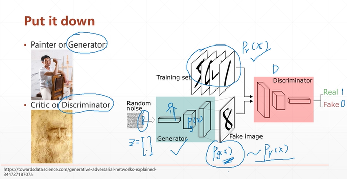  
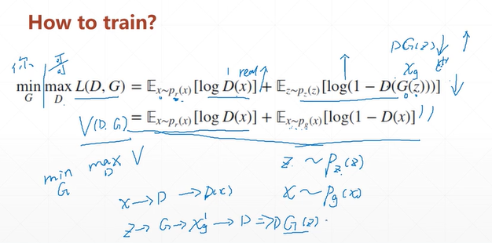  
max_D: 識別出來, D converge, given fixed.   
min_G: 減少value, G converge, after optimal D.  
x->D->D(x)  
z->G->Xg->D  

### Having fun  
https://reiinakano.gitlab.io/gan-playground/    
https://affinelayer.com/pixsrv/   
https://www.youtube.com/watch?v=9reHvktowLY&feature=youtu.be    
https://github.com/ajbrock/Neural-Photo-Editor    
https://github.com/nashory/gans-awesome-applications    


## 2. Nash Equilibrium

Q1. Where will D go (fixed G)   
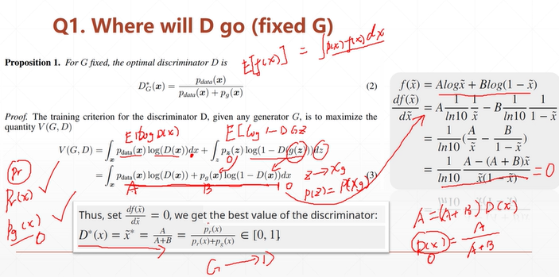   

* KL div vs. JS div
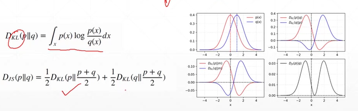

Q2. Where will G go (after D*)   
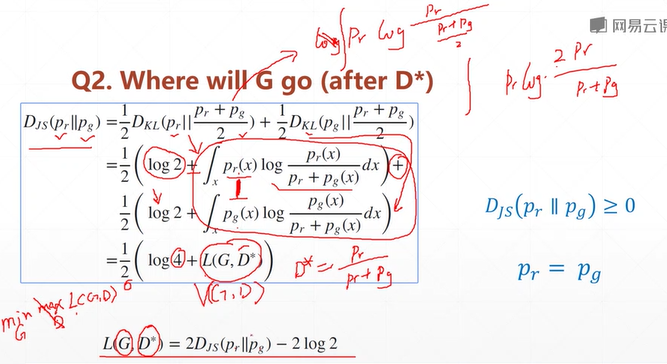   

## 3. A~Z GAN   
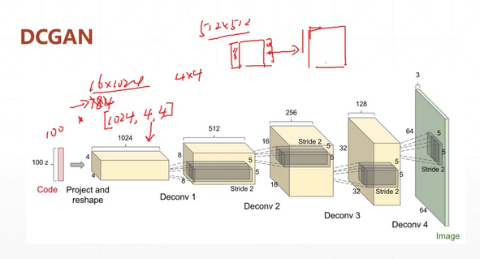  

* challenge: Training stability   
In most cases, PG and Pdata are not overlapped.  
1. the nature of data: both Pdata and PG are low-dim manifold in high-dim space. The overlap can be ignored.   
2. Sampling: Even though Pdata and PG have overlap. If you don't have enough sampling...   

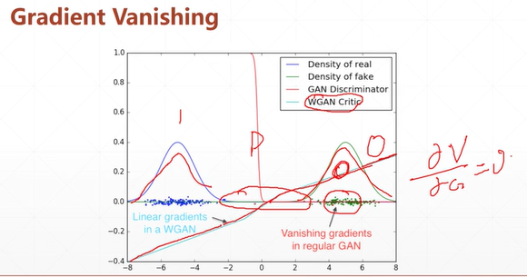  
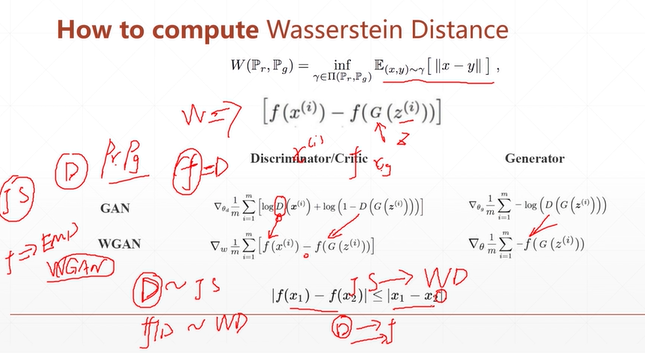    

sol1.  
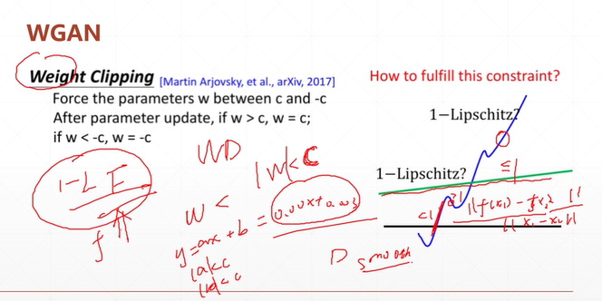   
sol2.  
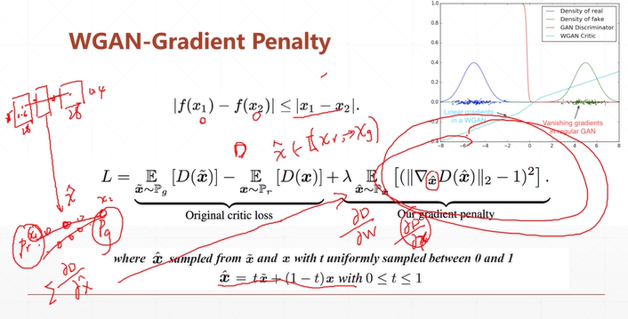    

## 4. comparison
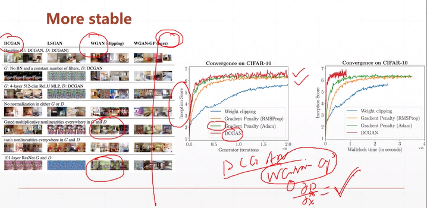  

* DCGAN: conv quickly, and the pred well. BUT the par need to be designed.      
* WGAN: conv slowly, BUT the par were free-style, just fit some condition, the value must conv. And the arch was complex so pred effect was worse a little bit.  


