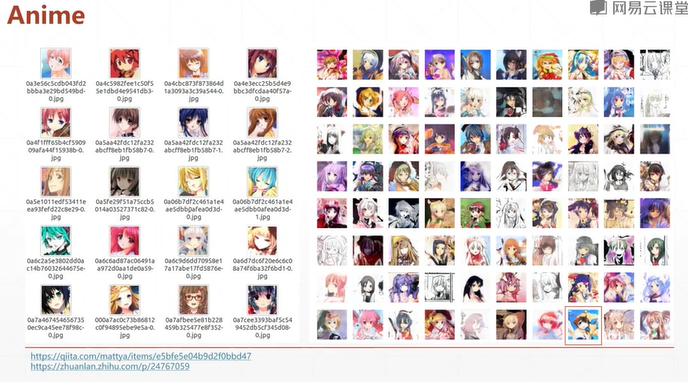

# Generative Adversarial Network

## Practice  
* Anime dataset   
* GAN  
* WGAN-GP

# 1. Anime dataset 




- autoencoder: decoder(升維) & encoder(降維)   
對於GAN來說, 這是個低維的vector, 升維成原始圖片-decoder    
根據所生成圖片, 再作二分類慢慢降維成 [0,1] 標量, 判別是真圖片還是假圖片。-encoder(discriminator, classifier通過堆疊convolution-2D層, 通過全連接層判斷類別。)    
對於generator來說, 實現上採樣, 往上增加圖片還是個convolution, 是個transport convolution, 從512到RGB三通道。    

# 2.1 gan.py   
```py
import tensorflow as tf
from   tensorflow import keras
from   tensorflow.keras import layers

class Generator(keras.Model):

    def __init__(self):
        super(Generator, self).__init__()

        # z: [b,100] => [b, 3*3*512] => [b,3,3,512] => [b,64,64,3]
        # reduce dim, and enlarge the image size
        self.fc = layers.Dense(3*3*512)

        self.conv1 = layers.Conv2DTranspose(256, 3, 3, "valid")
        self.bn1 = layers.BatchNormalization()

        self.conv2 = layers.Conv2DTranspose(128, 5, 2, "valid")
        self.bn2 = layers.BatchNormalization()
        
        self.conv3 = layers.Conv2DTranspose(3, 4, 3, "valid")
        

    def call(self, inputs, training=None):
        
        # [z,100] => [z, 3*3*512]
        x = self.fc(inputs)
        x = tf.reshape(x, [-1,3,3,512])
        x = tf.nn.leaky_relu(x)

        #
        x = tf.nn.leaky_relu(self.bn1(self.conv1(x), training=training))
        x = tf.nn.leaky_relu(self.bn2(self.conv1(x), training=training))
        x = self.conv3(x)
        x = tf.tanh(x)

        return


class Discriminator(keras.Model):

    def __init__(self):
        super(Discriminator, self).__init__()

        # [b,64,64,3] => [b,1]
        self.conv1 = layers.Conv2D(64, 5, 3, "valid")

        self.conv2 = layers.Conv2D(128, 5, 3, "valid")
        self.bn2 = layers.BatchNormalization()
        
        self.conv3 = layers.Conv2D(256, 5, 3, "valid")
        self.bn3 = layers.BatchNormalization()
        
        # [b,h,w,3] = [b,-1]
        self.flatten = layers.Flatten()
        self.fc = layers.Dense(1)


    def call(self, inputs, training=None):

        x = tf.nn.leaky_relu(self.conv1(inputs))
        x = tf.nn.leaky_relu(self.bn2(self.conv2(x), training=training))
        x = tf.nn.leaky_relu(self.bn3(self.conv3(x), training=training))

        # [b,h,w,c] => [b,-1]
        x = self.flatten(x)
        # [b,-1] => [b,1]
        logits = self.fc(x)
        
        return logits


def main():
    d = Discriminator()
    g = Generator()

    x = tf.random.normal([2,64,64,3])
    z = tf.random.normal([2,100])

    prob = d(x)
    print(prob)
    x_hat = g(z)
    print(x_hat, )


if __name__ == '__main__':
    main()


```

# 2.2 gan_train.py  
```py

import os
import numpy as np
import tensorflow as tf
from   tensorflow import keras
from   scipy.misc import toimage
import glob
from   gan import Generator, Discriminator 
from   dataset import make_anime_dataset
# dataset.py

# def save_result

def celoss_ones(logits):
    # [b,1]
    # [b] = [1,1,1,1]
    loss = tf.nn.sigmoid_cross_entropy_with_logits(logits=logits, 
                                                labels=tf.ones_like(logits))
    return tf.reduce_mean(loss)

def celoss_zeros(logits):
    # [b,1]
    # [b] = [1,1,1,1]
    loss = tf.nn.sigmoid_cross_entropy_with_logits(logits=logits, 
                                                labels=tf.zeros_like(logits))
    return tf.reduce_mean(loss)


def d_loss_fn(generator, discriminator, batch_z, batch_x, is_training):
    # 1. treat real imsge as real
    # 2. treat generated image as fake
    fake_image = generator(batch_z, is_training)
    d_fake_logits = discriminator(fake_image, is_training)
    d_real_logits = discriminator(batch_x, is_training)

    d_loss_real = celoss_ones(d_real_logits)
    d_loss_fake = celoss_zeros(d_fake_logits)

    loss = d_loss_fake + d_loss_real

    return loss


def g_loss_fn(generator, discriminator, batch_z, is_training):

    fake_image = generaator(batch_z, is_training)
    d_fake_logits = discriminator(fake_image, is_training)
    loss = celoss_ones(d_fake_logits)

    return loss


def main()

    tf.random.set_seed(22)
    np.random.seed(22)
    os.environ['TF_CPP_MIN_LOG_LEVEL'] = '2'
    assert tf.__version__.startswitch('2.')

    # hyper parameters
    z_dim = 100
    epochs = 3000000
    batch_size = 512
    learning_rate = 0.002
    is_training = True

    ima_path = glob.glob(r'img_path')  # image_path = ?
    print(img_path)
    dataset, img_shape, _ = make_anime_dataset(img_path, batch_size)    
    print(dataset, img_shape)
    sample = next(iter(dataset))
    print(sample.shape, tf.reduce_max(sample).numpy(),
            tf.reduce_min(sample).numpy())
    dataset = dataset.repeat()
    db_iter = iter(dataset)

    generator = Generator()
    generator.build(input_shape = (None, z_dim))
    discriminator = Discriminator()
    discriminator.build(input_shape = (None, 64, 64, 3))

    g_optimizer = tf.optimizers.Adam(learning_rate=learn_rate, beta_1=0.5)
    d_optimizer = tf.optimizers.Adam(learning_rate=learn_rate, beta_1=0.5)


    for epoch in range(epochs):

        batchs_z = tf.random.uniform([batch_size, z_dim], minval=-1., maxval=1.)
        batch_x = next(db_iter)

        #train D
        with tf.GradientTape() as tape:
            d_loss = d_loss_fn(generator, discriminator, batch_z, batch_x, is_training)
        grads = tape.gradient(d_loss, discriminator.trainable_variables)
        d_optimizer.apply_gradients(zip(grads, discriminator.trainable_variables))

        with tf.GradientTape() as tape:
            g_loss = g_loss_fn(generator, discriminator, batch_z, is_training)
        grads = tape.gradient(g_loss, generator.trainable_variables)
        g_optimizer.apply_gradients(zip(grads, generator.trainable_variables))

        if epoch % 100 == 0:
            print(epoch, 'd-loss:', float(d_loss), 'g-loss', float(g_loss))

            z = tf.random.uniform([100, z_dim])
            fake_image = generator(z, training=False)
            img_path = os.path.join('images', 'gan-%d.png'%epoch)
            save_result(fake_image.numpy(), 10, img_path, color_mode='p')


if __name__ == '__main__':
    main()


```

# WGAN-GP  


```py
# based on gan.py and gan_train.py   
# a. in d_loss_fn, add gp in loss
# b. and define gradient_penalty

...


def d_loss_fn(generator, discriminator, batch_z, batch_x, is_training):
    # 1. treat real image as real
    # 2. treat generated image as fake
    fake_image = generator(batch_z, is_training)
    d_fake_logits = discriminator(fake_image, is_training)
    d_real_logits = discriminator(batch_x, is_training)

    d_loss_real = celoss_ones(d_real_logits)
    d_loss_fake = celoss_zeros(d_fake_logits)
    gp = gradient_penalty(discriminator, batch_x, fake_image)

    loss = d_loss_fake + d_loss_real + 1. * gp  # a.

    return loss, gp
# train D, output d_loss, gp
# print('gp:', float(gp))


# b.
def gradient_penalty(discriminator, batch_x, fake_image):

    batchsz = batch_x.shape[0]

    # [b,h,w,c]
    t = tf.random.uniform([batchsz, 1,1,1])
    # [b,1,1,1] => [b,h,w,c]
    t = tf.broadcast_to(t, batch_x.shape)

    interplate = t * batch_x + (1-t) * fake_image

    with tf.GradientTape() as tape:
        tape.watch([interplate])
        d_interplote_logits = discriminator(interplate)
    grads = tape.gradient(d_interplote_logits, interplate)

    # grads: [b,h,w,c] = [b,-1]
    grads = tf.reshape(grads, [grads.shape[0], -1])
    gp = tf.norm(grads, axis=1) #[b]
    gp = tf.reduce_mean( (gp-1)**2 )

    return gp

# turn gan to wgan
img_path = os.path.join('images', 'wgan-%d.png'%epoch)


```


