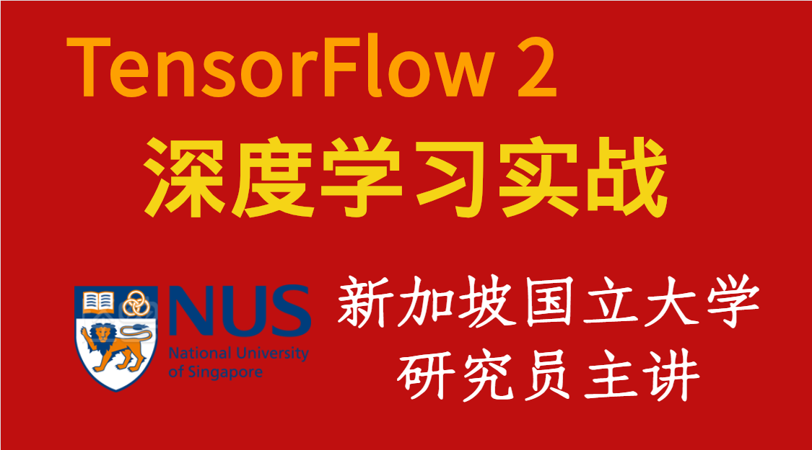

# 深度学习与TensorFlow2入门实战

视频教程链接：[深度学习与TensorFlow2入门实战](https://study.163.com/course/courseMain.htm?share=2&shareId=480000001847407&courseId=1209092816&_trace_c_p_k2_=10515f5942ba46b5a4ec1c30a46b0269)

 
01 深度學習初見  
03 回歸問題  
04 tf2 basic  
05 tf2 adv  
06 神經網絡與全連接層  
07 隨機梯度下降  
08 keras高層接口
09 過擬合    
10 卷積神經網絡  
11 循環神經網絡  
12 autoencoders  
13 GAN  

# Result
1. 透過二元方程組，引入連續值預測的方法 回歸問題，與手寫數字識別 分類問題。在介紹分類問題前，補充了深度學習框架的相關理論，利用深度學習框架，操作tensor，好去實現前向傳播、反向傳播、測試邏輯。    
2. 講解必要基礎後，補充了 *梯度下降算法*，當中有大量的公式，以及激活函數、損失函數、交叉謪、梯度下降更新規則...之類的公式。   
3. 接著說 *卷積神經網絡CNN*，與卷積中最著名的生成ResNet(?)，亦作了大量的實戰。還介紹了 *循環神經網絡RNN*，處理序列訊號(文本、音頻)，還介紹了情感分類問題。   
4. 後面還介紹了 *無監督學習*，如auto-encoder，目前autoencoder已不用，因為GAN出現前，並沒有一個很好的模型，autoencoder作為降維、提取特徵，VAE作為生成模型使用較為廣泛。   
GAN出來後全面輾壓VAE，GAN是在使用圖像生成時的首選方案。   

**followup:** 圖卷集, 目標識別, 神經網路搜索, 

